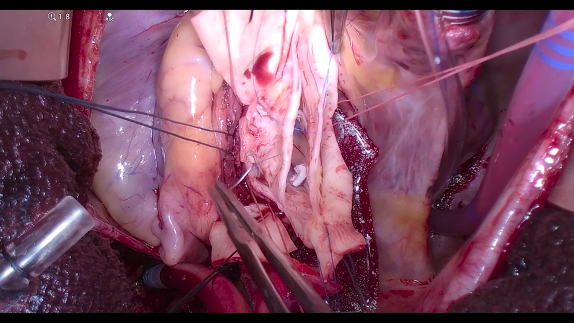
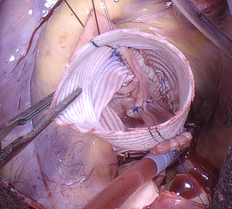

# Valve-Sparing Root Replacement for Bicuspid Aortic Valve: Combining the Remodeling Procedure with an External Annuloplasty Ring

**Source:** HeartValvePro  
**Original title:** 二叶式主动脉瓣的保瓣根部置换：重塑技术与瓣环外成形环的联合应用  
**Original URL:** https://mp.weixin.qq.com/  

To spare a valve is to preserve the geometry that sustains it.

JTCVS Structural and Endovascular · 2026;9:100099 · Mount Sinai, New York

When the aortic root is aneurysmally dilated but the valve itself remains suitable for preservation, the surgical question is how to strike a balance between stability and function.

A 45-year-old patient underwent echocardiography showing a Sievers type 1 bicuspid aortic valve (BAV), moderate aortic regurgitation (AR), and a 5.2-cm aortic root aneurysm. For the surgeon, the choice was not limited to replacing the valve with either a mechanical or a bioprosthetic prosthesis. The team led by El-Hamamsy at Mount Sinai Hospital in New York documented the entire operation and published it in JTCVS Structural and Endovascular in 2026, presenting a different strategy in full: preserving the patient's native valve while reconstructing only the dilated root. This case was considered suitable for a valve-sparing approach because of several specific anatomic features: the leaflets remained pliable and mobile, calcification was minimal, there were no fenestrations or leaflet retraction, and the two commissures maintained a broad angle of more than 150°.

Valve-sparing root replacement (VSRR), in the authors' view, is an ideal solution for precisely this setting. When the root is aneurysmally dilated but the valve remains suitable for preservation, it is preferable to retain the patient's own valve rather than replace both the valve and the root together. This is not a new concept. Multiple operative techniques have long been described in the literature, with their main differences lying in how the annulus and sinus portion are managed. Early experience with the remodeling procedure, also known as the Yacoub procedure, left an unfavorable legacy: with longer follow-up, some patients developed late aortic regurgitation as the annulus progressively dilated. The mechanism is straightforward. Once the annulus enlarges, the two leaflets that previously coapted are pulled outward, central coaptation loosens, and regurgitation appears through that gap. The article does not avoid this history. It is precisely to close this vulnerability that the surgeons add an external annuloplasty ring at the level of the basal ring, allowing the reconstructed root to maintain annular stability.

## 01

## Can Stability and Physiology Be Achieved Together?

Within the spectrum of valve-sparing operations, the reimplantation procedure is often compared with the remodeling procedure. The former places the entire root inside a straight vascular graft, thereby firmly stabilizing the annulus, but at the cost of partially flattening the physiologic sinus geometry. The latter uses a scalloped vascular graft to recreate sinus-like geometry, making the root more anatomically natural, but it is somewhat less robust in maintaining long-term annular stability. Adding an external annuloplasty ring is intended to connect the strengths of both approaches. It provides reimplantation-like circumferential support outside the basal ring while preserving the more physiologic root architecture of the remodeling procedure. Put simply, it is like placing a durable band around the base of the root, where dilation is most likely to recur: it does not disturb the sinuses above the valve, but it preemptively limits future annular enlargement.

The article grounds the value of preserving the sinuses in hemodynamics. Restoration of the sinuses of Valsalva is regarded as fundamental to optimizing root function. It is related not only to coronary flow reserve, but also to uniform distribution of leaflet stress, which is thought to help preserve the integrity of the valve itself. In plain terms, the gently bulging sinus behind each leaflet acts like a small recess that allows blood flow to recirculate. This gentle vortex supports smooth leaflet closure with each heartbeat, preventing abrupt impact at the moment of closure. If the root is replaced with a straight tube, that recess is flattened; what the leaflets lose is precisely this well-calibrated buffer. The studies cited in the article point to the same mechanism: the sinuses mitigate abnormal stress on the leaflets during valve closure and facilitate smooth coaptation. Preserving both this buffer and annular stability is the central technical balance in this operation.

## 02

## A Valve Worth Preserving

Not every bicuspid valve is suitable for preservation. Whether it can be repaired depends first on the condition of the leaflets themselves. The features noted above, pliability, minimal calcification, absence of fenestration, absence of retraction, and widely spaced commissures, together convey the same message: anatomically, this valve still has room to be reshaped, rather than being a rigid structure that can only be replaced en bloc. This assessment is placed upfront because the success or failure of repair is often largely determined by the valve's intrinsic condition before the incision is even made. The more disciplined the selection, the more reliable the subsequent repair. This is also where valve-sparing surgery first diverges from straightforward valve replacement.

Figure 1. The bicuspid leaflets and commissural configuration exposed after opening the aortic root intraoperatively, allowing assessment of leaflet mobility and reparability.

The repair itself consists of a sequence of precise maneuvers centered on geometry. The surgeons first release the raphe, thereby increasing leaflet geometric height and appropriately lowering the insertion point of the fused leaflet. They then reshape the free margin with central plication sutures, increasing effective height so that the coaptation surface sits higher and more securely. The commissures are repositioned symmetrically at 180° according to the remodeling technique. Only after leaflet-level function has been restored does the external root work proceed. After the outer wall of the root is fully dissected deep down to the basal ring, the annuloplasty ring is placed. This ring is positioned outside the aortic wall rather than sutured intraluminally, which is exactly what is meant by "extra-aortic." Repair the valve first, then stabilize the annulus: the sequence itself reveals the internal logic of this technique.

Figure 2. External appearance of the reconstructed root after valve-sparing root replacement, in which physiologic sinus reconstruction and annular stability are achieved in the same operation.

It should be clarified that this report is, in essence, an invited operative video. It shows "how to do it," rather than presenting follow-up data with sample size, P values, and endpoint events. The authors also state its boundaries: institutional review board approval was not required, and the patient provided informed consent for publication. Their central conclusion is similarly restrained: this is a safe and effective surgical option. The durability evidence on which it relies comes from prior cohort studies showing that extra-aortic annuloplasty rings improve annular dimensions and long-term outcomes, rather than from this single case itself. The reproducibility of the technique can be seen clearly in the operative images, but the long-term fate of the valve must still be returned to time. This is particularly true in the anatomic setting of a bicuspid valve, which is intrinsically more prone to degeneration. How long a follow-up is long enough remains an open question. This patient is only 45 years old, with a long road ahead. What native-valve preservation gains for him is a state closer to nature: the leaflets continue to open and close in their original manner, and the sinuses continue to provide physiologic support to the entire root complex.

By integrating extra-aortic circumferential support with physiologic root reconstruction in a single operation, the authors describe the approach as "combining the strengths of both." It allows the leaflets to maintain ideal dynamics throughout the cardiac cycle while providing long-term stability for the annulus. What this video leaves behind is a clearly visible and reproducible set of operative steps, together with a question that only follow-up can answer: how far this approach can ultimately go.

## References

Chen L, Williams E, El-Hamamsy I. How I do it: Bicuspid valve-sparing aortic root replacement using a remodeling procedure with extra-aortic ring annuloplasty. JTCVS Structural and Endovascular. 2026;9:100099. doi:10.1016/j.xjse.2026.100099

Basmadjian L, Basmadjian AJ, Stevens LM, et al. Early results of extra-aortic annuloplasty ring implantation on aortic annular dimensions. J Thorac Cardiovasc Surg. 2016;151(5):1280-1285.e1. doi:10.1016/j.jtcvs.2015.12.014

Lansac E, Bouchot O, Arnaud Crozat E, et al. Standardized approach to valve repair using an expansible aortic ring versus mechanical Bentall: early outcomes of the CAVIAAR multicentric prospective cohort study. J Thorac Cardiovasc Surg. 2015;149(2 suppl):S37-S45. doi:10.1016/j.jtcvs.2014.07.105

Katayama S, Umetani N, Sugiura S, Hisada T. The sinus of Valsalva relieves abnormal stress on aortic valve leaflets by facilitating smooth closure. J Thorac Cardiovasc Surg. 2008;136(6):1528-1535.e1. doi:10.1016/j.jtcvs.2008.05.054

For collaboration or submissions, please leave a message in the WeChat official account or email adams.wang@heartvalvepro.com.

This content is intended solely for academic reference by medical and healthcare professionals. It does not constitute medical advice or a basis for diagnosis or treatment in any form. Clinical decisions must be made by the attending physician based on individual patient factors and relevant clinical guidelines. This account assumes no legal liability arising therefrom. The technical evaluation and literature interpretation in this article are based on currently available evidence-based data and are intended to reflect academic discussion objectively; they do not represent an exclusive recommendation of any specific product or operative technique.

