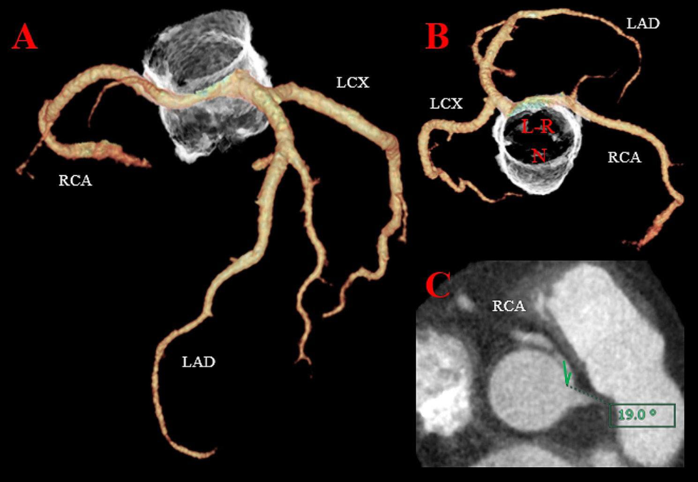
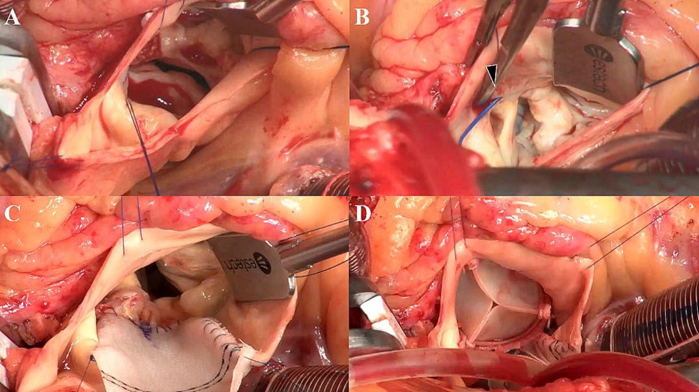
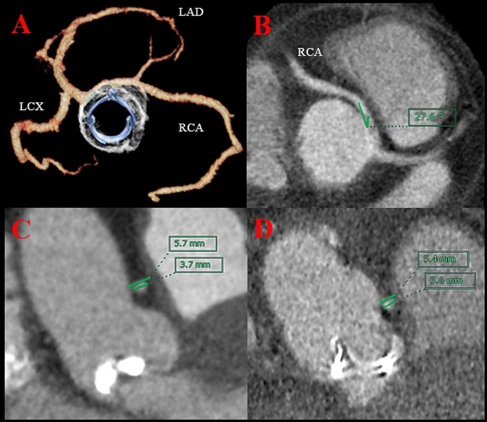

# Y-Incision Aortic Root Enlargement for Aortic Stenosis with Anomalous Aortic Origin of the Right Coronary Artery: A Case Observation

**Source:** HeartValvePro
**Original title:** 右冠异常起源合并主动脉瓣狭窄的Y切口根部扩大观察
**Original URL:** https://mp.weixin.qq.com/s/TxVASE2V_HEwq-bXdERncQ

Anatomy decides what pressure alone cannot tell.

Aortic valve stenosis (AS) and anomalous aortic origin of the coronary artery (AAOCA) can overlap at the level of symptoms. Chest pain, dyspnea, palpitations, or fatigue may arise from valvular obstruction, but they may also reflect myocardial ischemia related to an anomalous coronary artery. In 2024, the Journal of Cardiothoracic Surgery published a case report from Yoshida and colleagues at Kochi Medical School Hospital that places this overlapping territory into a concrete surgical scenario: severe AS requiring aortic valve replacement (AVR), while an anomalous aortic origin of the right coronary artery (AAORCA) makes the spatial relationship between the prosthesis and the coronary artery sensitive.

This is a case report with a sample size of one. The patient was a 57-year-old man, weight 114 kg, height 170 cm, body surface area (BSA) 2.19 m², referred for evaluation because of chest pain and dyspnea, with New York Heart Association (NYHA) functional class III. On admission, blood pressure was 152/85 mmHg and heart rate 71 beats/min. Transthoracic echocardiography suggested a stenotic bicuspid aortic valve, with a calculated valve area of 1.09 cm², a mean transvalvular gradient of 50 mmHg, a left ventricular ejection fraction of 54%, and no regional wall-motion abnormality. Coronary angiography showed no significant stenosis, but the right coronary artery arose from the left coronary sinus; cardiac computed tomography (CCT) further showed an aortic annulus, sinus of Valsalva, and sinotubular junction (STJ) of 24, 31, and 29 mm, respectively, with a right coronary take-off angle of 19°.

The difficulty in the disease background arises from the overlap of two facts. AAOCA is described in the original article as an uncommon congenital cardiac anomaly; most patients may be asymptomatic, but certain anomalous courses are associated with myocardial ischemia, myocardial infarction, and the risk of sudden cardiac death. AS is a common valvular disease whose chest pain, palpitations, and fatigue may resemble those of AAOCA. When the two coexist, symptoms alone no longer explain where the risk comes from, and structural and functional imaging evidence becomes the main thread of the case narrative.

Preoperative CCT shows the right coronary artery arising from the left coronary sinus, a bicuspid aortic valve, and a 19° take-off angle.

## Two Clues Behind One and the Same Chest Pain

The 19° right coronary take-off angle is flagged in the original article as a known risk factor for myocardial ischemia. The problem is that this patient also had severe AS, so the chest pain could not be attributed to the anomalous right coronary artery by default. During adenosine triphosphate infusion the patient did indeed develop chest pain, yet single-photon emission computed tomography (SPECT) found no ischemic focus. Put simply, imaging did not give a single-point answer but a set of mutually counterbalancing evidence: the coronary anatomy had a high-risk morphology, while functional testing captured no definite ischemia.

This set of results narrowed the surgical path. The team ultimately chose AVR without revascularization. The logic was not to ignore the AAORCA, but to first confirm the coronary course preoperatively and then assess the possibility of ischemia with a provocative test. Such a judgment still has its boundaries: a negative SPECT cannot substitute for risk stratification in a larger sample, and 6-month follow-up can hardly answer questions about longer-term coronary events. What a case report can offer is a clear decision chain, not a generalizable conclusion.

## The Spatial Problem Behind the Y-Incision

The real contradiction to be managed appeared between the annulus and the right coronary artery. Intraoperative direct inspection confirmed a Sievers type 1a bicuspid aortic valve, with fusion of the left and right coronary cusps, heavy calcification, an asymmetric commissural orientation, and the right coronary artery arising from the left coronary ostium. After removal of the leaflets and annular calcification, a 23-mm prosthesis sizer could pass through the annulus but with mild resistance. A prosthesis smaller than 23 mm would be mismatched to a BSA of 2.19 m², whereas an oversized prosthesis could compress the anomalously arising right coronary artery. In plain terms, the problem was not simply to seat a new valve, but to leave room for both the valve and the right coronary artery within an already crowded root.

Intraoperative view showing the Sievers type 1a bicuspid aortic valve, the anomalous right coronary ostium, the rectangular patch, and the implanted bioprosthesis.

Y-incision aortic root enlargement therefore became the core maneuver in this operation. The team enlarged the root with a rectangular Hemashield Dacron patch and implanted a 25-mm Inspiris RESILIA bioprosthesis. The discussion in the original article notes that the Y-incision is simpler and safer than the Manouguian and Konno procedures, and more effective than the Nicks procedure in upsizing; however, in the setting of AAORCA, an altered left coronary sinus configuration may shift the coronary ostium relatively to the right and may stretch or distort the right coronary artery. This detail keeps the value of the case from resting on successful valve implantation alone, anchoring it also in a careful documentation of the boundaries of the technique.

The original article cites a report in which, after AVR, a prosthesis compressed an AAOCA in the aortopulmonary continuity, and from this introduces the idea of prosthesis undersizing. This case chose a different path: rather than simply downsizing the prosthesis to gain space, it addressed both potential problems—prosthesis–patient mismatch and right coronary compression—through root enlargement. The sense of proportion here is important. If one pursues only a larger valve, the anomalous right coronary artery may become a new risk point; if one attends only to avoiding compression, a smaller prosthesis may leave a hemodynamic cost.

## A Restrained Conclusion in the Postoperative Imaging

The postoperative data provided a relatively complete short-term loop. The mean aortic-valve gradient fell to 6 mmHg, the aortic root and STJ diameters increased, the right coronary take-off angle increased from 19° to 28°, and no dynamic interarterial compression was seen. Finer measurements also remained stable: preoperatively, the narrowest point of the interarterial segment and the right coronary diameter were 5.7 mm and 3.7 mm; postoperatively they were 5.4 mm and 3.6 mm, judged in the original article to show no significant narrowing. For a case worried about prosthetic compression of an anomalous right coronary artery, these numbers carry more explanatory power than "the operation went well" alone.

Postoperative CCT shows the bioprosthesis does not compress the AAORCA, the right coronary take-off angle increased from 19° to 28°, and the interarterial segment and right coronary diameter show no significant narrowing.

The patient was ultimately discharged without complications. At 6-month follow-up, weight had decreased from 114 kg to 95 kg, BSA was 2.06, and NYHA class had improved to I. From the patient's perspective, symptom improvement and uncomplicated discharge are the more easily understood outcomes; from the standpoint of the literature, what is more worth recording is that the imaging, the intraoperative spatial findings, and the postoperative measurements formed one and the same thread. When uncommon anatomy meets common valvular disease, a single metric is often insufficient, and preoperative functional assessment together with postoperative structural review constitute the principal information of this report.

The discussion also places this case back within the existing evidence gap. The 2018 American College of Cardiology/American Heart Association and the 2020 European Society of Cardiology guidelines have respectively addressed the surgical indications for isolated AAOCA, but for AAOCA combined with AS requiring AVR, a standardized optimal surgical strategy is currently lacking. The original article stresses that CCT is the gold standard for assessing coronary anatomy and that provocative testing can evaluate inducible ischemia in uncertain cases. Here, the negative SPECT shifted the team's focus from "whether to reconstruct the right coronary artery" to "how to avoid having the newly implanted prosthesis create new coronary compression."

The limitations are equally clear. A single case report cannot compare different surgical strategies, nor can it answer the event risk of SPECT-negative cases over longer follow-up; the 6-month NYHA improvement and imaging stability can only indicate that this particular patient achieved good structural and symptomatic results in the short term. The original article also acknowledges that the applicability of the Y-incision for AAORCA combined with AVR still requires further validation and accumulated clinical experience. Such reservation keeps the tone of the report at the level of case observation.

The value of this case report lies in decomposing an uncommon combination into two observable questions: whether the anomalous right coronary artery has already caused ischemia, and whether the AVR prosthesis might create new compression within the anatomical space. Sample size, follow-up duration, and single-center experience limit extrapolation, but the case offers a verifiable chain of imaging and intraoperative logic. In an individual with AS combined with AAORCA and no inducible ischemia, Y-incision root enlargement can be recorded as a surgical strategy to avoid prosthetic compression and prosthesis–patient mismatch, rather than as an already-established universal answer.

## References

Yoshida K, Miura Y, Fukunaga Y, Mitsuishi A. A Y-incision to enlarge the aortic root for aortic valve stenosis with anomalous aortic origin of the right coronary artery. Journal of Cardiothoracic Surgery. 2024;19:54. https://doi.org/10.1186/s13019-024-02518-z. Published 04 February 2024.

For collaboration or submissions, please leave a message in the WeChat official account or email adams.wang@heartvalvepro.com.

This content is intended solely for academic reference by medical and healthcare professionals. It does not constitute medical advice or any basis for diagnosis or treatment. Clinical decisions must be made by the attending physician based on individual patient factors and relevant clinical guidelines; this account assumes no legal liability arising therefrom. The technical evaluation and literature interpretation in this article are based on currently available evidence and are intended to reflect academic discussion objectively; they do not represent an exclusive recommendation of any specific product or surgical technique.

