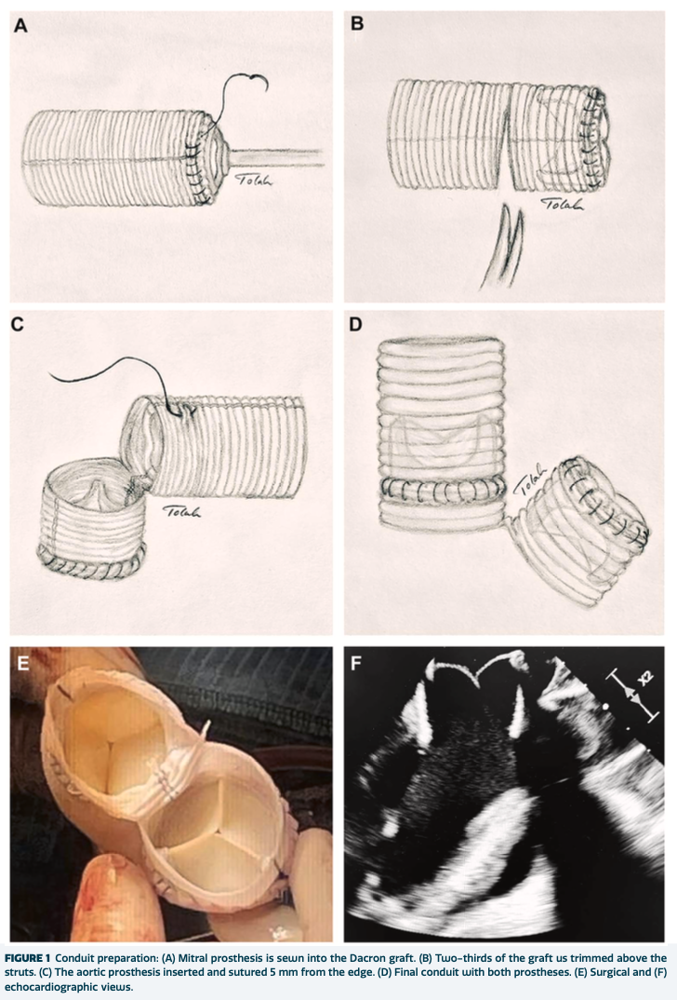
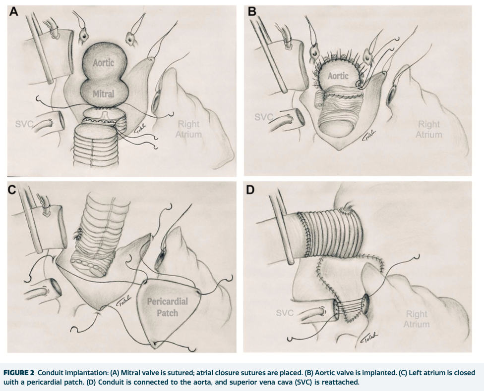

# A Technical Report on Simultaneous Double Annular Enlargement Using a Single Dacron Graft

**Source:** HeartValvePro
**Original title:** 单根 Dacron 移植物同步扩大双瓣环的技术报道
**Original URL:** https://mp.weixin.qq.com/s/mquGoC7so-e9p94cfBiB1Q

Geometry matters when reconstruction narrows the margin.

In 2026, Annals of Thoracic Surgery Short Reports published a new-technique report by the team of Majed Tolah titled "A Novel Technique for Simultaneous Double Annular Enlargement Using a Single Dacron Graft." The paper comes from the Heart and Diabetes Center NRW in Bad Oeynhausen, Germany, and the Madinah Cardiac Center in Saudi Arabia. Its core content is not a large-sample outcome comparison but a surgical configuration built around reconstruction of the left-heart fibrous skeleton: using a single Dacron graft to simultaneously enlarge the aortic annulus and the mitral annulus, and completing the geometric positioning of two bioprostheses within the same conduit.

When the left-heart fibrous skeleton is involved, the Commando procedure described by David et al. in 1997 addresses complex disease by reconstructing the intervalvular fibrous body; but the article notes that such operations are technically demanding and are not ideal in patients in whom both the aortic and mitral annuli are small. Over the years, the chimney technique, Y-incision annular enlargement, and double-conduit approaches have successively emerged, each trying to address exposure, valve interference, left ventricular outflow tract (LVOT) distortion, and constrained prosthesis size. The new approach proposed by Tolah's team, built atop these existing difficulties, compresses "two patches, two positioning sets" into a single prefabricated conduit. Its technical concept is not to push some particular patch-suturing method half a step further, but rather to fix in advance the spatial relationships that are most prone to losing control during complex reconstruction.

## Two Valves Within One Conduit

The key step of the technique occurs before cardiopulmonary bypass (CPB) is established. The team first sutures a 29-mm mitral bioprosthesis into the end of a 32-mm Dacron graft, then trims roughly two-thirds of the graft circumference above the valve frame and folds it back; subsequently a 27-mm aortic bioprosthesis is placed within the same conduit and fixed 5 mm from the trimmed edge. Pledgeted Prolene sutures preset along the conduit's fold line are then used to close the left atrial roof. The structure thus completed serves both as the carrier for the double valve replacement and as the template for the joint enlargement of the two annuli. In plain terms, the surgeon no longer separately seats two circular valves within a narrow, distorted in-situ space, but first calibrates the relative position of the two valves ex vivo and then implants them as a whole.

Sequential steps of prefabricating the mitral and aortic valves within a single Dacron graft.

The case background reveals the real complexity this configuration confronts. The patient was a 61-year-old woman who had undergone aortic valve replacement (AVR) with a 23-mm Freestyle valve in 2011; she now presented with severe aortic prosthetic stenosis and mitral regurgitation, and had recently been treated for mitral endocarditis. Intraoperatively, the aortic annular and subannular diameters were extremely small, and the mitral valve was small and infected. After the original Freestyle leaflets and the anterior mitral leaflet were excised, the prefabricated conduit was first implanted from the mitral side, and the aortic side was then fixed at the region of the left and right coronary sinuses. Because the coronary buttons were severely altered, the team ultimately used the Cabrol technique to complete coronary reimplantation; the left atrium was closed with a pericardial patch, the distal conduit was connected to the aorta, and reanastomosis of the superior vena cava was also completed intraoperatively. These steps make this case far more than a superposition of "double valve replacement"—it is a reoperation in which root, annular, left atrial, and coronary reconstruction are interwoven simultaneously.

The process of implanting the double-valve conduit as a whole, closing the left atrium, and connecting the distal aorta.

## Geometry Is the Core of This Technique

The most valuable part of this short report is that it explicitly reduces the difficulty of complex double valve replacement to a geometric problem. The article discusses that after incising the aortomitral curtain and extending it anterior to the mitral valve, the balance of the semilunar commissures is disrupted, and the originally near-circular aortic root and LVOT may become elliptical. Such distortion may increase the risk of LVOT obstruction, especially near the commissure between the left and non-coronary cusps, and may also make a circular aortic prosthesis harder to seat stably within a smaller anatomy. Precise positioning of two pericardial patches and two prostheses may further introduce potential problems such as paravalvular leak (PVL).

The logic of the single Dacron graft is to create a standardized, circular neo-annulus inside the graft. Both the mitral and aortic valves are placed within a predefined spatial relationship, so that mechanical tension, mutual valve interference, and the need for dual patches are reduced. Compared with the chimney technique, the article holds that this approach does not merely fix the mitral valve to a conduit but also brings the aortic valve into the same controlled geometric framework, thereby avoiding having the aortic valve remain constrained by a distorted or small native annulus and reducing concerns about prosthesis–patient mismatch (PPM). The "simplification" here does not mean the operation itself becomes easy, but rather that part of the decision-making is shifted from the deep operative field to an ex-vivo prefabrication stage, making subsequent implantation closer to execution according to a predefined geometry.

Cross-sectional schematic of the single conduit containing the aortic and mitral valves (Source: original Figure 3, "Clinical Experience" section, anatomical cutdown view).

Early results were relatively smooth in this patient. The postoperative recovery was uneventful, echocardiography showed both prostheses functioning well, the mean aortic transvalvular gradient was 6 mm Hg, and the mean mitral gradient was 1.5 mm Hg. The patient was discharged in stable condition and completed 6-month follow-up. The article also notes that postoperative echocardiography showed no signs of blood-flow stasis; nonetheless, flow stasis and thrombus formation are still listed by the authors as safety concerns that this reconstruction method must face. In the discussion, the authors propose that bioprosthesis patients receive warfarin for at least 6 months postoperatively, targeting an international normalized ratio (INR) of 2.5 to 3.5, after which they may switch to a non–vitamin K oral anticoagulant; mechanical-valve patients maintain long-term warfarin therapy at the same INR target. The anticoagulation regimen is not the endpoint of this article, but it lets the reader see that hemodynamic-level questions remain behind this geometric reconstruction.

## The Boundaries Left by a Single-Case Report

Regarding the scope of application, the article discusses this method in complex anatomical scenarios, including a small annulus combined with a small aortic root, aortomitral destruction and root abscess caused by endocarditis, severe calcification such as a porcelain aorta, and reoperation after prior root surgery. The prosthesis sizes used are also considered by the authors to leave room for future valve-in-valve transcatheter aortic valve implantation or replacement (TAVI/TAVR). This judgment derives from a single highly selected case and remains closer to a demonstration of technical feasibility than to a definitive statement about efficacy boundaries.

The limitations are equally clear: a sample size of one, a follow-up of 6 months, no control group, and no long-term imaging or anticoagulation-safety data. Whether the prefabricated conduit can be reliably reproduced across different body sizes, coronary anatomies, and extents of infectious destruction still requires more cases to answer. The patient-level significance therefore remains in a very restrained position: this case shows that an extremely small annulus and a redo root operation do not necessarily have to proceed only with multiple patches and complex positioning; but it cannot yet answer whether this approach is equally durable over a longer period. Especially in scenarios where infection, calcification, and prior root surgery overlap, an early patent flow curve is only the beginning of the story; the truly difficult questions often lie in the long-term paravalvular structure, intra-graft flow, and accessibility of reintervention.

As a New Technology report, what Tolah's team provides is a new structural diagram, not a path already paved by large amounts of data. Its value lies in placing double annular enlargement, double valve replacement, and aortic root replacement within a single geometric framework, giving complex reconstruction a more standardized space for the imagination. What ultimately determines the place of this technique will still be more cases, longer follow-up, and continued documentation of flow patterns and thrombotic risk.

## References

Tolah M, Opačić D, Sharaf M, Gilis-Januszewski J, Renner A, Gummert J, Gilis-Januszewski T. A Novel Technique for Simultaneous Double Annular Enlargement Using a Single Dacron Graft. Annals of Thoracic Surgery Short Reports. 2026;4:625-629. doi:10.1016/j.atssr.2025.12.001.

For collaboration or submissions, please leave a message in the WeChat official account or email adams.wang@heartvalvepro.com.

This content is intended solely for academic reference by medical and healthcare professionals. It does not constitute medical advice or any basis for diagnosis or treatment. Clinical decisions must be made by the attending physician based on individual patient factors and relevant clinical guidelines; this account assumes no legal liability arising therefrom. The technical evaluation and literature interpretation in this article are based on currently available evidence and are intended to reflect academic discussion objectively; they do not represent an exclusive recommendation of any specific product or surgical technique.

