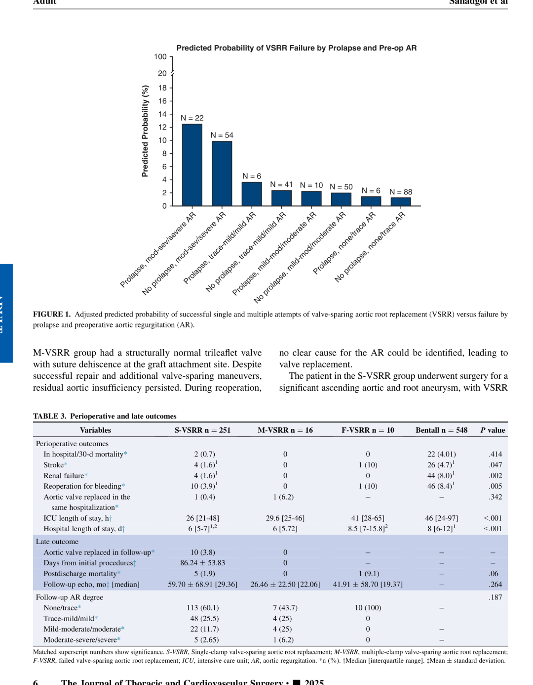

# Predicting Intraoperative Failure During Valve-Sparing Root Replacement

**Source:** HeartValvePro  
**Original title:** VSRR主动脉瓣保留术中失败风险预测  
**Original URL:** https://mp.weixin.qq.com/s/8LeMpjY1xSV3Za0PQVa0uA

The wisdom of repair lies as much in knowing when to abandon it.

A retrospective study from Massachusetts General Hospital and Harvard Medical School, published in The Journal of Thoracic and Cardiovascular Surgery in 2025, provides intention-to-treat quantitative evidence on a topic that has long been avoided in valve-sparing aortic root replacement (VSRR): intraoperative failure. Sanadgol and colleagues included all 825 patients who underwent aortic root replacement (ARR) at Massachusetts General Hospital between 2002 and 2023. According to the actual intraoperative course, patients were divided into 4 groups: successful single cross-clamp VSRR (S-VSRR, n=251), successful multiple cross-clamp VSRR (M-VSRR, n=16), failed VSRR converted to valve replacement after an attempted repair (F-VSRR, n=10), and a control group treated with a Bentall procedure from the outset (n=548). The investigators defined intraoperative VSRR failure and repeat cross-clamping as "challenging or failed." This direct classification itself touches a gray zone in aortic root surgery that has rarely been examined in depth.

If one looks only at ultimately successful VSRR, most series report 10-year freedom from reoperation above 88% to 98%, almost making it appear to be a perfect operation. But that narrative deliberately avoids one question: where did the patients go in whom VSRR was attempted but not completed? This study answers that question. Among 277 ARR procedures initiated with the intent to spare the valve, 90.6% were successfully completed as VSRR with a single cross-clamp; 5.8% required repeat cross-clamping before valve preservation was achieved; and another 3.6% ultimately abandoned repair and underwent valve replacement. Taken together, roughly one in ten VSRR attempts did not proceed smoothly. That is not a trivial figure, especially during an operation that has already committed to a VSRR strategy.

## Severe Regurgitation With Leaflet Prolapse: The Core Failure Signal

The clearest signal in the data came from the interaction between preoperative aortic regurgitation (AR) severity and leaflet pathology. A prediction model built using multivariable logistic regression showed that patients with both moderate-to-severe or severe AR and leaflet prolapse had the highest predicted probability of intraoperative VSRR failure, reaching 12.5%. Patients with severe AR but no prolapse had a predicted failure probability of 9.9%. In contrast, patients with mild or less AR, whether or not leaflet prolapse was present, had predicted failure rates within a narrow range of 1% to 3%. In other words, VSRR risk is not a uniformly rising slope. It rises sharply only after AR crosses the moderate-to-severe threshold.

Viewed from the other side of the same prediction model, the predicted probability of single cross-clamp success fell from 97.9% in patients with mild AR and no prolapse to 69.2% in those with severe AR and prolapse. A difference of nearly 30 percentage points is compressed into the color Doppler frames of the preoperative echocardiogram.

Adjusted probability of intraoperative VSRR failure jointly predicted by preoperative AR grade and leaflet prolapse, with subgroup sample sizes. Source: original Figure 1, Results section, predicted failure probabilities.

Looking one layer deeper, regurgitant jet direction also provided an important clue. Among patients with tricuspid aortic valve (TAV) anatomy and more than trace regurgitation in the S-VSRR group, eccentric regurgitation accounted for 22%. This rose to 50% in the M-VSRR group and 87% in the F-VSRR group (P=0.013), with most eccentric jets directed toward the posterior annulus. Rather than viewing this simply as leaflet dysfunction, it may be better understood as a signal of geometric instability. When the jet does not emerge symmetrically from the center of the valve but instead points obliquely to one side, the underlying problem is often asymmetric deformation of the annulus-sinotubular junction complex or localized restriction of one leaflet set. These are precisely the types of lesions that are most difficult to correct cleanly within a single cross-clamp period.

## The Cost of Repeat Cross-Clamping and the Durability of Repair

Repeat intraoperative cross-clamping is not cost-free. In the F-VSRR group, median cardiopulmonary bypass (CPB) time was 334 minutes and aortic cross-clamp time was 266 minutes. In the M-VSRR group, the corresponding times were 295 and 220 minutes. In the S-VSRR group, they were only 223 and 189 minutes, respectively (all P<0.001). The same pattern appeared in ICU length of stay: the median ICU stay was 26 hours in the S-VSRR group and 41 hours in the F-VSRR group (P<0.001), while total hospital stay increased from 6 days in the S-VSRR group to 8.5 days in the F-VSRR group. Reoperation for bleeding occurred in 10% of the F-VSRR group, compared with 0% in the M-VSRR group and 3.9% in the S-VSRR group (P=0.005). Failure is not a simple switch between VSRR and Bentall. It is a more complex operation layered on top of longer CPB, more cross-clamping, and additional hemostatic work.

Even so, early mortality and stroke did not show a catastrophic difference. In-hospital or 30-day mortality was 0.7% in the S-VSRR group, 0% in both the M-VSRR and F-VSRR groups, and 4.0% in the Bentall group. Stroke occurred in 10% of the F-VSRR group (1/10), higher than the 1.6% rate in the S-VSRR group (P=0.047), although this difference requires great caution because the subgroup contained only 10 patients.

Fourteen surgeons performed all VSRR procedures in the study and were stratified into low-, medium-, and high-volume groups. High-volume surgeons attempted VSRR significantly more often (41% vs 29% vs 23%, P=0.016). The S-VSRR success rates were 92%, 92%, and 89% across the 3 surgeon-volume groups, without a statistically significant difference (P=0.439). Interestingly, however, the proportion of M-VSRR increased with surgeon volume (0% in low-volume, 4.2% in medium-volume, and 6.7% in high-volume surgeons), whereas F-VSRR was highest in the low-volume group (7% vs 2.8% vs 3.5%). This may reflect two different intraoperative behavior patterns: high-volume surgeons may be more willing to make repeated attempts to preserve the valve, whereas low-volume surgeons may abandon repair earlier and convert to Bentall. Which approach is better cannot be decided by simple numbers, but the finding at least faithfully describes real-world decision-making differences.

At a median echocardiographic follow-up of 59 months, 84.8% of patients in the S-VSRR group maintained none-to-mild AR, consistent with prior large series. The M-VSRR group had a shorter mean follow-up of 26 months, but the proportion with none-to-mild AR fell to 68.8%, while 31.3% had mild-to-moderate or greater AR. This suggests that even when a multiple cross-clamp VSRR is ultimately successful, valve durability may be less favorable than after a single cross-clamp repair. Of course, this comparison is limited by different follow-up durations and by the small M-VSRR sample size of only 16 patients, and it requires longer observation and larger cohorts for validation.

Perhaps the study's most important contribution is not the discovery of a new predictor, but the reframing of how VSRR outcomes should be assessed. Excluding F-VSRR and M-VSRR and reporting only S-VSRR success data is, in essence, another form of survivorship bias. In the discussion, the authors explicitly propose that future Society of Thoracic Surgeons data collection should consider a 3-category classification of S-VSRR, M-VSRR, and F-VSRR to enable cross-institutional comparison. This is a pragmatic and clear-eyed recommendation.

The ceiling of a single-center retrospective study is also apparent. The F-VSRR group included only 10 patients and the M-VSRR group only 16, leaving insufficient statistical power for refined risk stratification. Individual surgeon differences could not be quantitatively adjusted. The study also spans 21 years, during which operative technique, perioperative management, and indications for VSRR evolved, adding the imprint of time to the data.

In a field where 95% freedom from reoperation has almost become conventional wisdom, Sanadgol and colleagues used a long-marginalized set of data to answer a simple question that few had touched: what does it mean when the native valve cannot be preserved intraoperatively? The additional cross-clamp time and ICU days are not merely median values in an operative report. For these patients, they represent a real shift in the postoperative trajectory. Placing these omitted data back on the table is itself an act of academic honesty.

## References

Mookhoek A, Yanagawa B, Verma S, et al. Intention-to-treat outcome analysis for valve-sparing aortic root replacement versus Bentall procedure. The Journal of Thoracic and Cardiovascular Surgery. 2025. doi:10.1016/j.jtcvs.2025.06.038

For collaboration or submissions, please leave a message in the WeChat official account or email adams.wang@heartvalvepro.com.

This content is intended solely for academic reference by medical and healthcare professionals. It does not constitute medical advice or any basis for diagnosis or treatment. Clinical decisions must be made by the attending physician based on individual patient factors and relevant clinical guidelines; this account assumes no legal liability arising therefrom. The technical evaluation and literature interpretation in this article are based on currently available evidence-based data and are intended to reflect academic discussion objectively; they do not represent an exclusive recommendation of any specific product or surgical technique.

