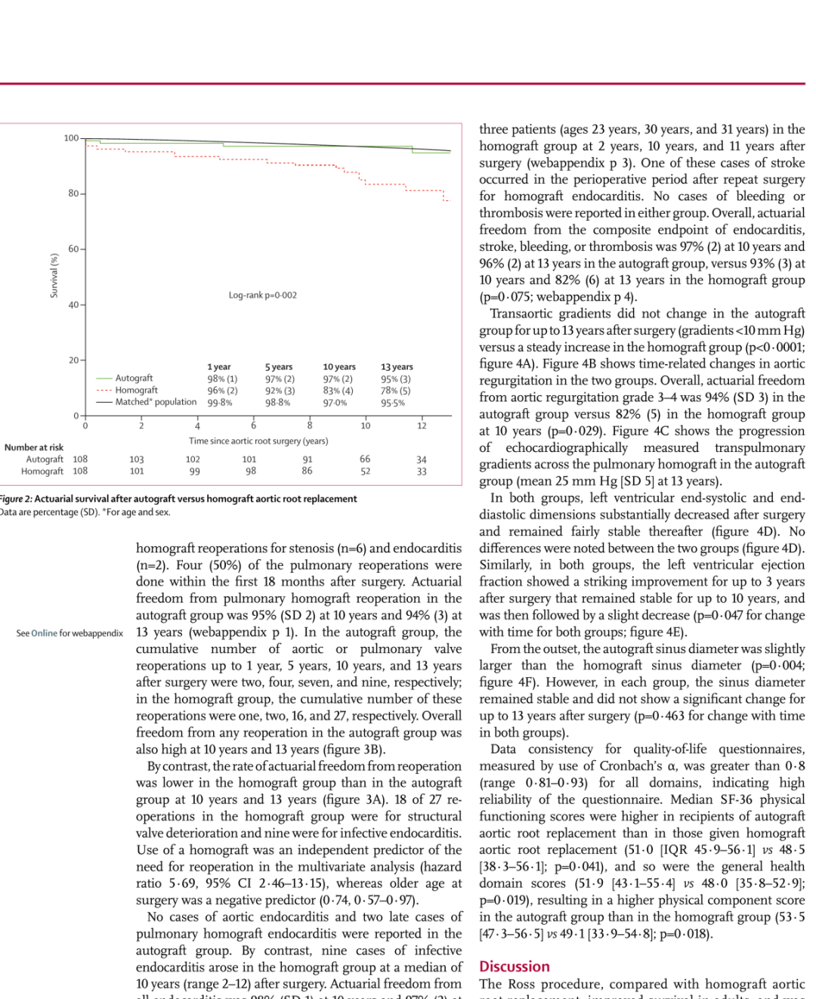
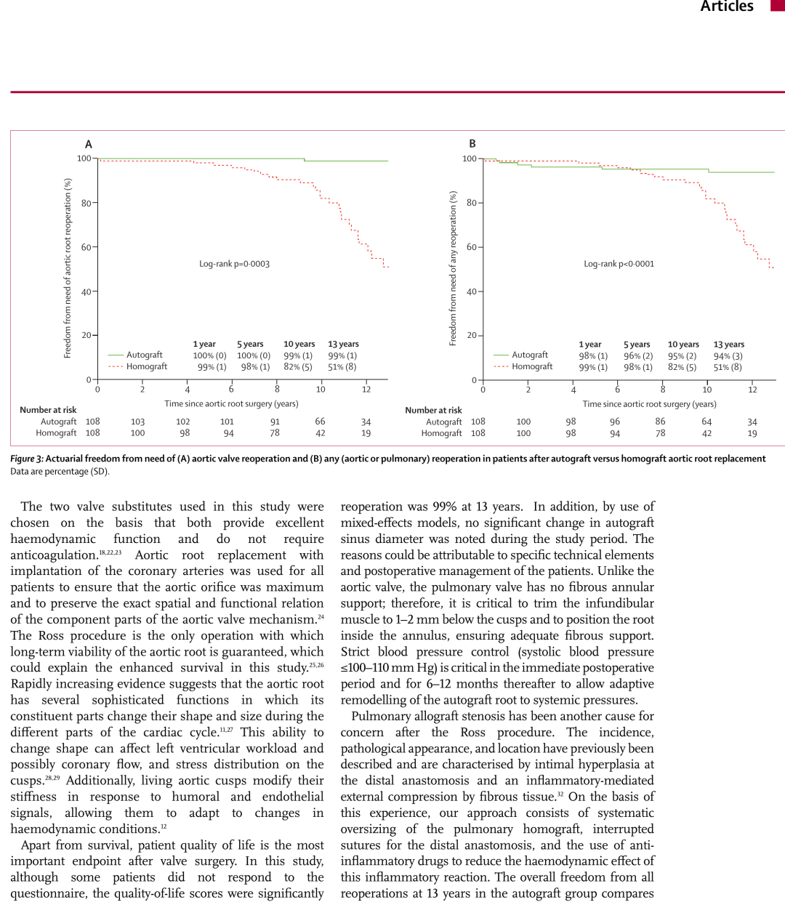

# Long-Term Evidence for a Living Valve: The 13-Year Follow-Up of the Lancet Randomized Trial of the Ross Procedure

**Source:** HeartValvePro  
**Original title:** 活体瓣膜的长期证据：Lancet Ross手术随机对照试验13年随访  
**Original URL:** https://mp.weixin.qq.com/s/-S-ykeTPg9gFYuJApQ-z7A

A living valve does not merely replace; it restores.

For young adults who require aortic valve replacement, the optimal valve substitute remains an evolving question. Mechanical valves require lifelong anticoagulation, bioprosthetic valves face structural degeneration, and homografts are limited by donor availability and long-term durability. Against this background, the Ross procedure, using the pulmonary autograft, occupies a position that is difficult to replace because of its unique concept of a "living valve." In August 2010, The Lancet published a single-center randomized controlled trial from the Royal Brompton and Harefield NHS Trust in the United Kingdom, led by Sir Magdi Yacoub, directly comparing the Ross procedure with homograft aortic root replacement in adult patients. The study enrolled 228 patients between 1994 and 2001, with 216 ultimately included in the analysis, 108 in each group. Mean follow-up was 10.2 years (SD 3.2), and clinical follow-up was 97% complete, an exceptionally high level of completeness for an RCT in this field. The first author, Ismail El-Hamamsy, then a young member of the team, is now Director of Aortic Surgery at Mount Sinai and an internationally recognized leader in the Ross procedure. This paper stands as one of the foundation stones of his career.

The study's most striking finding is shown in the survival curves. Ten-year actuarial survival was 97% (SD 2) in the Ross group and 83% (SD 4) in the homograft group. The hazard ratio for death in the homograft group was 4.61 (95% CI 1.71-16.03, P=0.006). What truly drew attention was that the survival curve in the Ross group almost completely overlapped with that of the age- and sex-matched general UK population, whose expected 10-year survival was 96%. This means that patients who underwent the Ross procedure had a probability of being alive 10 years later that was almost indistinguishable from that of same-age peers without heart disease. During the same period, the homograft group had accumulated 15 deaths, 12 of them late deaths.

Kaplan-Meier survival curves after the Ross procedure and homograft aortic root replacement. Ten-year survival was 97% in the Ross group, almost overlapping with the age- and sex-matched UK general population at 96%.

Perioperative mortality did not differ significantly between groups: 1 patient (<1%) in the Ross group and 3 patients (3%) in the homograft group (P=0.621). All 3 perioperative deaths occurred in patients undergoing urgent surgery for acute infective endocarditis. The separation of the survival curves therefore came mainly from the accumulation of late events, rather than from differences in early operative risk.

The comparison of reoperation rates was equally impressive. At 13 years, freedom from aortic valve reoperation was 99% in the Ross group, compared with only 51% in the homograft group (P=0.0003). Among the 27 homograft reoperations, 18 were due to structural valve deterioration and 9 to infective endocarditis. Multivariable analysis confirmed homograft use as an independent predictor of reoperation (HR 5.69, 95% CI 2.46-13.15), whereas older age at operation was protective (HR 0.74, 95% CI 0.57-0.97). Only 1 patient in the Ross group underwent reoperation on the autograft, at 9.5 years after surgery, because of mild autograft dilatation (44 mm), moderate AR, and progressive left ventricular enlargement. In addition, 7 patients in the Ross group underwent 8 pulmonary valve reoperations for pulmonary homograft stenosis or endocarditis. Ten-year freedom from pulmonary valve reoperation was 95% (SD 2).

Kaplan-Meier curves for freedom from aortic valve reoperation (A) and freedom from any reoperation (B). At 13 years, freedom from aortic valve reoperation was 99% in the Ross group and only 51% in the homograft group.

The between-group difference in infective endocarditis was also notable. No aortic valve endocarditis occurred in the Ross group during follow-up, with only 2 late cases of pulmonary homograft endocarditis. In contrast, 9 cases of endocarditis occurred in the homograft group, with a median time to onset of 10 years (range, 2-12 years). Freedom from endocarditis in the Ross group was 98% at 10 years and 97% at 13 years, compared with 94% and 82% in the homograft group (P=0.002). Freedom from the composite endpoint of endocarditis, stroke, bleeding, and thromboembolism was 97% at 10 years and 96% at 13 years in the Ross group, versus 93% and 82% in the homograft group (P=0.075).

Hemodynamically, the transaortic gradient in the Ross group remained stable below 10 mmHg throughout 13 years of follow-up, whereas the homograft group showed a continuous upward trend (P<0.0001). Freedom from moderate or severe AR (grade 3-4) at 10 years was 94% (SD 3) in the Ross group and 82% (SD 5) in the homograft group (P=0.029). Improvements in left ventricular ejection fraction and chamber dimensions were broadly similar between groups. Both improved significantly after surgery, peaked within the first 3 years, remained stable through 10 years, and then declined slightly. The autograft sinus diameter in the Ross group remained stable throughout follow-up, without the progressive dilatation previously reported in the literature.

Quality-of-life data from the SF-36 health survey showed significantly better scores in the Ross group for physical functioning (51.0 vs 48.5, P=0.041) and general health (51.9 vs 48.0, P=0.019), ultimately reflected in a higher physical component score (53.5 vs 49.1, P=0.018). When a survival curve overlaps with that of the general population, quality of life becomes another unavoidable dimension of operative value.

The operative details recorded in this paper are highly valuable for later surgeons. All operations were performed by the same surgeon. In the Ross procedure, the pulmonary root was harvested in a scalloped fashion, preserving 1 to 2 mm below the leaflet hinge points, and the autograft was implanted in an intra-annular position to use the fibrous structure of the native aortic root as external support. No prosthetic material was used in either the proximal or distal anastomosis. During the first 6 postoperative months, systolic blood pressure was strictly controlled below 110 mmHg to allow the autograft to undergo safe adaptive remodelling under systemic pressure. Put simply, after moving from the low-pressure pulmonary position to the high-pressure aortic position, this valve requires a period of training to adapt to a new mechanical environment, and that adaptation needs a deliberately created period of low-pressure protection. The investigators attributed the stability of the autograft sinus diameter to meticulous operative technique and strict postoperative management.

From the patient's perspective, the message of this study may be more concrete than any statistical endpoint. Patients undergoing the Ross procedure had survival expectations over more than a decade that were almost indistinguishable from their peers, a very low reoperation risk, and better daily physical well-being. This means they did not need lifelong anticoagulation like mechanical valve recipients, nor did they face the near-inevitable prospect of reoperation around a decade later as many bioprosthetic valve recipients do. Of course, this benefit came at the price of a more complex operation and longer cardiopulmonary bypass and cross-clamp times (163 vs 117 minutes and 110 vs 85 minutes, respectively, both P<0.0001).

The boundaries of the study are equally clear. It was a single-center trial. The sample size was statistically adequate but still limited in absolute terms. The study compared the Ross procedure only with homograft replacement, without xenograft bioprostheses or mechanical valves as comparators. Ultra-long-term data beyond 20 years were not yet available, a limitation the authors acknowledged while noting that continued follow-up was ongoing. In addition, all operations were performed by one surgeon. This ensured technical consistency, but it also means that multicenter generalization requires caution. The central contribution of this study is that it confirmed, at the evidence level of a randomized controlled trial, a core hypothesis: a living valve implanted in the aortic position can provide long-term benefits beyond those of conventional valve substitutes. This concerns not only hemodynamic parameters, but also how patients live and how long they live.

This paper was published in 2010 and is now more than 16 years old. In an era of rapid medical research iteration, the shelf life of many clinical studies is only a few years. Yet this Lancet paper remains one of the most-cited randomized pieces of evidence in the Ross procedure field. It has endured because randomized studies directly comparing the long-term outcomes of different valve substitute strategies remain rare at the top of the evidence pyramid. Its academic value has not faded with time precisely because it addressed a fundamental question, and answered it with unusual rigor. When technical complexity and long-term benefit sit on opposite sides of the scale, these data provide weight for the clinical conversation. For young patients facing valve choice, the evidence itself is already part of the answer.

## References

El-Hamamsy I, Eryigit Z, Stevens LM, Sarang Z, George R, Clark L, Melina G, Takkenberg JJM, Yacoub MH. Long-term outcomes after autograft versus homograft aortic root replacement in adults with aortic valve disease: a randomised controlled trial. Lancet. 2010;376(9740):524-531. doi:10.1016/S0140-6736(10)60828-8.

For collaboration or submissions, please leave a message in the WeChat official account or email adams.wang@heartvalvepro.com.

This content is intended solely for academic reference by medical and healthcare professionals. It does not constitute medical advice or any basis for diagnosis or treatment. Clinical decisions must be made by the attending physician based on individual patient factors and relevant clinical guidelines; this account assumes no legal liability arising therefrom. The technical evaluation and literature interpretation in this article are based on currently available evidence-based data and are intended to reflect academic discussion objectively; it does not represent an exclusive recommendation of any specific product or surgical technique.
