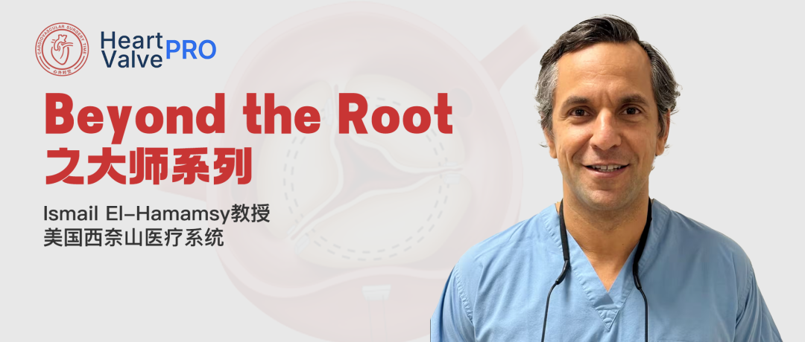

# Beyond the Root Master Series | Interview With Professor Ismail El-Hamamsy: Why Is a "Living Aortic Root" So Important?

**Source:** HeartValvePro  
**Original title:** Beyond the Root之大师系列 | Ismail El-Hamamsy 教授专访：“活体主动脉根部”为何如此重要？  
**Original URL:** https://mp.weixin.qq.com/s/HpmCppyYfkgMsvxyRuTPVA

In the development of aortic valve surgery, more and more discussion has returned to the physiologic structure itself: what is a truly "living valve"? Why does aortic root dynamics matter? And how should long-term stability and physiologic function be balanced among repair, the Ross procedure, and external support technologies?

In this episode of the Master Series, we invited Professor Ismail El-Hamamsy, one of the most influential surgeons in the international field of aortic valve reconstruction and the Ross procedure. As one of the major drivers of the recent global revival of the Ross procedure, he has long focused on aortic valve repair, the Ross procedure, and aortic root reconstruction. Professor El-Hamamsy currently serves as Director of Aortic Surgery at the Mount Sinai Health System and as the inaugural Director of the Adams Valve Institute. The institute is positioned as one of the world's major centers for valve reconstruction. At the same time, he also leads one of the largest Ross procedure programs in the United States.

In this interview, we hoped to discuss with Professor El-Hamamsy how to understand the relationship among long-term outcomes, physiologic structure, and surgical choice in today's rapidly evolving field of aortic valve surgery.

This interview covers:

Why the Ross procedure is regaining international attention

The "living valve" and the "living aortic root"

The importance of aortic root dynamics

How to choose between aortic valve repair and the Ross procedure

External support technology and long-term physiologic function

Rheumatic multivalvular disease and the Ross procedure

The future concept of Ross reference centers

AI and future surgical training

How young surgeons can develop long-term thinking

As Professor El-Hamamsy said during the interview:

"What we are really trying to achieve with the Ross procedure is not only a living valve, but a living aortic root."

For a deeper discussion of the aortic valve, the living aortic root, and long-term outcomes, please watch the full interview.

For collaboration or submissions, please leave a message in the WeChat official account or email adams.wang@heartvalvepro.com.

This content is intended solely for academic reference by medical and healthcare professionals. It does not constitute medical advice or any basis for diagnosis or treatment. Clinical decisions must be made by the attending physician based on individual patient factors and relevant clinical guidelines; this account assumes no legal liability arising therefrom. The technical evaluation and literature interpretation in this article are based on currently available evidence-based data and are intended to reflect academic discussion objectively; it does not represent an exclusive recommendation of any specific product or surgical technique.

