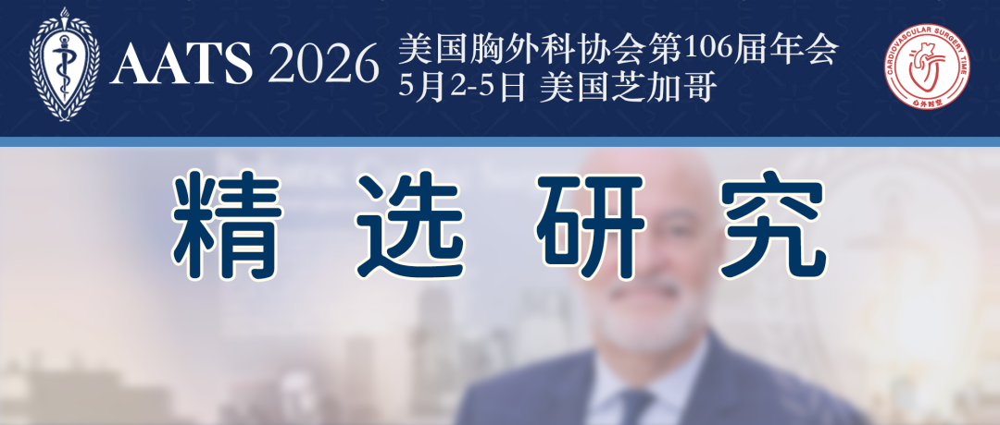
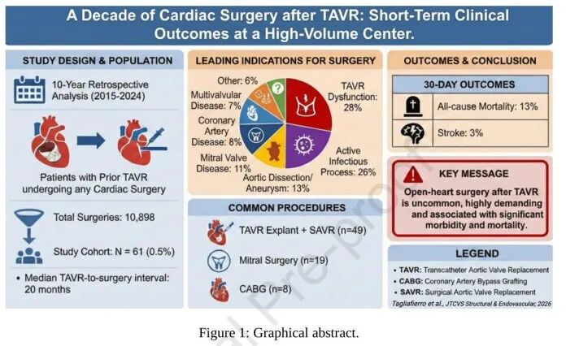
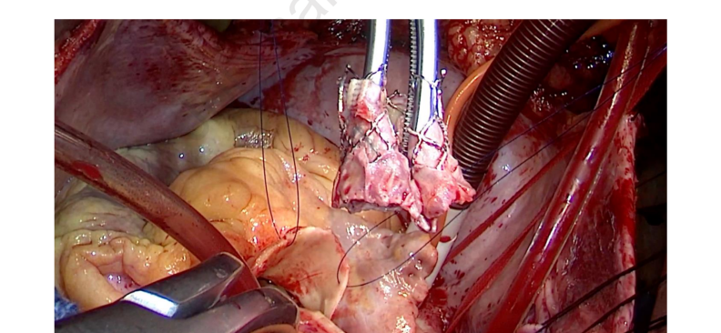
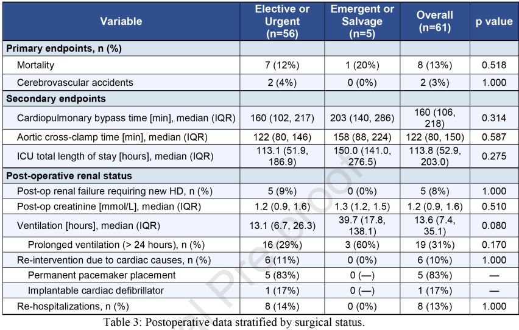

# AATS 2026 Selected Study | Cardiac Surgery After TAVR: The Real Cost From a Decade-Long Single-Center Cohort

**Source:** HeartValvePro  
**Original title:** AATS 2026 精选研究 | TAVR 术后再次心脏手术：十年单中心队列的真实代价  
**Original URL:** https://mp.weixin.qq.com/s/lsHRbogyeXJSNwEV4i_Dqw

AATS annual meetings often include not only conference abstracts and data that have not yet been formally published, but also studies already published in cardiothoracic journals such as JTCVS, JTCVS Open, and JTCVS Structural and Endovascular, which continue to be discussed in relevant sessions.

The studies summarized in this series have all been formally published in related journals and selected for presentation or display in AATS 2026 sessions. Their topics span the Ross procedure, aortic dissection, TAVR, pediatric aortic valve surgery, mitral valve repair, and valve materials for congenital heart disease, with presentations across adult cardiac surgery, aortic surgery, structural heart disease, and congenital heart disease sessions.

Author: HeartValvePro

The true cost of reintervention lies beyond the valve itself.

As indications for transcatheter aortic valve replacement (TAVR) continue to expand toward younger and lower-risk populations, an unavoidable clinical reality is emerging: over the long survival horizon ahead of them, these patients may very likely need to face cardiac surgery again. In a retrospective study published in JTCVS Structural and Endovascular in 2026, the Columbia University Irving Medical Center team provided a decade-long single-center answer. Among 10,898 cardiac operations, only 61 cases (0.5%) involved patients who had previously undergone TAVR. Behind this seemingly tiny proportion lies extremely high operative complexity and non-negligible perioperative risk.

Summary of study design, distribution of surgical indications, common operative types, and 30-day outcomes.

The clinical profile of these 61 patients illustrates the real dilemma of post-TAVR reintervention. Their median age was 72 years, and the median interval from the index TAVR to the subsequent operation was only 20 months. Even more important was the urgency of surgery: as many as 57% of cases were urgent or emergent/salvage operations. The leading reason for returning to the operating room was TAVR dysfunction (28%), followed by infective endocarditis (IE, 26%) and aortic pathology (13%). Put simply, these patients were not calmly undergoing a second procedure to pursue better hemodynamics. Most were forced into a high-risk rescue operation at the edge of valve failure or severe infection.

Intraoperative view during TAVR explant, showing the removed transcatheter heart valve.

## Operative Complexity: More Than Removing a Valve

The operative data further confirmed this complexity. Isolated operations accounted for only 33% of all cases (n=20), whereas the remaining 67% (n=41) were combined procedures. The most common operation was TAVR explant with surgical aortic valve replacement (SAVR), performed in 49 patients (80%). In addition, 19 cases involved mitral valve surgery, and 12 involved aortic root or arch surgery. This broad disease involvement directly extended operative times. In the overall cohort, median cardiopulmonary bypass (CPB) time reached 160 minutes, and aortic cross-clamp time reached 121 minutes.

When the analysis focused on the TAVR explant group (n=49) versus the non-explant group (n=12), CPB time was significantly longer in the former (173 vs 133 minutes, P=0.028), as was aortic cross-clamp time (125 vs 86 minutes, P=0.025). This reminds us that removing a transcatheter valve that has endothelialized or become encased in infected tissue is nothing like pulling out a catheter. It often means extensive dissection and reconstruction of the aortic root.

## Perioperative Outcomes: Quantifying the Real Cost

The cost ultimately appeared in postoperative outcomes. Overall 30-day or in-hospital all-cause mortality reached 13%, and stroke occurred in 3%. In addition, 31% of patients required prolonged mechanical ventilation (>24 hours), 8% required new dialysis, 61% received blood products postoperatively, 10% required cardiac-related reintervention, 34% were discharged to a rehabilitation facility, and the 30-day readmission rate was 13%.

Postoperative outcomes stratified by operative urgency: elective/urgent (n=56) versus emergent/salvage (n=5).

Although mortality in the emergent/salvage group was numerically higher than in the elective/urgent group (20% vs 12%), the difference did not reach statistical significance (P=0.518), likely in part because of the small sample size. Even so, the overall 13% mortality rate closely matches the 13.9% TAVR explant mortality reported in the STS database. In plain terms, this is a difficult battle. Even in an experienced high-volume center, patients still pay a heavy physiologic price to get through it.

The limitations of the study are also clear: a single-center retrospective design, inevitable selection bias, and a relatively small sample size. Yet it still provides an extremely important observational window. When we evaluate a younger or low-risk patient with aortic stenosis for an initial procedure, perhaps we should look beyond the immediate minimally invasive benefit of TAVR and ask one more question: if this valve fails in the future, or if the patient develops another cardiac lesion, will they be able to tolerate such a complex operation? This paper does not provide a standard answer. But with real numbers, it shows that cardiac surgery after TAVR is not an easy factory reset. It is a life test that must be treated with great caution.

## References

Tagliafierro M, Fatehi Hassanabad A, Nickles J, Sevensky R, Geirsson A, George I, Takayama H, Argenziano M, Pirelli L. A Decade of Cardiac Surgery after Transcatheter Aortic Valve Replacement: Short-Term Clinical Outcomes at a High-Volume Center. JTCVS Structural and Endovascular. 2026. doi:10.1016/j.xjse.2026.100128.

For collaboration or submissions, please leave a message in the WeChat official account or email adams.wang@heartvalvepro.com.

This content is intended solely for academic reference by medical and healthcare professionals. It does not constitute medical advice or any basis for diagnosis or treatment. Clinical decisions must be made by the attending physician based on individual patient factors and relevant clinical guidelines; this account assumes no legal liability arising therefrom. The technical evaluation and literature interpretation in this article are based on currently available evidence-based data and are intended to reflect academic discussion objectively; it does not represent an exclusive recommendation of any specific product or surgical technique.
