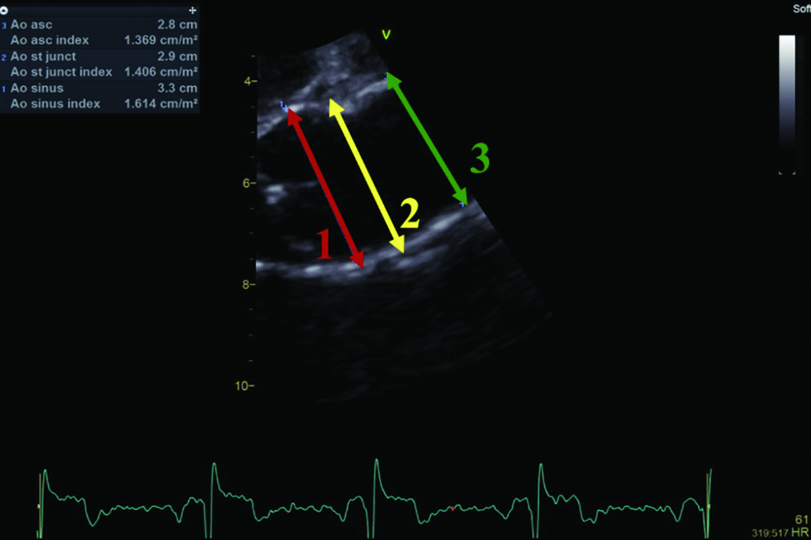
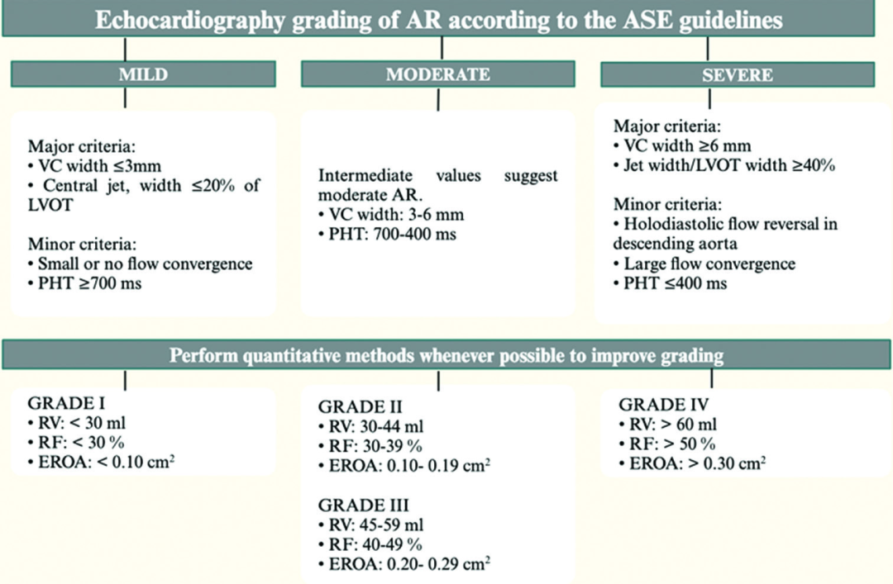
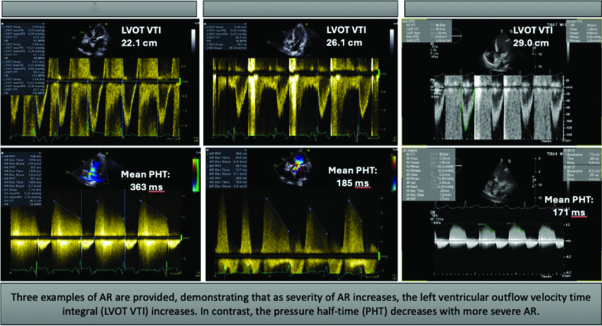

# 2026 Guideline Update: Quantifying Aortic Regurgitation and Deciding When to Intervene

**Source:** HeartValvePro  
**Original title:** 2026指南更新：主动脉瓣反流量化评估与治疗决策  
**Original URL:** https://mp.weixin.qq.com/s/nt6GKUiCqi5t8OP-1COnTA

Quantifying regurgitation, deciding intervention: where guidelines converge and diverge.

The clinical management of aortic regurgitation (AR) has always been marked by tension around the central question of when to intervene. A 2026 review published in Annals of Clinical Cardiology systematically summarized the etiologies, pathophysiology, quantitative assessment methods, and points of agreement and divergence between the European Society of Cardiology (ESC) and the American College of Cardiology/American Heart Association (ACC/AHA) guidelines on timing of treatment. It offers a complete academic map for understanding this valvular disease.

The etiologic spectrum of AR is far more complex than "valve degeneration." Acute AR may arise from infective endocarditis (IE), aortic dissection, or iatrogenic injury. Chronic AR includes rheumatic heart disease (RHD), bicuspid aortic valve, aortic root (AoR) dilatation, and connective tissue diseases such as Marfan syndrome. Pathophysiologically, the central mechanism of chronic AR is left ventricular volume overload. During diastole, blood regurgitates from the aorta into the left ventricle, triggering compensatory eccentric hypertrophy and chamber dilatation. Stroke volume and ejection fraction may remain normal early on, but with excessive myocardial fiber stretch, left ventricular systolic function eventually declines, compliance decreases, and interstitial fibrosis worsens. Acute AR is entirely different. Sudden large-volume regurgitation causes a rapid rise in left ventricular end-diastolic volume (LVEDV); if the ventricle cannot compensate, left ventricular diastolic pressure rises quickly, leading to pulmonary edema and cardiogenic shock. Equalization of diastolic pressures can also cause subendocardial hypoperfusion. This pathophysiologic distinction between acute and chronic AR determines very different intervention timelines.

## Carpentier Classification and AHA Staging: Two Complementary Frameworks

Mechanistic understanding of AR depends on the Carpentier functional classification. Type I features normal leaflet motion with aortic root dilatation, subdivided by the site of dilatation into Ia, involving the ascending aorta and sinotubular junction; Ib, involving the sinuses of Valsalva and sinotubular junction; Ic, involving the ventriculo-aortic junction; and Id, involving leaflet perforation. Type II reflects excessive leaflet motion due to prolapse. Type III reflects restricted leaflet motion. This classification directly guides surgical strategy: Type I repair focuses on root reconstruction, such as the David procedure, which preserves the aortic valve while replacing the root; Type II requires free-margin plication or resuspension; and Type III relies on decalcification and removal of fibrotic tissue to restore leaflet mobility.

Alongside the Carpentier classification is the AHA staging system for AR. Stage A denotes patients at risk, who are asymptomatic with normal valve structure. Stage B represents progressive disease, with mild or moderate AR and structural valve changes. Stage C is divided into C1, with left ventricular ejection fraction (LVEF) >55% and mild-to-moderate ventricular enlargement, and C2, with LVEF <=55% or severe dilatation. Stage D denotes symptomatic severe AR. Together, the two frameworks clarify the triangular relationship among mechanism, severity, and ventricular status.

Schematic diagram of aortic measurements under the Carpentier functional classification.

## Echocardiographic Quantification: A Ladder From Qualitative to Quantitative Assessment

Echocardiography remains the foundation of AR assessment. The American Society of Echocardiography (ASE) and the British Society of Echocardiography (BSE) each provide assessment algorithms. Both center on jet width, vena contracta (VC) width, regurgitant volume (RV), regurgitant fraction (RF), and effective regurgitant orifice area (EROA), although they differ in the priority given to qualitative versus quantitative parameters. Several key thresholds deserve attention: VC width >6 mm has high sensitivity and specificity for severe AR; EROA >0.30 cm² or RV >60 mL indicates severe AR; and holodiastolic flow reversal in the descending aorta with end-diastolic velocity >=20 cm/s strongly suggests severe AR. The BSE recommends follow-up every 12 to 24 months for moderate AR, every 6 to 12 months for severe AR not meeting operative criteria, and every 3 to 5 years for mild AR with AoR diameter >=40 mm.

Pressure half-time (PHT) is another meaningful parameter. A PHT >500 ms suggests mild AR, 200 to 500 ms suggests moderate AR, and <200 ms suggests severe AR. These classic thresholds are widely used in clinical practice. However, a retrospective study analyzed more than 100,000 transthoracic echocardiography (TTE) reports from 2000 to 2017 and identified approximately 2,500 AR patients with PHT data. Severe AR was confirmed in 18% of patients with PHT <200 ms, whereas only 0.6% of those with PHT >500 ms had severe AR. During 8 years of follow-up, approximately 800 deaths occurred, representing 30% of the cohort. Univariate analysis showed that PHT <=320 ms or >750 ms was associated with increased mortality, but the association disappeared after adjustment for diastolic function variables. PHT may therefore reflect the degree of diastolic dysfunction more than the severity of AR itself, adding uncertainty to clinical decision-making.

ASE echocardiographic assessment algorithm for chronic aortic regurgitation.

Cardiac magnetic resonance imaging (CMRI) is recommended by both guidelines as an adjunct when echocardiographic findings are inconclusive. CMRI is the gold standard for measuring ventricular volume and mass. Its regurgitant fraction threshold of 30% to 40% is lower than echocardiographic thresholds because direct volumetric measurement avoids geometric assumptions. A study of 81 AR patients comparing ASE guideline parameters with CMRI found that vena contracta width was the most accurate parameter for determining chronic AR severity. In addition, 4D-flow CMRI studies have found that a regurgitant fraction >=30% at the sinotubular junction in chronic AR is associated with increased LVEDV, extending the dimensionality of hemodynamic quantification.

## Timing of Surgery: Consensus and Gaps Between Guidelines

Surgical aortic valve replacement (SAVR) remains the gold standard for severe symptomatic AR, but timing of surgery, especially in asymptomatic patients, forms the most important guideline divergence. Both ESC and ACC/AHA agree that asymptomatic patients with severe AR and LVEF <50% should undergo surgery, a Class I recommendation. A left ventricular end-systolic diameter (LVESD) >50 mm or >25 mm/m² is also a Class I indication.

The divergence appears in the gray zone. ACC/AHA includes asymptomatic patients with LVEF 50% to 55% under a Class IIb recommendation, while ESC also assigns Class IIb but uses more cautious wording. In addition, ACC/AHA proposes progressive LVEF decline on serial echocardiography as a potential surgical indication (Class IIb), whereas ESC does not address this point. In a retrospective analysis of 673 asymptomatic patients with severe AR, only 20% met Class I or IIa surgical indications, yet 42% had at least one marker of early ventricular dysfunction: LVEF <60%, left ventricular end-systolic volume index >=45 mL/m², or abnormal global longitudinal strain (GLS). Among these, LVEF <60% had the strongest association with mortality. When all three markers were present, mortality was even higher than in patients who met only Class I guideline indications. This suggests that current guidelines may miss nearly half of asymptomatic patients who already have the potential to benefit from earlier surgery.

Representative echocardiographic grading examples of mild, moderate, and severe AR, showing trends in LVOT VTI and PHT with increasing severity.

The role of transcatheter aortic valve replacement (TAVR) in pure native AR is more cautious. Current TAVR devices are primarily designed for aortic stenosis (AS) and rely on valvular calcification for anchoring. Pure AR lacks this calcified support, with device migration or embolization rates approaching 20%, far higher than the 0.1% rate in AS. Oversizing transcatheter valves by 10% to 200% is currently suggested to improve anchoring, but long-term data remain insufficient. For procedure selection, ACC/AHA stratifies by age: SAVR is recommended for patients younger than 65 years; TAVR may be considered for those older than 80 years or with life expectancy <10 years; and shared decision-making is used for those aged 65 to 80 years. ESC stratifies by STS-PROM risk: SAVR is recommended for low-risk patients younger than 75 years (STS-PROM <4%), while TAVR is recommended for high-risk patients older than 75 years (STS-PROM >8%).

Medical therapy also has a role. ACE inhibitors and ARBs have clear effects in reducing preload and regurgitant volume. A cohort of 2,266 patients with AR, 45% of whom had left ventricular systolic dysfunction, showed a significant survival benefit with ACEi/ARB therapy, especially in the severe AR subgroup. Beta-blockers theoretically prolong diastolic filling time and may increase regurgitant volume, but existing studies have not shown obvious adverse effects on left ventricular dimensions, and some even suggest a survival advantage, particularly in patients with Marfan syndrome. Calcium channel blockers such as nifedipine can reduce afterload through vasodilation, delay ejection fraction decline, and postpone surgery, although their long-term survival impact remains to be further confirmed.

The more refined clinical quantification tools become, the less "when to intervene" can be answered automatically. From the millimeters of vena contracta width to the milliseconds of PHT, from the percentage of LVEF to the negative shift of GLS, data continue to become denser. Yet the analysis of 673 asymptomatic patients reveals a practical paradox: guidelines cover fewer than one-fifth of patients, while more than two-fifths already carry signals of early ventricular injury. Quantification gives us a scale. It still does not give the command.

## References

Hussain M, Hussain FA, Almdhaian J, Al Jarallah M, Dashti R, Al Mulla K, et al. Aortic regurgitation quantification, management, and guidelines: A 2026 update. Ann Clin Cardiol. 2026;8:18-29. doi:10.4103/ACCJ.ACCJ_4_26.

For collaboration or submissions, please leave a message in the WeChat official account or email adams.wang@heartvalvepro.com.

This content is intended solely for academic reference by medical and healthcare professionals. It does not constitute medical advice or any basis for diagnosis or treatment. Clinical decisions must be made by the attending physician based on individual patient factors and relevant clinical guidelines; this account assumes no legal liability arising therefrom. The technical evaluation and literature interpretation in this article are based on currently available evidence-based data and are intended to reflect academic discussion objectively; it does not represent an exclusive recommendation of any specific product or surgical technique.

