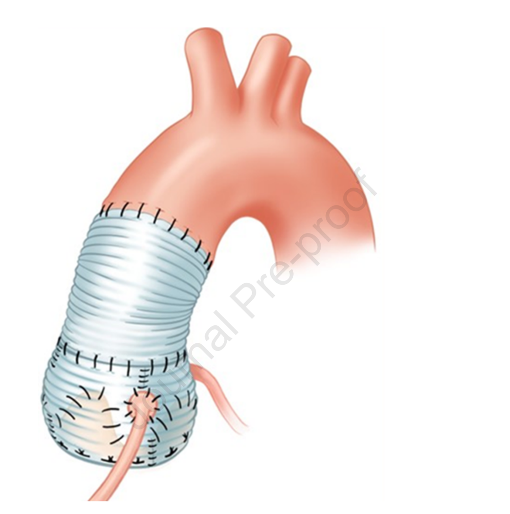
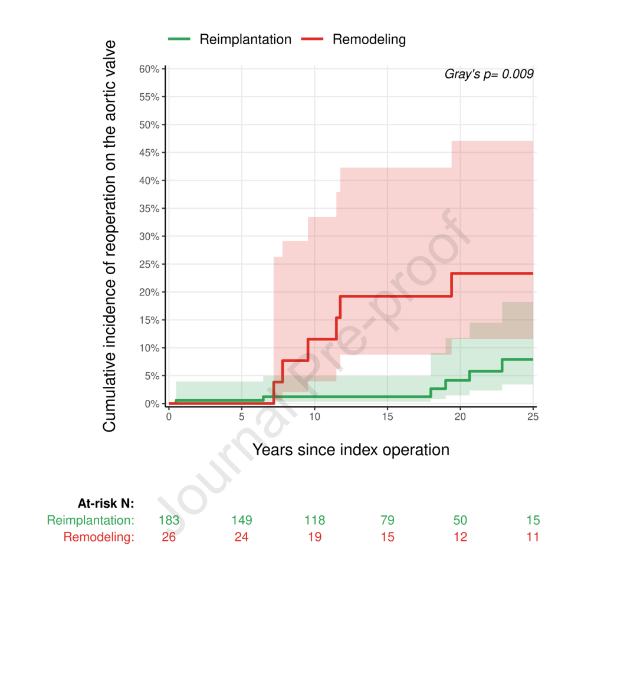
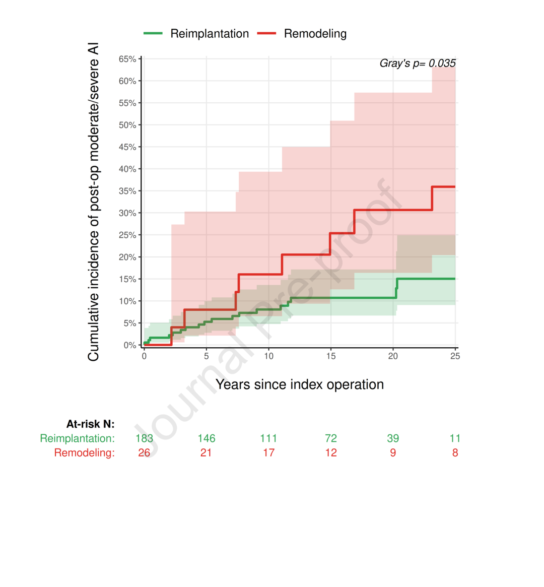
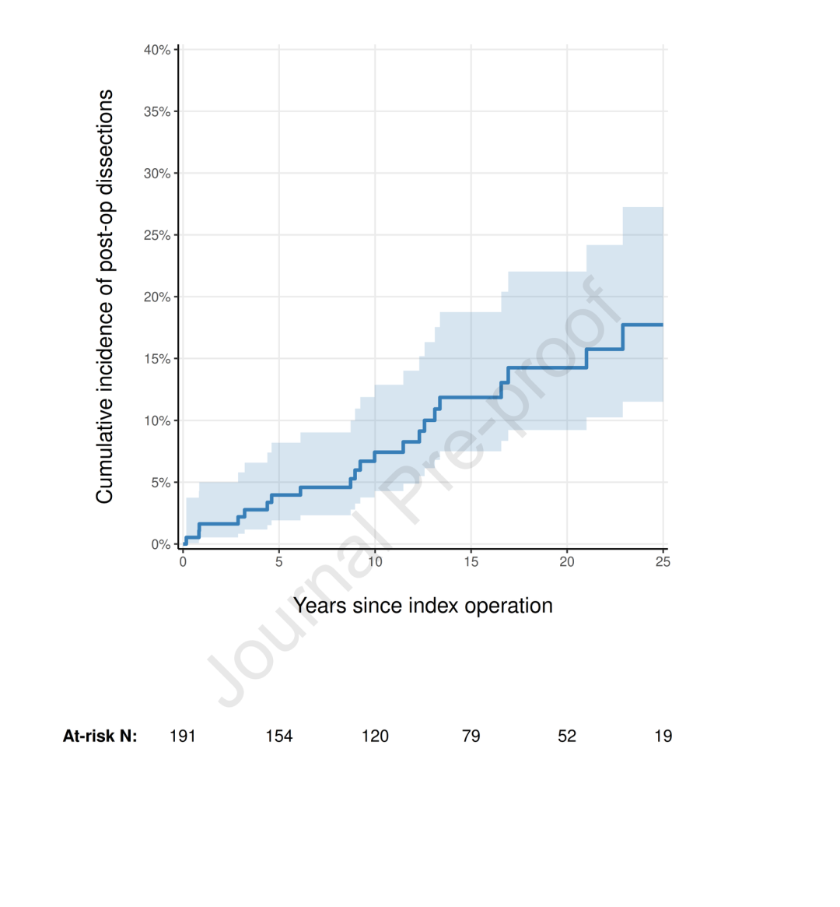

# Tirone David Team's 25-Year Follow-Up: Durability of Valve-Sparing Reimplantation for Marfan Aortic Root Aneurysm and the Persistent Concern of Distal Dissection

**Source:** HeartValvePro  
**Original title:** Tirone David团队25年随访：马凡综合征主动脉根部瘤保瓣再植术的耐久性与远端夹层隐忧  
**Original URL:** https://mp.weixin.qq.com/s/DkYFDA_iDo0K-O1Qle3aVQ

Time reveals the true cost of preserving the native valve.

In the surgical treatment of aortic root aneurysm associated with Marfan syndrome (MFS), preserving the native aortic valve has always been an attractive but debated option. In a 2026 study published in The Journal of Thoracic and Cardiovascular Surgery, Tirone E. David's team at Toronto General Hospital reported the longest follow-up to date for a cohort of aortic valve-sparing operations (AVS). The study included 215 patients with MFS who underwent surgery, 209 of whom (97%) received AVS. Median follow-up reached 14.6 years, with maximum follow-up of 25 years.

This quarter-century dataset not only validates the long-term durability of the reimplantation procedure, but also clearly exposes the high risk of distal aortic dissection after surgery in patients with MFS.

Schematic of the aortic valve reimplantation procedure using a tubular Dacron graft to create neo-aortic sinuses, showing the graft enclosing the aortic root and plication sutures at the sinotubular junction. Source: original Figure 1, Operative procedures section.

## Reimplantation Versus Remodeling: The 25-Year Separation

Among the two major valve-sparing techniques, the debate between reimplantation and aortic root remodeling has existed for a long time. In this cohort, 183 patients underwent reimplantation and 26 underwent remodeling. At 25 years, the cumulative incidence of aortic valve reoperation for all patients was 10.5%. When the two operations were analyzed separately, however, the difference was striking: 25-year reoperation was 7.9% after reimplantation and 23.3% after remodeling (Gray's P=0.009).

Cumulative incidence curves for aortic valve reoperation after reimplantation (green) and remodeling (red), Gray's P=0.009. At 25 years, reoperation was approximately 23.3% after remodeling and 7.9% after reimplantation. Source: original Figure 3, Results section, Reoperations on the aortic valve.

The same difference was evident in the incidence of aortic insufficiency (AI). At 25 years, the cumulative incidence of moderate or severe AI was 15.0% after reimplantation and 35.9% after remodeling (Gray's P=0.035). Multivariable analysis further confirmed remodeling as an independent risk factor for postoperative moderate or severe AI (HR 2.56 [1.09, 6.00], P=0.030).

Cumulative incidence curves for moderate or severe aortic insufficiency after reimplantation (green) and remodeling (red), Gray's P=0.035. At 25 years, incidence was approximately 35.9% after remodeling and 15.0% after reimplantation. Source: original Figure 3, Results section, Development of aortic insufficiency.

Put simply, the remodeling procedure is closer to natural physiology in root structure, but in a connective tissue disorder such as MFS, its lack of complete fixation of the aortic annulus leaves the root tissue vulnerable to continued dilatation under long-term hemodynamic load. In contrast, reimplantation encloses the entire aortic root within a Dacron conduit, achieving more durable stability of valve function.

## Distal Dissection: The Valve Is Preserved, but the Aorta Remains Vulnerable

Preserving the valve, however, does not mean the problem is solved permanently. The most sobering finding in this paper is the high incidence of postoperative distal aortic dissection. During follow-up, 21 patients developed new distal aortic dissection, with a 25-year cumulative incidence of 17.7%. Even more concerning, among 40 late deaths, 7 were directly caused by complications of aortic dissection, and another 4 sudden deaths occurred in patients who already had dissection.

Cumulative incidence curve for new distal aortic dissection after valve-sparing surgery, showing an approximately 17.7% cumulative incidence at 25 years, with at-risk N decreasing from 191 to 19. Source: original Figure 4, Results section, Postoperative aortic dissections.

This breaks the expectation of a definitive cure. In plain terms, the most dangerous root segment has been repaired, but the entire aortic tree in MFS remains structurally fragile. When a rigid Dacron conduit replaces the elastic native root, the pulse wave generated by ventricular ejection may strike the distal aorta with greater force, potentially increasing dissection risk. The article notes that creating neo-aortic sinuses by plicating the graft during reimplantation may help reduce distal dissection risk (HR 0.34 [0.13, 0.87], P=0.025), perhaps because the buffering effect of the neo-sinuses reduces distal wall shear stress. But the authors also acknowledge that the sample size remains small and that this finding requires further validation.

For patients with MFS, a successful valve-sparing operation is only the beginning of a long campaign. The 25-year all-cause mortality rate of 36.6% reminds us that this is a systemic disease. Preserving the native valve does avoid the anticoagulation burden of a mechanical prosthesis and offers young patients, with a median operative age of only 34 years, better quality of life. But the latent risk in the distal aorta remains. At a median follow-up of 14.6 years, among 156 patients (75%) who were alive without aortic valve reoperation, 97 (62%) were free from any adverse event, independent in daily life, and had minimal cardiovascular limitations. Still, 14 patients (9%) had varying degrees of disability and required assistance with daily activities.

This 25-year follow-up report does not use excellent valve survival to obscure the harsh background of the disease. With detailed data, it establishes reimplantation as the preferred valve-sparing treatment in MFS, while also placing the unresolved problem of distal aortic dissection directly before the cardiovascular surgical community. From more than 30 years of single-center experience at Toronto General Hospital, the value of this dataset lies not only in its duration, but also in its honest portrayal of what valve-sparing surgery can and cannot provide.

## References

David TE, Weiss J, Runeckles K, Chung J, David C, Ouzounian M. Late adverse cardiovascular events after aortic valve-sparing operations in patients with Marfan Syndrome. J Thorac Cardiovasc Surg. 2026. doi:10.1016/j.jtcvs.2026.03.615.

For collaboration or submissions, please leave a message in the WeChat official account or email adams.wang@heartvalvepro.com.

This content is intended solely for academic reference by medical and healthcare professionals. It does not constitute medical advice or any basis for diagnosis or treatment. Clinical decisions must be made by the attending physician based on individual patient factors and relevant clinical guidelines; this account assumes no legal liability arising therefrom. The technical evaluation and literature interpretation in this article are based on currently available evidence-based data and are intended to reflect academic discussion objectively; it does not represent an exclusive recommendation of any specific product or surgical technique.
