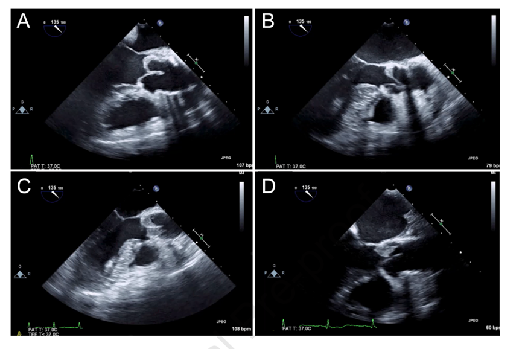
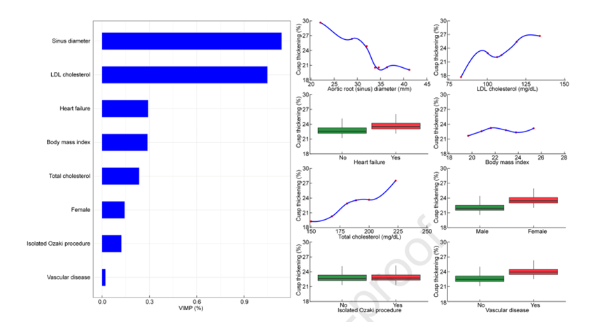
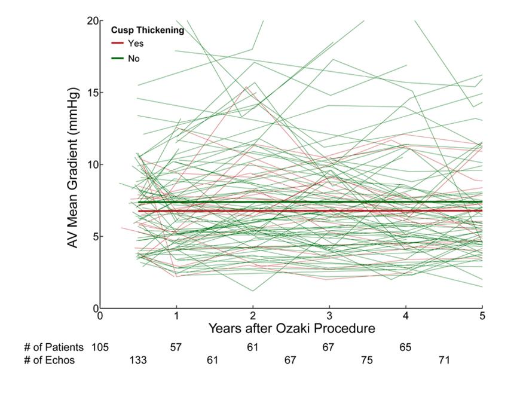
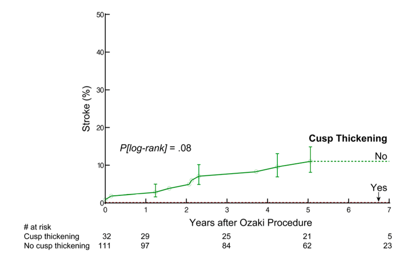
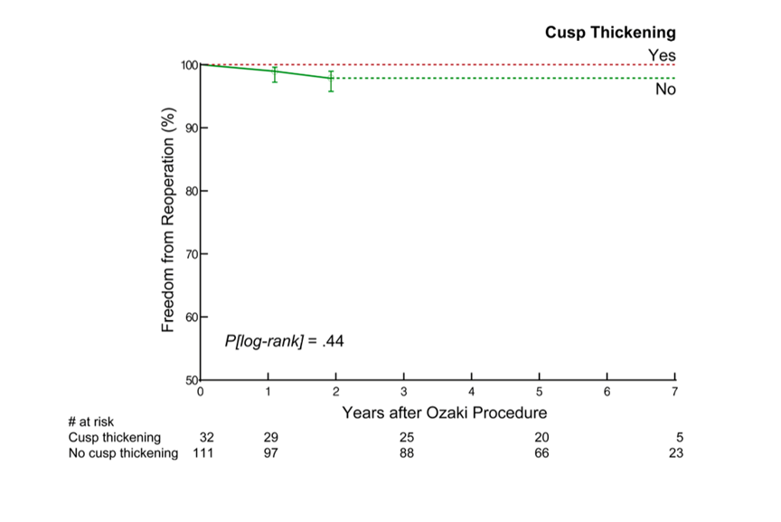
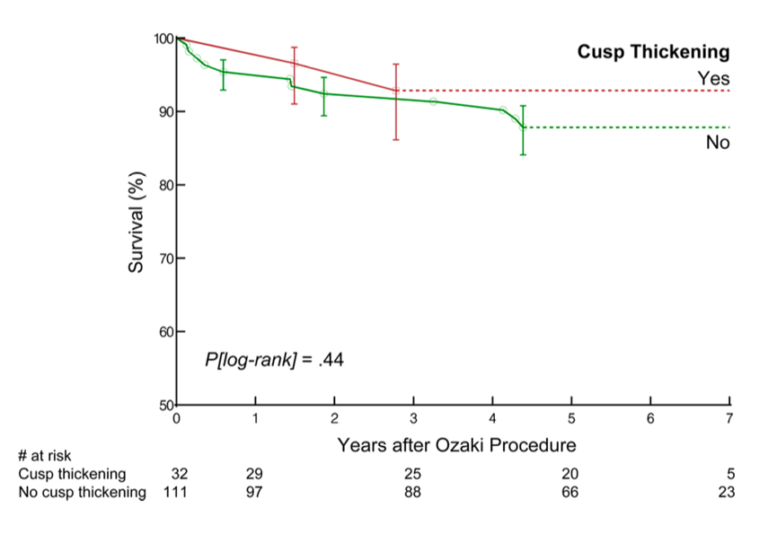

# Early Cusp Thickening and Reduced Motion After the Ozaki Procedure: Tissue Evolution and Long-Term Outcomes Behind the Echocardiographic Image

**Source:** HeartValvePro  
**Original title:** Ozaki术后早期瓣叶增厚与运动减弱：超声影像背后的组织演变与远期预后  
**Original URL:** https://mp.weixin.qq.com/s/pwtc7e3_PPsGlsrdK61kQA

Nature adapts through form, while surgery heals through function.

Among the many innovations in cardiovascular surgery, the aortic valve reconstruction technique using autologous pericardium, promoted by Professor Shigeyuki Ozaki and colleagues, occupies a unique position. By precisely tailoring glutaraldehyde-treated autologous pericardium to reconstruct the cusps, the technique offers an attractive therapeutic pathway for patients with aortic valve disease because of its potential to enlarge effective orifice area and optimize transvalvular gradients.

However, as the procedure has spread globally and postoperative echocardiographic surveillance has become more systematic, clinicians have gradually observed a concerning phenomenon. On early postoperative transesophageal echocardiography (TEE), some reconstructed cusps show abnormal hyperechoic thickening accompanied by markedly reduced systolic motion. This morphology closely resembles hypoattenuated leaflet thickening and reduced leaflet motion (HALT/RLM), commonly seen after transcatheter aortic valve replacement (TAVR). Is this tissue change hidden beneath the ultrasound probe merely a transient adjustment of surgically crafted tissue to hemodynamic load, or is it an early warning sign of future structural valve deterioration? A recent longitudinal study accepted by The Annals of Thoracic Surgery from the Toho University Ohashi Medical Center team in Japan offers a measured answer with unprecedented imaging density.

## Breaking the Stillness of an Echocardiographic Abnormality

This single-center retrospective cohort was not large, but its very high imaging completeness gives it strong clinical credibility. The investigators strictly screened patients who underwent the Ozaki procedure from 2014 to 2016. Ultimately, 143 patients with high-quality TEE images within 2 weeks after surgery were included in the analysis. This was a typical elderly valve-disease cohort, with a mean age of 69 years; 44% were women, and most had clear preoperative hemodynamic disturbance, with 65% having pure stenosis or mixed disease.

Figure 1. TEE images showing different severities of cusp thickening: A, <25%; B, 25%-50%; C, 50%-75%; D, >75%.

The echocardiographic finding was direct and striking. In this very early postoperative evaluation, 22% of patients (32 cases) had definite signs of cusp thickening, and 40% (57 cases) had reduced cusp motion. More interesting was the one-way pathophysiologic association: every case with cusp thickening also had reduced cusp motion, and the abnormality appeared particularly often in the right coronary cusp. Compared with the absolute symmetry of prosthetic valves after TAVR, the individualized reconstruction of different cusp sizes in the Ozaki procedure may create subtle tendencies in hemodynamic distribution.

## The Fluid-Mechanical Logic Behind Morphologic Abnormality

Faced with these frequent imaging abnormalities, the underlying anatomic and fluid-mechanical causes must be explored. Using a complex algorithmic model to analyze 28 variables, the study outlined a clinically valuable risk map. Smaller aortic sinus diameter, higher total cholesterol, and higher low-density lipoprotein (LDL) levels were independent core risk factors for early cusp thickening.

For reduced cusp motion, in addition to advanced age and hyperlipidemia, an important anatomic variable emerged: relative oversizing of the noncoronary cusp (NCC) and right coronary cusp (RCC), together with size mismatch among the three cusps.

Figure 2. Partial dependence plots predicting the risk of reduced cusp motion, showing the influence of patient age, LDL level, and cusp-size asymmetry on abnormal morphology.

This touches the central geometric issue in valve repair. The pathophysiology must be considered objectively. A glutaraldehyde-fixed autologous pericardial free patch differs fundamentally from a native leaflet with a living endothelium in how it transmits stress during the early period after implantation. Put simply, a statically tailored biological patch, suddenly exposed to the dynamic high-pressure ejection of the left ventricle, needs a period of local shape adaptation and physical remodeling.

It is like replacing the load-bearing doors of an old building with custom panels. If the frame, the aortic root, is itself irregular, and the three door panels, the reconstructed cusps, differ significantly in size, then with every forceful opening and closing, the side under unequal stress will inevitably experience friction, stasis, or early material wear. When the aortic sinuses cannot provide smooth vortical flow to assist cusp closure, local turbulent shear stress and blood stasis can increase local thrombus formation or fibrin deposition. The "thickening" and "stiffness" captured on ultrasound often represent the visual expression of this mechanical adjustment and hemodynamic conflict. This also strongly supports the core principle of pursuing symmetric tricuspidization during the Ozaki procedure.

## Time's Answer and Hemodynamic Outcomes

The true value of medical research often lies in validation over a long timescale. During a median follow-up of 5.9 years, these patients discharged with echocardiographic "imperfections" delivered a highly reassuring clinical answer. The investigators maintained considerable clinical restraint throughout follow-up and did not intensify or prolong antithrombotic therapy simply because TEE detected cusp thickening. Most patients received only 6 months of low-dose aspirin.

Figure 3. Follow-up trends in postoperative mean transaortic gradient. Regardless of whether cusp thickening was present, gradient curves remained stable and closely overlapping over several years.

The long-term data were robust. Kaplan-Meier curves showed no statistically significant difference in 5-year all-cause mortality between patients with and without early cusp thickening (93% vs 88%, P=.44). The 5-year probability of freedom from aortic valve reoperation was also similar, at 100% and 98%, respectively (P=.44). Regarding neurologic complications, the 5-year stroke rate in the thickening group was 0, compared with 9.6% in the non-thickening group (P=.08), which largely alleviates concern that morphologic abnormality inevitably leads to malignant embolic events.

Even more important, whether cusp thickening or reduced cusp motion was present or absent, the mean transaortic gradient remained stable in a very low and favorable range over several years (P=.39 and .25, respectively). Time did not worsen the lesion. Instead, it witnessed tissue remodeling. Serial ultrasound monitoring showed that the severity of early cusp thickening and reduced motion, initially defined as abnormal, gradually regressed and tended to normalize over time.

Figure 4. Kaplan-Meier curves comparing postoperative survival, freedom from reoperation, and cumulative stroke incidence.

The real importance of this study may not be merely that it identified early cusp thickening and reduced motion after the Ozaki procedure. More importantly, it helps reinterpret what these imaging abnormalities mean.

Previously, similar changes were easily associated with thrombosis or structural degeneration. This long-term follow-up study suggests that some early thickening and reduced motion in autologous pericardial cusps after the Ozaki procedure may instead represent a transient stage in tissue adaptation to blood flow and mechanical environment.

More importantly, with longer follow-up, these early abnormalities did not clearly translate into worse long-term outcomes, and imaging findings even gradually recovered in some patients. This gives post-Ozaki cusp changes a pattern of tissue evolution distinct from conventional prosthetic valve degeneration.

## References

Hoshino Y, Hayama H, Frankel WC, et al. Prevalence and Clinical Significance of Cusp Thickening and Reduced Cusp Motion after the Ozaki Procedure. The Annals of Thoracic Surgery. 2026. https://doi.org/10.1016/j.athoracsur.2026.03.003

For collaboration or submissions, please leave a message in the WeChat official account or email adams.wang@heartvalvepro.com.

This content is intended solely for academic reference by medical and healthcare professionals. It does not constitute medical advice or any basis for diagnosis or treatment. Clinical decisions must be made by the attending physician based on individual patient factors and relevant clinical guidelines; this account assumes no legal liability arising therefrom. The technical evaluation and literature interpretation in this article are based on currently available evidence-based data and are intended to reflect academic discussion objectively; it does not represent an exclusive recommendation of any specific product or surgical technique.
