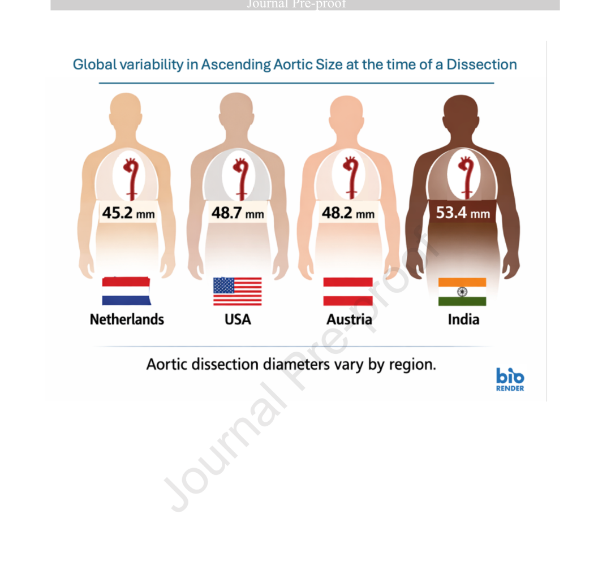
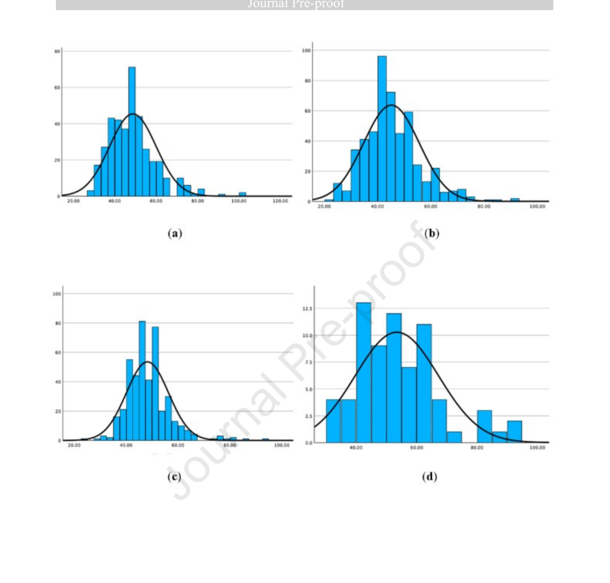
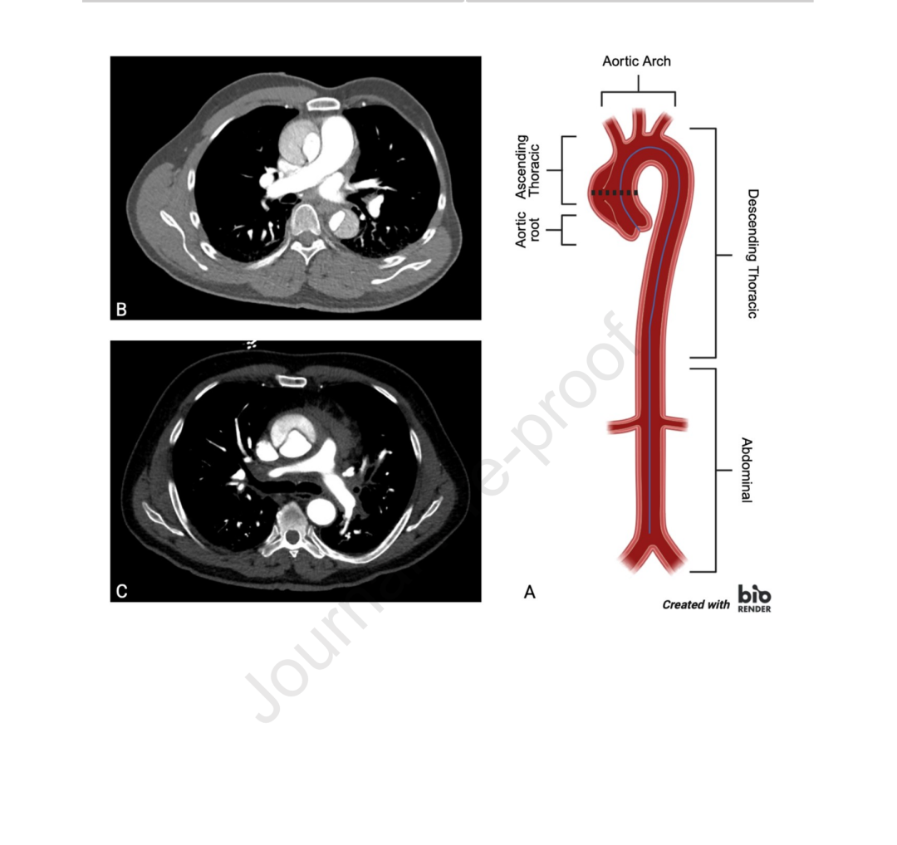

# The Size Paradox in Ascending Aortic Dissection: Can the 55-mm Threshold Still Apply Universally?

**Source:** HeartValvePro  
**Original title:** 升主动脉夹层的尺寸悖论：55mm阈值是否还能放之四海而皆准？  
**Original URL:** https://mp.weixin.qq.com/s/LP7Q9lH9RMl-YYN7bXOIcw

Dissection dimensions differ, challenging universal thresholds.

In preventive strategies for acute type A aortic dissection (ATAAD), a 55-mm ascending aortic diameter has long been treated as a red line. However, a 2026 multicenter retrospective study published in JTCVS Structural and Endovascular has placed the universality of this absolute standard under scrutiny. Conducted by collaborators from Amsterdam University Medical Centers, Yale University, and other institutions, the study analyzed data from 1,388 patients with ATAAD across Europe, North America, and South Asia. It revealed an important clinical phenomenon: most dissections occurred when aortic diameter was still well below the current preventive surgical threshold, and this size varied significantly by sex and geography.

The investigators collected data from four international centers in the Netherlands (n=500), the United States (n=382), Austria (n=435), and India (n=71). The mean ascending aortic diameter of the overall cohort was 47.5 ± 10.4 mm. Strikingly, only 19.5% of patients had a diameter of 55 mm or greater when dissection occurred, while 39.7% of events clustered in the intermediate 45- to 54-mm range. Considering that acute dissection itself, because of wall expansion and intramural hematoma formation, can acutely increase aortic diameter by 5 to 10 mm, the true pre-dissection diameter may have been even smaller. Put simply, if we stand guard only at the 55-mm gate, most danger actually occurs outside the gate.

Comparison of mean ascending aortic diameter at the time of dissection across four countries: Netherlands, 45.2 mm; United States, 48.7 mm; Austria, 48.2 mm; India, 53.4 mm. Source: original Central Figure, Abstract section, Global variability in ascending aortic size at the time of dissection.

## Geographic Differences in Diameter: The Same Disease, Different Starting Points

The geographic comparison showed particularly clear differences. Using Dutch patients, whose mean diameter was 45.2 ± 10.5 mm, as the reference, multivariable regression showed that Austrian patients had diameters 2.42 mm larger (95% CI 1.01-3.85, P<.001), US patients 3.11 mm larger (95% CI 1.61-4.62, P<.001), and Indian patients 7.09 mm larger (95% CI 4.00-10.17, P<.001), reaching 53.4 ± 13.8 mm. Even more noteworthy, Indian patients developed dissection at a mean age of only 48.5 years, more than a decade earlier than Western cohorts. This pattern of larger diameters at a younger age suggests that the natural history of aortic disease and intrinsic wall vulnerability may differ fundamentally among populations.

Histograms of ascending aortic diameter distribution in the United States (a), Netherlands (b), Austria (c), and India (d), showing distinct peak distributions across countries. Source: original Figure 2, Results section, Ascending aortic diameter distribution.

This geographic difference remained independently significant in multivariable models even after adjustment for age, sex, height, body surface area (BSA), diabetes, hypertension, connective tissue disease, and bicuspid aortic valve (BAV). It is also worth noting that BAV itself was independently associated with a larger diameter at dissection (B=6.00, 95% CI 3.46-8.54, P<.001), consistent with its known tendency toward aortic dilatation.

## Sex Dimension: Women Dissect at Smaller Diameters

Sex also reshapes risk assessment. The data showed that women developed dissection significantly later than men (68 vs 59 years, P<.001), but their absolute diameter at dissection was smaller (46.0 ± 9.8 mm vs 48.4 ± 10.6 mm, P<.001). Multivariable regression further confirmed that female sex was independently associated with a smaller aortic diameter at dissection (B=-1.84, 95% CI -3.18 to -0.50, P=.007). In plain terms, the female aorta may reach its tensile limit at a smaller size. This again suggests that relying only on an absolute number, detached from body surface area or expected baseline size, may leave some vulnerable groups exposed to unrecognized danger.

Representative CT angiography and aortic anatomy images showing measurement of maximal ascending aortic diameter using centerline multiplanar reconstruction and orthogonal imaging planes. Source: original Figure 1, Methods section, CT measurement.

The boundaries of the study are also clear. As a retrospective analysis, it included only surgically treated patients and did not capture those who died before intervention, inevitably introducing selection bias. In addition, measurements came from acute-phase CT angiography, and there is currently no validated method to perfectly reconstruct the true pre-dissection diameter. The investigators also acknowledged that classifying patients by country cannot exclude the effect of ethnic heterogeneity within each country. The Indian cohort was relatively small (n=71), and its conclusions require validation in larger datasets.

Returning to the individual patient, these data call for a reconsideration of what "safe" means. When one absolute number can no longer provide equal protection for all people, risk assessment must return to more refined dimensions. This paper does not attempt to immediately overturn current guidelines, nor does it offer a new universal number. Its real value lies in demonstrating, through detailed multinational data, that sex and population specificity deserve the same attention as absolute diameter on the risk scale of aortic dissection.

## References

Grewal N, Bacour N, Zafar M, Grewal S, Idhrees M, Velayudhan B, Dumfarth J, Gasser S, Elefteriades J. Dissection Dimensions Differ: Global Variability in Ascending Aortic Size Challenges Universal Surgical Thresholds. JTCVS Structural and Endovascular. 2026. doi:10.1016/j.xjse.2026.100124

For collaboration or submissions, please leave a message in the WeChat official account or email adams.wang@heartvalvepro.com.

This content is intended solely for academic reference by medical and healthcare professionals. It does not constitute medical advice or any basis for diagnosis or treatment. Clinical decisions must be made by the attending physician based on individual patient factors and relevant clinical guidelines; this account assumes no legal liability arising therefrom. The technical evaluation and literature interpretation in this article are based on currently available evidence-based data and are intended to reflect academic discussion objectively; it does not represent an exclusive recommendation of any specific product or surgical technique.
