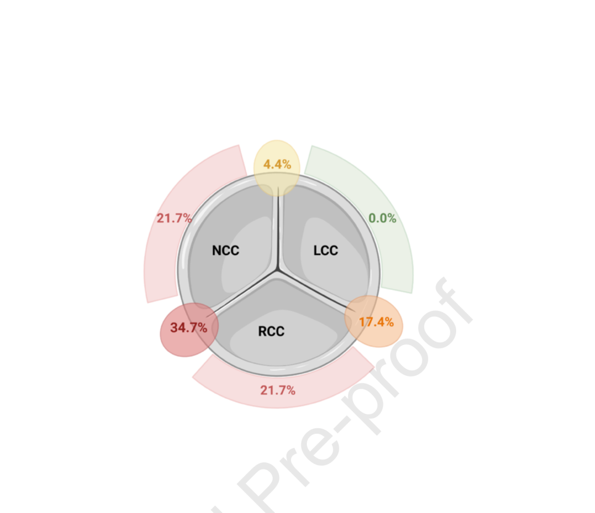
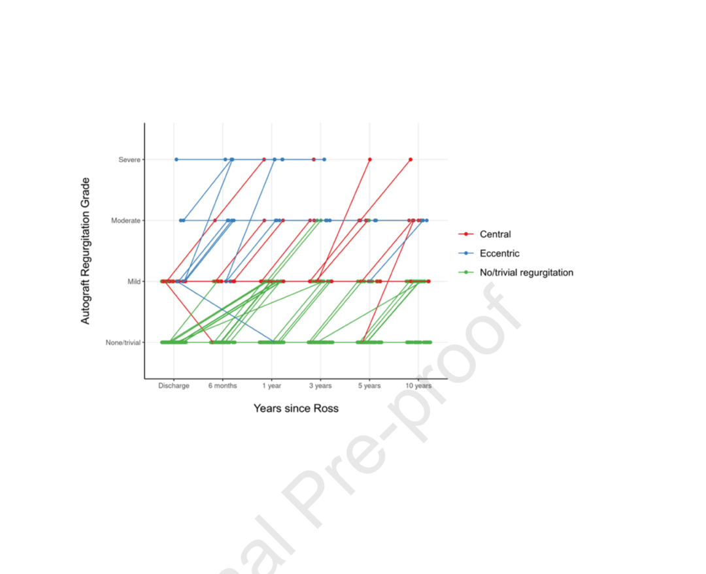
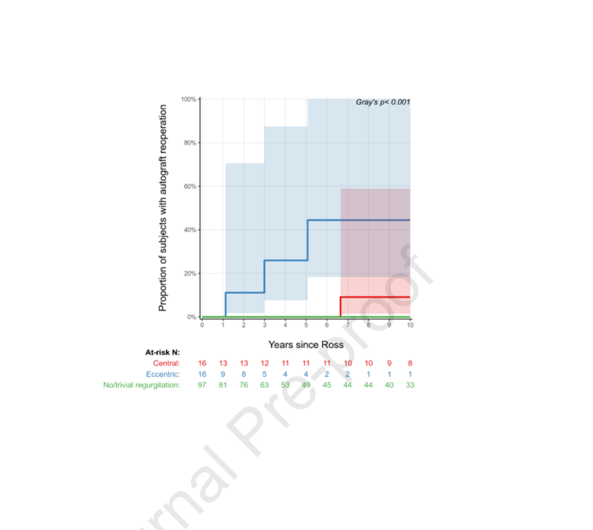

# A New Clue to Autograft Durability After the Ross Procedure: The Prognostic Value of Regurgitant Jet Type

**Source:** HeartValvePro  
**Original title:** Ross手术后自体移植物耐久性的新线索：反流束类型的预后价值  
**Original URL:** https://mp.weixin.qq.com/s/bZvVa9LsPIltZ-sKiFsunw

Not all regurgitation carries the same implications.

In the treatment of congenital aortic valve disease, the Ross procedure, using a pulmonary autograft to replace the aortic valve, has become a preferred strategy for children and young patients in experienced centers because of its excellent hemodynamics and growth potential. Yet the long-term durability of the autograft remains a persistent concern for surgeons. In a 2026 retrospective study published in The Journal of Thoracic and Cardiovascular Surgery, a joint team from The Hospital for Sick Children in Toronto and Marie Lannelongue Hospital in France focused on an often-overlooked echocardiographic detail: the type of regurgitant jet. They sought to answer a central question: beyond the severity of regurgitation, can the jet pattern, eccentric or central, provide earlier warning about the fate of the autograft?

The study included 131 patients aged 12 years or older with congenital aortic valve disease, all of whom underwent the Ross procedure using a full-root replacement technique. Operations were performed between 1996 and 2024, with a median follow-up of 5.7 years. On intraoperative transesophageal echocardiography (TEE), 31 patients (23.7%) had mild or greater autograft regurgitation (AR), but only 1 had moderate or greater AR. If one looked only at regurgitation severity, this seemed like a reassuring start. However, when the investigators divided the jets by morphology into eccentric and central types, two very different prognostic trajectories emerged.

## Eccentric Regurgitation: An Early Signal of Geometric Imbalance

The data revealed a stark fact: intraoperative eccentric regurgitation, even when only mild, was associated with a very high long-term reoperation risk. Among 16 patients with intraoperative eccentric AR, the 10-year autograft reoperation rate was 44.4% (95% CI, 18.3%-100.0%). In contrast, among 16 patients with central AR, the 10-year reoperation rate was only 9.1% (95% CI, 1.4%-58.9%; P<.05). Even more strikingly, when no regurgitation was observed intraoperatively, the 10-year reoperation rate was 0%.

The anatomic origins of eccentric regurgitation also showed a clear pattern. Among 23 patients with eccentric AR, the most common origin was the right coronary-noncoronary commissure (34.7%), followed by the noncoronary cusp (21.7%) and right coronary cusp (21.7%). This distribution is intriguing because it corresponds exactly to the region completed last during autograft implantation in the Ross procedure, where the suture line is placed slightly higher than elsewhere to avoid the conduction system. In the discussion, the investigators noted that this anatomic clustering suggests technical details during implantation may contribute to leaflet distortion or commissural imbalance.

Anatomic origin distribution of eccentric autograft regurgitant jets, with the right coronary-noncoronary commissural region (34.7%) as the most common source. Source: original Figure 1, Results section, distribution of eccentric AR origins.

Put simply, eccentric regurgitation is like an early sign that the hinge of a door is loose. Even if the leak is small, it signals imbalance of the entire structure. Central regurgitation is more like a doorframe that gradually widens over time. There is a gap, but the door panels themselves remain relatively functional. This intuitive distinction is reflected clearly in the data.

## Two Jet Types, Two Trajectories

The prognostic difference between jet types appeared not only in reoperation rates, but also in the speed and pattern of regurgitation progression. Patients with eccentric AR had earlier and steeper progression; some progressed rapidly from mild to severe AR within several postoperative years. Patients with central AR showed slower progression and a more stable overall trajectory.

Progression trajectories of autograft regurgitation by jet type. Eccentric jets (blue) progressed earlier and more steeply, whereas central jets (red) progressed more slowly. Source: original Figure 2, Results section, AR progression trajectories.

This difference in progression pattern is closely related to the mechanisms behind the two jet types. The investigators found that eccentric AR was strongly associated with the fully supported Dacron technique; 74% of patients with eccentric AR had received this technique, whereas 74% of patients with central AR had undergone unsupported Ross procedures. After adjustment for support technique, the hazard ratio for eccentric jet type remained 3.3 times that of central jet type, suggesting that the jet pattern itself has prognostic value independent of surgical technique.

In the unsupported Ross subgroup, AR severity was closely associated with aortic annular and sinus dilatation, and this central regurgitation pattern corresponded to a relatively benign clinical course. This supports an important concept: in this setting, central AR primarily reflects progressive root remodeling rather than intrinsic leaflet failure. In other words, both are "regurgitation," but eccentric AR points toward a leaflet-level problem, while central AR points toward a change in root volume. These two situations require very different clinical responses.

Cumulative incidence curves for autograft reoperation stratified by intraoperative regurgitant jet type. Eccentric jets (blue) were significantly higher than central jets (red) and no-regurgitation cases (green), Gray's P<0.001. Source: original Figure 3, Results section, intraoperative residual AR diagnosis.

The limitations of this study also deserve attention. As a single-center retrospective analysis, its median follow-up of 5.7 years remains limited for assessing long-term Ross durability, resulting in wide confidence intervals for late outcomes. The strong association between eccentric regurgitation and the fully supported Dacron technique also makes it difficult to fully separate the independent effect of the surgical technique itself, although regression analysis after adjustment for support technique still supports the independent prognostic value of jet type. In addition, because the sample size for eccentric regurgitation subtypes was limited, the study could not provide more granular prognostic analysis by different anatomic origins. These limitations are frankly acknowledged in the paper, and the authors clearly state that the findings require validation in larger multicenter studies.

When we move our gaze from the ultrasound screen back to the patient, all these geometric parameters and flow patterns ultimately point toward a simple wish: that this "heart door" built from the patient's own tissue can open and close longer and more smoothly with every heartbeat. This study does not provide all the answers. But it reminds us that when assessing the fate of an autograft, listening to the direction of flow may matter more than simply measuring its size.

## References

Provost B, Fournier E, Weixler V, Deng MX, Howell A, Ho G, Runeckles K, Honjo O. Regurgitant Jet Type Predicts Autograft Outcomes After the Ross Procedure in Congenital Patients. The Journal of Thoracic and Cardiovascular Surgery. 2026. doi:10.1016/j.jtcvs.2026.03.607.

For collaboration or submissions, please leave a message in the WeChat official account or email adams.wang@heartvalvepro.com.

This content is intended solely for academic reference by medical and healthcare professionals. It does not constitute medical advice or any basis for diagnosis or treatment. Clinical decisions must be made by the attending physician based on individual patient factors and relevant clinical guidelines; this account assumes no legal liability arising therefrom. The technical evaluation and literature interpretation in this article are based on currently available evidence-based data and are intended to reflect academic discussion objectively; it does not represent an exclusive recommendation of any specific product or surgical technique.
