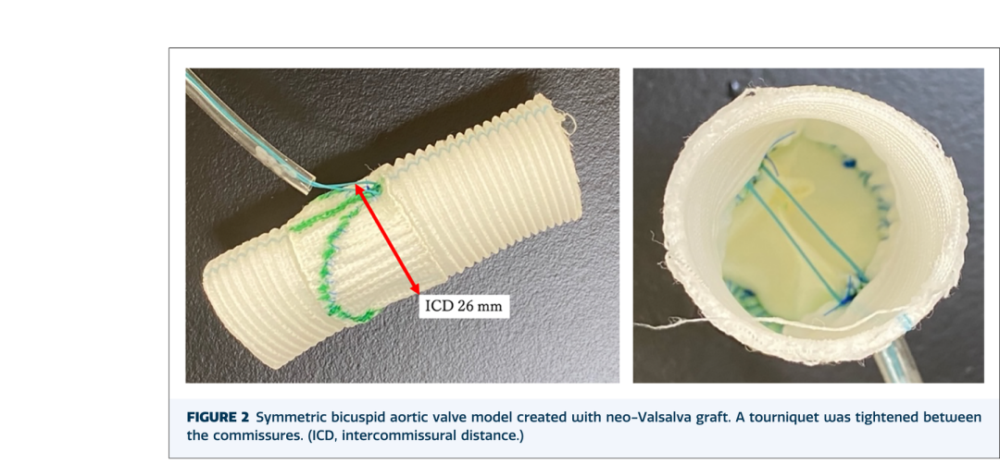
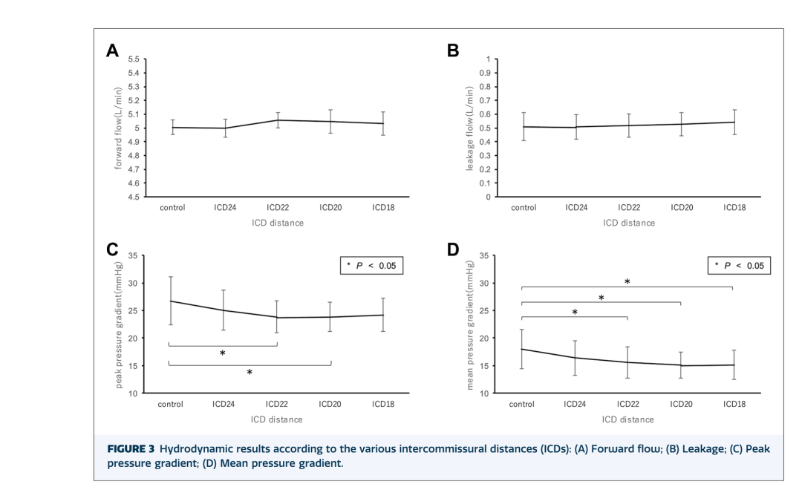
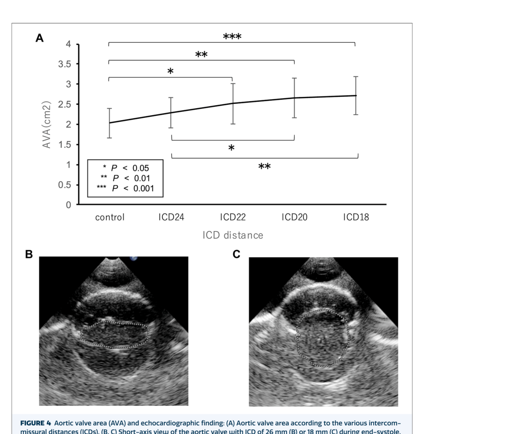

# In Vitro Evidence for Intercommissural Distance Shortening in Symmetric Bicuspid Aortic Valve Repair

**Source:** HeartValvePro  
**Original title:** 二叶式主动脉瓣对称修复中瓣联合间距缩短的体外证据  
**Original URL:** https://mp.weixin.qq.com/s/qBb5wCFHVtRaJR6ab9VkDw

Geometry shapes flow before flow reveals geometry.

In bicuspid aortic valve (BAV) repair, symmetrization is almost always discussed together with opening area. In a 2026 short report published in Annals of Thoracic Surgery Short Reports, a team from The Jikei University School of Medicine and Waseda University narrowed the question very specifically: after central plication brings the free margins of the two leaflets closer to equal length, can further shortening of the intercommissural distance (ICD) release some of the already elevated leaflet tension and thereby increase the aortic valve area (AVA)?

The background judgment in the paper is not exaggerated. It notes that central plication helps create 180° symmetry, but may also reduce postoperative AVA in BAV. Prior data suggest that a postoperative peak transvalvular pressure gradient (PPG) greater than 20 mmHg is associated with increased reoperation risk. Therefore, the real question is not symmetry itself, but how much opening reserve the valve can still maintain after symmetrization.

## Reducing Stenosis Risk Back to Geometric Parameters

The in vitro model was essentially a translation of this problem into geometry. Six pairs of symmetric BAV models were created by suturing bovine pericardial leaflets into a neo-Valsalva graft. The free margin length (FML) was 30 mm and the geometric height was 20 mm. Central plication then shortened the FML to 26 mm, creating a stenotic model with PPG greater than 20 mmHg. The ICD was subsequently shortened stepwise from 26 mm to 24, 22, 20, and 18 mm, corresponding to progressive tightening of the sinotubular junction (STJ) diameter.

The pulsatile circuit conditions were kept stable: forward flow of 5.0 L/min, heart rate 70 beats/min, systolic duration 35%, and aortic pressure 120/80 mmHg. Each model was measured 3 times, yielding 18 measurement sets. The study did not measure the subjective feel of one repair technique, but a more basic question: when leaflet tension prevents the valve from opening fully, is the limitation only in the leaflets themselves, or is the distance between the two commissures also constraining opening?

Symmetric BAV model and intercommissural distance-shortening device used in the experiment. Source: original Figure 2, Methods section, In vitro stenotic BAV model.

## Opening Area Increased, but the Improvement Was Not Linear

Flow remained stable. Forward flow stayed at approximately 5.0 L/min throughout. Regurgitation increased slightly as ICD shortened, from 0.47 ± 0.10 L/min in the control group to 0.52 ± 0.09 L/min at ICD18, but the difference was not statistically significant (P=.17). At least in this model, ICD shortening did not immediately create a meaningful regurgitant penalty.

The true change was in gradient. PPG fell from 26.75 ± 4.33 mmHg in the control group to 23.85 ± 2.91 mmHg at ICD22 (P<.05). Mean transvalvular pressure gradient (MPG) fell from 17.57 ± 3.59 mmHg to 14.76 ± 2.40 mmHg at ICD20 (P=.01). But the curve did not continue to fall indefinitely. The improvement was concentrated at ICD24 and ICD22; with further shortening, benefit began to plateau, and at ICD18 the gradient rose slightly compared with ICD20. Perhaps the most valuable point in the paper lies here: the effect of ICD shortening is not simply unidirectional amplification. It is more like finding a balance zone after leaflet tension has been redistributed.

Changes in forward flow, regurgitation, peak gradient, and mean gradient at different intercommissural distances. Source: original Figure 3, Results section, hydrodynamic results.

The AVA change was more intuitive. It increased continuously from 2.03 ± 0.37 cm² in the control group to 2.71 ± 0.47 cm² at ICD18 (P<.01), and echocardiographic short-axis images showed a larger opening contour. Put simply, after ICD shortening, the valve did not merely change shape on paper. At the moment of ejection, it truly opened more. A dynamic difference that is difficult to see after symmetric BAV repair was laid out here with relative clarity for the first time.

Aortic valve area and short-axis echocardiographic openings at different intercommissural distances. Source: original Figure 4, Results section, AVA increased significantly.

The boundaries of the evidence are also clearly stated. This remains a basic experiment. The leaflets were bovine pericardium, and the loop used tap water rather than blood; real tissue elasticity, viscosity, and long-term fatigue were not included in the model. The paper also notes that simply shortening the commissural position does not release tension near the annulus, and the graft may develop a snowman-like strain pattern due to suture traction. This may explain why improvement slowed after ICD20.

Clinical translation was also not overstated. The sutures are directly exposed to blood flow, and whether this creates turbulence or thrombus adhesion remains unresolved. AVA measurement by echocardiography is sensitive to imaging plane, so measurements were restricted to the same observer. In other words, this short report does not provide an operative pathway ready for immediate adoption. It provides a relatively clear in vitro mechanical clue.

If we shift the perspective to postoperative follow-up, the truly relevant question is not whether the ICD changed from 26 mm to 18 mm, but whether the repaired valve can retain enough opening reserve during every ejection without leaving behind a new stenotic problem for the future. These 6 pages do not attempt to answer the whole question. But they place the stenosis risk after symmetric BAV repair onto a geometric parameter that can be measured and further discussed. The value of the paper lies not in announcing that an endpoint has been reached, but in presenting the relationship among tension, opening, and flow in a quieter and more concrete way.

## References

Hoshino S, Arimura S, Takada J, Okamoto Y, Mineta S, Iwasaki K, Kunihara T. Does Intercommissural Distance Shortening in Bicuspid Aortic Valve Repair Improve Valve Opening Area? Ann Thorac Surg Short Reports. 2026;4:102-107. doi:10.1016/j.atssr.2025.08.010.

For collaboration or submissions, please leave a message in the WeChat official account or email adams.wang@heartvalvepro.com.

This content is intended solely for academic reference by medical and healthcare professionals. It does not constitute medical advice or any basis for diagnosis or treatment. Clinical decisions must be made by the attending physician based on individual patient factors and relevant clinical guidelines; this account assumes no legal liability arising therefrom. The technical evaluation and literature interpretation in this article are based on currently available evidence-based data and are intended to reflect academic discussion objectively; it does not represent an exclusive recommendation of any specific product or surgical technique.
