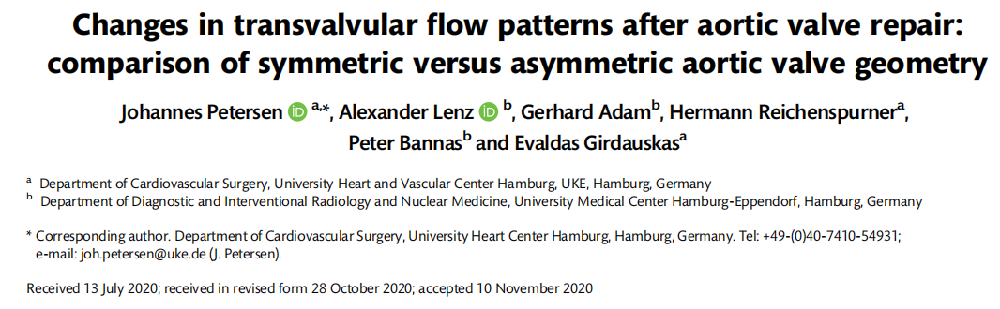

# 二叶式主动脉瓣对称修复中瓣联合间距缩短的体外证据

Geometry shapes flow before flow reveals geometry.

二叶式主动脉瓣 (bicuspid aortic valve, BAV) 修复里，对称化几乎总与开放面积放在一起讨论。2026 年发表于 Annals of Thoracic Surgery Short Reports 的一篇 short report 中，东京慈惠会医科大学与早稻田大学团队把问题收得很具体：当中央褶皱把两瓣自由缘拉回到更接近的长度后，若再缩短瓣联合间距 (intercommissural distance, ICD)，能否把已经偏紧的瓣叶张力松开一些，从而换来更大的主动脉瓣面积 (aortic valve area, AVA)？

这篇文章的背景判断并不夸张。文中提到，中央褶皱有助于形成 180° 对称，但也可能让 BAV 术后 AVA 变小；既往资料里，术后峰值跨瓣压差 (peak transvalvular pressure gradient, PPG) 超过 20 mm Hg 与再手术风险升高相关。因此，真正需要被追问的，并不是对称本身，而是对称之后，瓣膜还能保留多少开放余地。

把狭窄风险拆回到几何参数

体外模型的搭建，几乎就是把这个问题翻译成几何学。6 对对称 BAV 由牛心包片缝入 neo-Valsalva graft，自由缘长度 (free margin length, FML) 为 30 mm，几何高度 20 mm；随后再通过中央褶皱把 FML 缩到 26 mm，直到形成一个 PPG 超过 20 mm Hg 的狭窄模型。之后，ICD 从 26 mm 依次缩短到 24、22、20 和 18 mm，对应的其实是窦管交界 (sinotubular junction, STJ) 直径逐步收紧。

脉动回路的条件也保持得很稳定：前向流量 5.0 L/min，心率 70 次/分，收缩期占比 35%，主动脉压 120/80 mm Hg，每个模型重复 3 次，共得到 18 组测量值。这里测的不是某一种成形技巧的手感，而是一个更基础的问题：当瓣叶因为张力过高而开不大时，限制它的到底只是瓣叶本身，还是两侧瓣联合之间的距离也在一并收束。

实验用对称二叶式主动脉瓣模型与瓣联合间距缩短装置（来源：原文 Figure 2 — Methods 节中 In vitro stenotic BAV model 小节）

开放面积增大，但改善并非线性

先保持不变的，是流量。前向流量始终稳定在约 5.0 L/min；返流虽随 ICD 缩短略有增加，但从对照组 0.47 ± 0.10 L/min 到 ICD18 的 0.52 ± 0.09 L/min，差异并未达到统计学意义（P = .17）。至少在这个模型里，ICD 缩短没有立刻换来一个更明显的漏流代价。

真正变化的是压差。PPG 从对照组的 26.75 ± 4.33 mm Hg 降到 ICD22 的 23.85 ± 2.91 mm Hg（P < .05）；平均跨瓣压差 (mean transvalvular pressure gradient, MPG) 则从 17.57 ± 3.59 mm Hg 降到 ICD20 的 14.76 ± 2.40 mm Hg（P = .01）。但这条曲线并没有一路向下。改善主要集中在 ICD24 和 ICD22，继续缩短后，收益开始变缓；到 ICD18 时，压差反而较 ICD20 略有回升。文章最值得读的一点，也许正在这里：ICD 的作用并非单向放大，它更像是在寻找一个张力重新分配后的平衡区间。

不同瓣联合间距下的前向流量、返流、峰值压差与平均压差变化（来源：原文 Figure 3 — Results 段落中 hydrodynamic results 部分）

AVA 的变化更直观。它从对照组的 2.03 ± 0.37 cm² 持续增加到 ICD18 的 2.71 ± 0.47 cm²（P < .01），超声短轴图也显示出更大的开放轮廓。简单来讲就是，ICD 缩短后，瓣膜并不是只在纸面几何上变了形，而是在射血那一刻，真正多打开了一些。对称修复里最难被看见的那部分动态差异，这里第一次被相对清楚地摆了出来。

不同瓣联合间距下的主动脉瓣面积与超声短轴开口对照（来源：原文 Figure 4 — Results 段落中 AVA increased significantly 部分）

证据的边界同样写得清楚。这仍是基础实验：瓣叶来自牛心包，回路里使用的是自来水而非血液，真实组织的弹性、黏滞性与长期疲劳均未进入模型。文中还提到，单纯缩短瓣联合位置并不能解除瓣环附近的张力，移植物会因缝线牵拉出现类似雪人样应变，这或许正是 ICD20 之后改善趋缓的解释之一。

临床转化也没有被提前拔高。缝线直接暴露在血流中，是否会带来湍流或血栓黏附，文章没有回避；AVA 的超声测量容易受切面影响，因此测量被限制在同一位观察者完成。换句话说，这篇 short report 交出的不是一套可以即刻照搬的操作路径，而是一条相对清晰的体外力学线索。

若把视线移到术后随访，真正相关的并不是 ICD 从 26 mm 变成 18 mm 这些数字本身，而是修复后的瓣膜能否在每一次射血中保留足够的开放余地，而不把新的狭窄留到之后。6 页正文没有试图包办这个问题的全部答案，但它至少把二叶式主动脉瓣对称修复后的狭窄风险，具体落在了一个可以被测量、也可以被继续讨论的几何参数上。对这篇文献而言，价值不在于宣布某个终点已经出现，而在于把张力、开口与流动之间的关系，更安静也更具体地呈现出来。

参考文献

Hoshino S, Arimura S, Takada J, Okamoto Y, Mineta S, Iwasaki K, Kunihara T. Does Intercommissural Distance Shortening in Bicuspid Aortic Valve Repair Improve Valve Opening Area? Ann Thorac Surg Short Reports 2026;4:102-107. doi:10.1016/j.atssr.2025.08.010.

 

合作投稿请在公众号内留言或发送邮件至adams.wang@heartvalvepro.com

本文内容仅供医疗卫生专业人士学术参考，不作为任何形式的医疗建议或诊疗依据。临床决策须由主治医师依据患者个体差异及相关诊疗规范综合判断，本号不承担由此产生的任何法律责任。文中涉及的技术评价与文献解析基于现有循证证据，旨在客观反映学术探讨，不代表对特定产品或术式的排他性推荐。
