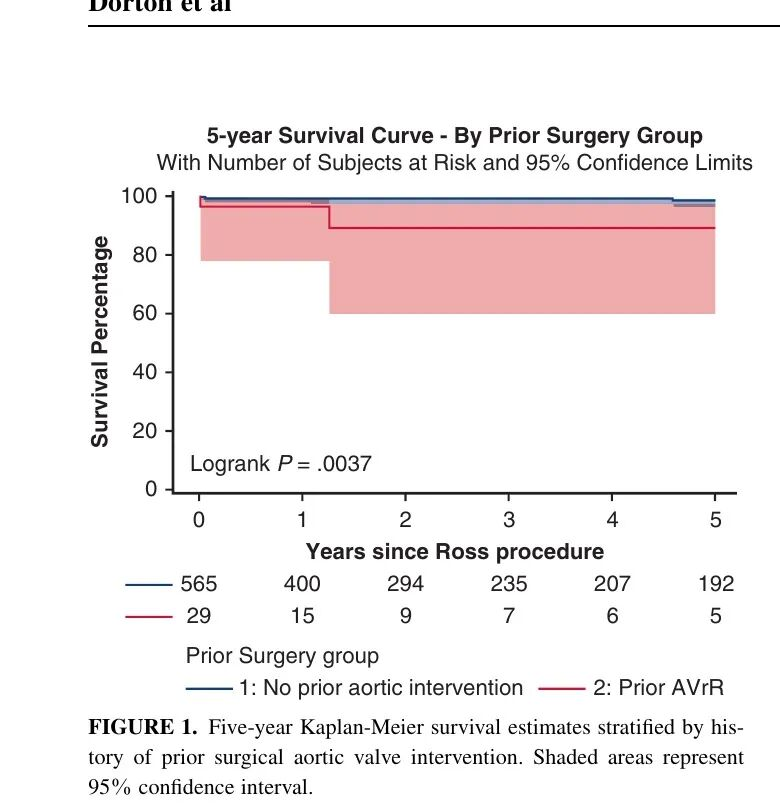

# Prior Aortic Valve Intervention: A Contraindication to the Ross Procedure or a New Boundary?

**Source:** HeartValvePro  
**Original title:** 既往主动脉瓣干预史：Ross手术的禁区还是新边界？  
**Original URL:** https://mp.weixin.qq.com/s/6ejlB2-LlQgbJQc2ipEOKg

The durability of a solution often depends on the foundation it is built upon.

Since Donald Ross first described replacement of the aortic valve with the pulmonary autograft in 1967, the Ross procedure has occupied a special place in cardiovascular surgery because of its unique advantages: it provides a living valve substitute, preserves native hemodynamics, avoids lifelong anticoagulation, and offers excellent resistance to infection. Yet in most single-center and multicenter studies of the Ross procedure, one patient group is often excluded: those who have previously undergone surgical aortic valve intervention (SAVI). Does prior operation make the Ross procedure a forbidden zone, or can it define a new boundary for reoperation? A recent multicenter retrospective study from the North American Ross Consortium Working Group, published in JTCVS Open, provides valuable data for this unresolved clinical question.

The study collected clinical data from four high-volume cardiothoracic centers in North America, including Baylor Scott & White The Heart Hospital, Washington University, Northwestern University, and the University of Pennsylvania, from 1994 to 2025. The investigators included 594 adult patients who underwent the Ross procedure and divided them into two groups: 29 patients with prior SAVI and 565 without prior SAVI. SAVI was defined as previous aortic valve repair, aortic valve replacement, or valve-sparing root replacement. Transcatheter-only interventions, such as balloon aortic valvuloplasty, were not included.

The data showed comparable age at surgery, sex distribution, and body mass index between the two groups. Median age was 38 years in the SAVI group (IQR, 32-46) and 42 years in the non-SAVI group (IQR, 32-51; P=.16). However, baseline comorbidities differed. Patients in the SAVI group had a higher incidence of endocarditis, including treated endocarditis (6.9% vs 4.3%) and active endocarditis (10.3% vs 1.4%; P=.012). This baseline difference partly reflects the long-term infection risk that may follow prior surgical intervention and adds complexity to the subsequent operation.

## The Cost of Operative Complexity

As expected, prior surgery significantly increased the technical difficulty of the Ross procedure. CPB time was longer in the SAVI group (median 248 vs 212 minutes, P<.001), as was aortic cross-clamp time (median 203 vs 186 minutes, P=.001). In addition, intraoperative aortic annular size was smaller in the SAVI group (median 23.5 mm vs 27 mm, P=.011). Put simply, this is like renovating a room that has already undergone a structural rebuild. The surgeon must not only remove the old structure, but also place a new, precise hinge system within a limited space that may already be scarred and adherent. This increased complexity inevitably places very high demands on surgical expertise.

Encouragingly, however, this increase in operative complexity did not translate directly into a statistically significant rise in perioperative mortality. Operative mortality was 3.5% in the SAVI group (1 patient) and 0.7% in the non-SAVI group (4 patients), without a statistically significant difference (P=.22). Postoperative complications, including reoperation, acute kidney injury, stroke, and deep sternal wound infection, also occurred at similar rates. This suggests that in experienced centers and in the hands of skilled surgeons, perioperative safety can still be maintained even in complex Ross candidates with prior SAVI.

## Questions Behind the Survival Curve

Figure 1. Five-year Kaplan-Meier survival curves stratified by prior surgical aortic valve intervention. Blue line, no prior intervention group (n=565); red line, prior SAVI group (n=29); shaded areas indicate 95% confidence intervals. Log-rank P=.0037. Source: original Figure 1, Results section, Long-Term Outcomes.

Although short-term safety was demonstrated, longer-term follow-up revealed a finding that deserves deeper consideration. During follow-up, with a median of 12.2 months in the SAVI group and 25.4 months in the non-SAVI group, 5-year Kaplan-Meier survival was significantly lower in the SAVI group (P=.004 by log-rank test). Specifically, all-cause mortality was 13.8% in the SAVI group (4 patients), compared with 5.7% in the non-SAVI group (32 patients; P=.008).

This survival difference requires a careful and restrained interpretation. The article clearly notes that all 4 deaths in the SAVI group were noncardiac, caused by cancer, motor vehicle collision, heparin-induced thrombocytopenia with thrombosis, and unknown cause, respectively. This means that the lower survival does not appear to have been directly caused by the Ross procedure itself or by failure of cardiac structure or function. It may instead reflect external factors or the overall health profile of the patients.

## The Durability Test of the Autograft

More importantly, for the core markers of autograft durability, the two groups showed a high degree of consistency. The study found no significant difference in valve-related reintervention, annular dilatation, or autograft function between the groups. Reintervention occurred in 3.4% of the SAVI group and 11.9% of the non-SAVI group (P=.75). Put simply, whether this was the first installation or a second renovation, the newly placed hinge system did not show a loss of reliability or durability. This finding strongly supports the feasibility of performing the Ross procedure in patients with prior SAVI and suggests that previous intervention did not negatively affect short- to mid-term pulmonary autograft performance.

The study also has important limitations. The SAVI group included only 29 patients, a small sample size that limits the statistical power of some comparisons. As a retrospective analysis, it is inevitably subject to selection bias. The study spans 30 years, during which operative techniques evolved, potentially influencing outcomes in earlier patients. The authors also acknowledge that continued long-term follow-up is essential for fully evaluating autograft durability in this special population. After all, late failure patterns after the Ross procedure, primarily autograft reintervention, often emerge only after the first postoperative decade.

For young or middle-aged patients with aortic valve disease, especially those who have already undergone one operation, the decision about reoperation often comes with substantial psychological burden and concerns about future quality of life. The North American Ross Consortium data provide an important reference. Prior surgery does not necessarily close the door to the Ross procedure. After careful patient selection and evaluation in specialized centers, these patients may still have the opportunity to receive a treatment that offers excellent hemodynamics and freedom from lifelong anticoagulation.

Overall, this multicenter study objectively describes the clinical landscape of the Ross procedure in patients with prior surgical aortic valve intervention. It does not avoid the reality of increased operative complexity, and it honestly presents the survival difference and its noncardiac background. More importantly, it confirms reliable short- to mid-term autograft durability in this population, providing a solid evidence base for future refinement of patient selection and operative strategy.

## References

Dorton CW, Pickering T, McCullough KA, et al. Ross procedure after prior aortic valve intervention: Outcomes from the North American Ross Consortium database. JTCVS Open. 2026;29:101565. https://doi.org/10.1016/j.xjon.2025.101565

For collaboration or submissions, please leave a message in the WeChat official account or email adams.wang@heartvalvepro.com.

This content is intended solely for academic reference by medical and healthcare professionals. It does not constitute medical advice or any basis for diagnosis or treatment. Clinical decisions must be made by the attending physician based on individual patient factors and relevant clinical guidelines; this account assumes no legal liability arising therefrom. The technical evaluation and literature interpretation in this article are based on currently available evidence-based data and are intended to reflect academic discussion objectively; it does not represent an exclusive recommendation of any specific product or surgical technique.
