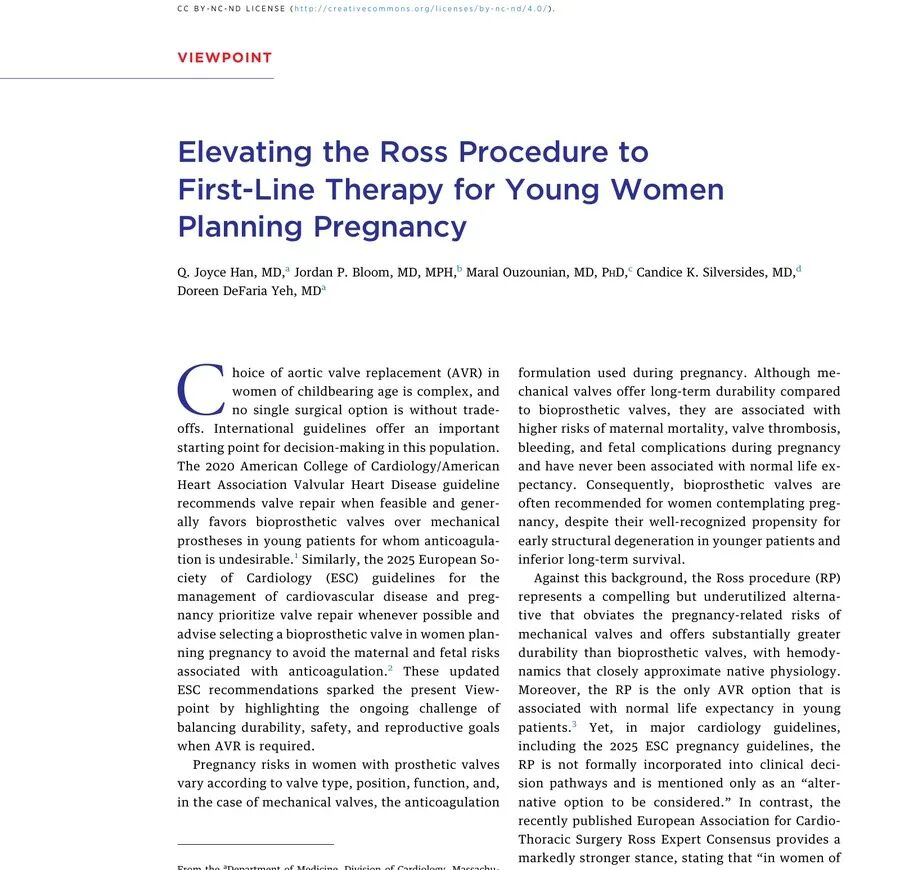
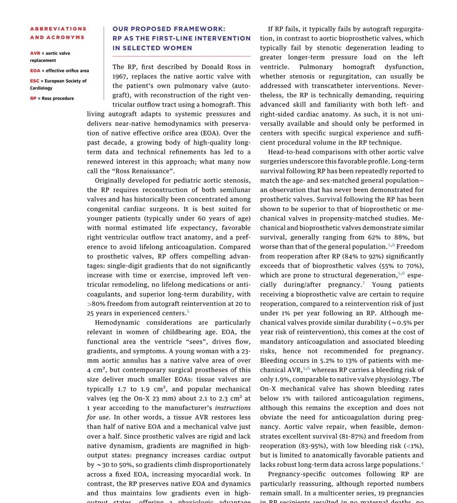

# Aortic Valve Replacement in Women of Childbearing Age: Can the Ross Procedure Become a First-Line Choice?

**Source:** HeartValvePro  
**Original title:** 育龄期女性的主动脉瓣置换：Ross 手术能否成为一线选择？  
**Original URL:** https://mp.weixin.qq.com/s/KWbBzLdZUSPZt8RMM1C96Q

A physiologic solution for the ongoing challenge of reproductive goals.

For women of childbearing age who require aortic valve replacement (AVR), valve choice remains a clinically difficult balance. The 2020 American College of Cardiology/American Heart Association (ACC/AHA) guideline and the 2025 European Society of Cardiology (ESC) guideline for cardiovascular disease management during pregnancy both tend to recommend bioprosthetic valves to avoid the maternal and fetal risks associated with mandatory anticoagulation for mechanical valves. Yet bioprosthetic valves are prone to early structural degeneration in young patients, meaning these patients will almost certainly face reoperation in the future. A recent Viewpoint published in JACC: Advances argues that for young women planning pregnancy, the Ross procedure (RP) should be elevated to a first-line treatment option. This position offers a new perspective on balancing durability, safety, and reproductive goals.

Figure. Article title and introduction, outlining the real-world dilemma of AVR choice in women of childbearing age. Source: Han et al., JACC: Advances, 2026, first-page introduction.

## Hemodynamics: The Physiologic Test of Pregnancy

The article, written by a multicenter expert group, points out that the Ross procedure has unique physiologic advantages compared with conventional prosthetic valves. By replacing the diseased aortic valve with the patient's own pulmonary valve, the operation not only adapts to systemic pressure but also preserves a native effective orifice area (EOA). This hemodynamic feature is especially important for women of childbearing age. During pregnancy, cardiac output increases by 30% to 50%, causing transvalvular gradients to rise disproportionately when EOA is fixed. Data show that a 23-mm bioprosthetic valve usually provides an EOA of only 1.7 to 1.9 cm², and a mechanical valve approximately 2.1 to 2.3 cm², both far below the more than 4 cm² area of a native valve of comparable size. Put simply, it is like installing a toll booth on a previously wide expressway. It may be passable under ordinary traffic, but during the high-flow state of pregnancy, congestion and additional myocardial work become unavoidable. Because the Ross procedure preserves a dynamic native structure, it can maintain lower transvalvular gradients even in high-output states, showing a clear physiologic advantage.

## Long-Term Outcomes: The Tradeoffs Behind the Data

Beyond hemodynamic benefit, the Ross procedure also has impressive long-term survival and freedom-from-reintervention data. The propensity-matched studies cited in the Viewpoint show that long-term survival after the Ross procedure is comparable to that of the age- and sex-matched general population, an outcome not previously seen with prosthetic valves. In contrast, long-term survival with mechanical and bioprosthetic valves usually ranges from 62% to 88%, lower than that of the general population. Regarding freedom from reoperation, freedom from autograft reintervention at 20 to 25 years after the Ross procedure exceeds 80%, whereas bioprosthetic freedom from reintervention is only 55% to 70%. Mechanical valves offer similar durability, with an annual reintervention risk of about 0.5%, but the associated 5.2% to 13% bleeding risk and the contraindications of anticoagulation during pregnancy greatly limit their use in women of childbearing age. The bleeding risk after the Ross procedure is only 1.9%, similar to that of a native valve physiologic state, and lifelong anticoagulation is not required.

Figure. Core framework proposed by the authors comparing hemodynamic characteristics and long-term outcome data for the Ross procedure and prosthetic valves. Source: Han et al., JACC: Advances, 2026, second-page framework.

Although the data are encouraging, the article also objectively notes the limitations and potential risks of the Ross procedure. It is a technically demanding double-valve reconstruction requiring deep understanding of left- and right-sided anatomy, and it is not routinely available in all centers. In addition, autograft dilatation and degeneration of the homograft used for right ventricular outflow tract reconstruction remain theoretical long-term concerns. The paper notes that although no aortic dissection occurred in 39 pregnancies reported across two cohort studies, 1 patient did require postpartum aortic root replacement. This reminds us that while pursuing physiologic benefit, clinicians must carefully evaluate individual anatomy and maintain rigorous postoperative imaging surveillance.

From a broader perspective, this proposal is not simply praise for one operation, but a deeper concern for the quality of life and reproductive rights of young female patients. Current guidelines have not formally incorporated the Ross procedure into the clinical decision pathway and often treat it as an alternative that may be considered. However, as surgical technique improves and long-term follow-up data accumulate, the growing physiologic, hemodynamic, and clinical evidence may already have laid the foundation for a more structured decision strategy. As the article concludes, when valve repair is not feasible and the required surgical expertise is available, the Ross procedure deserves a higher level of recommendation in AVR strategies for women of childbearing age.

## References

Han QJ, Bloom JP, Ouzounian M, Silversides CK, DeFaria Yeh D. Elevating the Ross Procedure to First-Line Therapy for Young Women Planning Pregnancy. JACC Adv. 2026. https://doi.org/10.1016/j.jacadv.2026.102638

For collaboration or submissions, please leave a message in the WeChat official account or email adams.wang@heartvalvepro.com.

This content is intended solely for academic reference by medical and healthcare professionals. It does not constitute medical advice or any basis for diagnosis or treatment. Clinical decisions must be made by the attending physician based on individual patient factors and relevant clinical guidelines; this account assumes no legal liability arising therefrom. The technical evaluation and literature interpretation in this article are based on currently available evidence-based data and are intended to reflect academic discussion objectively; it does not represent an exclusive recommendation of any specific product or surgical technique.
