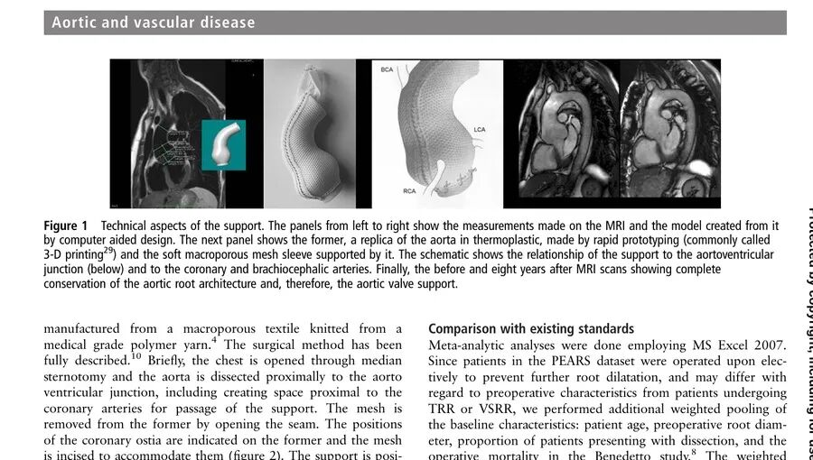
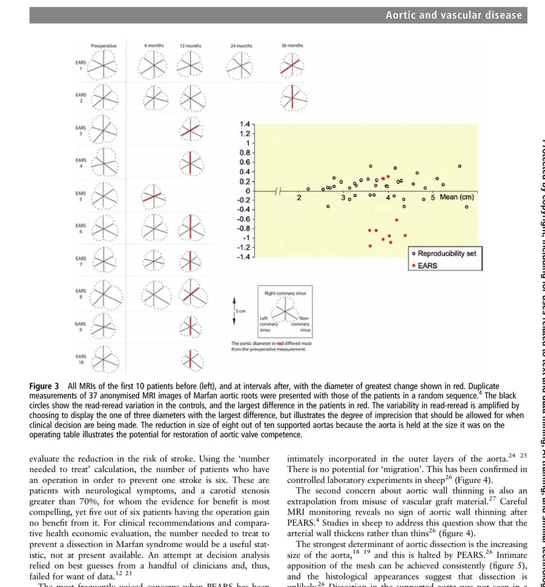
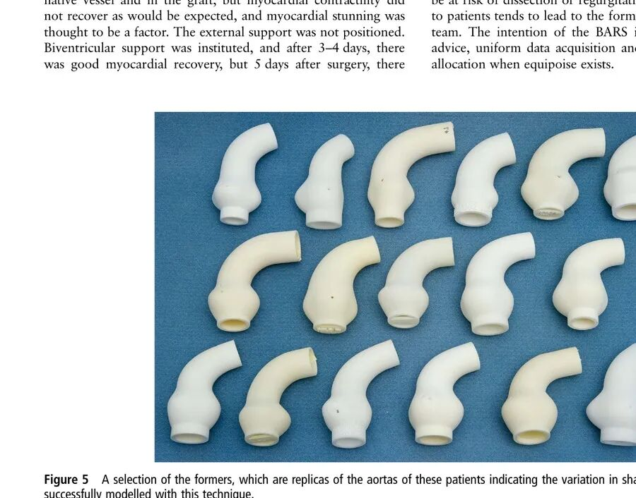

# Personalised Aortic Root Support: A Tailored Option for Patients With Marfan Syndrome

**Source:** HeartValvePro  
**Original title:** 个体化主动脉根部支撑：马凡综合征患者的「量体裁衣」之选  
**Original URL:** https://mp.weixin.qq.com/s/AH9ub5AFjAHRjoS2Jbu4bg

A tailored solution preserves the architecture of the native valve.

For patients with Marfan syndrome, aortic root aneurysm and the resulting risk of aortic dissection often cast the heaviest shadow over life expectancy. To prevent catastrophe, the traditional standard interventions are total root replacement (TRR) or valve-sparing root replacement (VSRR). However, both operations are technically demanding and are often associated with either lifelong anticoagulation or a higher risk of reintervention. In 2004, an innovative conservative therapy known as personalised external aortic root support (PEARS) emerged. A prospective study published in Heart reported 1- to 9-year follow-up outcomes of the first 30 consecutive patients with Marfan syndrome who underwent PEARS, providing key evidence on feasibility and longer-term efficacy.

The study was conducted jointly by the Royal Brompton Hospital in London and the University of Leuven in Belgium, and included 30 patients who underwent PEARS between 2004 and 2011. Median age was 28 years (IQR, 20-44), and mean preoperative aortic root diameter was 46.2 mm (SD 3.4). The core of PEARS is tailoring. The team first used each patient's MRI or CT spatial data for computer-aided design (CAD), then used 3-dimensional printing to create a physical former matching that patient's aorta exactly. A soft, macroporous mesh support made of medical-grade polymer yarn was then woven around this model. During surgery, with the heart beating, the surgeon wrapped this customized mesh support snugly around the patient's aortic root, extending beyond the brachiocephalic artery. This feature provides a wider protective range than conventional root replacement.

Caption: Core steps of PEARS, from MRI data to CAD modeling, 3D-printed aortic former, production of the individualized polymer mesh support, and comparison of preoperative and 8-year postoperative MRI scans showing preservation of aortic root structure. Source: original Figure 1, Methods section, PEARS technique.

The most striking data came from long-term postoperative follow-up. During 133 patient-years of follow-up, with a mean of 4.4 years and maximum of 8.8 years, none of the 30 patients died, and there were no cerebrovascular events or aortic- or valve-related complications. At the end of follow-up, 29 patients were in NYHA class I and were able to work or study normally. The only patient in NYHA class III had severe pre-existing comorbidities, such as chronic obstructive pulmonary disease, unrelated to aortic root disease. Put simply, this tailored "jacket" not only successfully prevented further aortic enlargement, but also allowed most patients to return to high-quality normal life without bearing the burdens of conventional replacement surgery.

## Comparison With the Gold Standard

When compared with conventional surgical standards, PEARS showed distinctive advantages. The investigators compared outcomes in these 30 PEARS patients with published meta-analysis data from 1,385 patients who had undergone TRR or VSRR. TRR had an early mortality rate of 4.1% (95% CI, 1.9-7.7) and a thromboembolism rate of 0.7% per year (0.5-0.9). VSRR had an early mortality rate of 3.2% (0.5-17.9) and a valve reintervention rate as high as 1.3% per year (0.3-2.2). In comparison, the PEARS cohort maintained a zero-event record for these major complications. PEARS was also markedly less invasive: only 1 of the 30 patients required a very short period of CPB, 20 minutes; median blood loss was only 150 mL (IQR, 75-469); and median total hospital stay was 8 days (IQR, 6.0-9.3).

Caption: Matrix of aortic root MRI images in the first 10 patients before surgery and at serial follow-up time points (left), and scatterplot of aortic diameter changes (right). Red marks indicate the diameter direction with the greatest change. The scatterplot shows that aortic diameter in PEARS patients (red dots) remained highly stable during follow-up, without significant difference from measurement repeatability controls (open circles). Source: original Figure 3, Results section, follow-up data.

This comparison is valuable, but it also requires cautious interpretation. Patients undergoing PEARS were generally younger at baseline than those undergoing TRR or VSRR, with a mean age of 31 years versus 35 and 33 years, respectively. They also had smaller aortic diameters, 46.2 mm versus 61 mm and 52 mm, and no history of dissection. These baseline differences inevitably introduce a degree of lead time bias into direct comparison. Intervention at a smaller aortic diameter means, by itself, a lower natural risk of dissection during follow-up. The authors state this frankly and note that only a prospective randomized controlled study can truly clarify the difference.

## The Biological Logic of an "Exoskeleton"

Such a disruptive new technology naturally raises careful academic questions. The main concerns include whether the support might migrate and compress coronary arteries, whether the aortic wall might become thinner because of external wrapping, and whether dissection might still occur within the supported segment. The investigators addressed these concerns through long-term animal experiments and clinical observation. The macroporous mesh structure allows cells from the outer aortic layer to grow into it, creating biological integration and eliminating the possibility of migration. In addition, a sheep carotid model showed that the supported vessel wall became thicker rather than thinner, while the endothelial layer remained intact. In plain terms, this mesh is not merely placed around the vessel. Over time, it becomes part of the vessel wall, forming a firm exoskeleton.

Caption: Individualized aortic formers from a group of patients, all created by 3D printing as aortic replicas. The image shows marked patient-to-patient differences in aortic shape and size, which drive the tailored design philosophy of PEARS. Source: original Figure 5, Discussion section, responses to four major concerns.

During the entire follow-up period, no patient experienced support-related coronary compression, and imaging showed no evidence of aortic wall thinning. Seven-year cumulative survival reached 100%. These data address some external concerns, but they must be interpreted within the context of a small cohort (n=30) and relatively limited follow-up. Longer-term data and larger comparative studies remain necessary. To obtain more definitive evidence, a large prospective comparative study called BARS, the Big Aortic Root Study, is being prepared.

For patients diagnosed with Marfan syndrome at a young age and living with the risk that the aorta could tear at any time, PEARS provides a hopeful new option. It preserves the patient's native anatomy and physiology to the greatest possible extent, avoids the long-term anticoagulation burden of prosthetic valves, and minimizes the trauma of CPB. These early data from the Royal Brompton Hospital objectively present an initial result with no aortic- or valve-related events across 133 patient-years of follow-up. The technical pathway it represents deserves continued exploration in a stricter prospective framework.

## References

Treasure T, Takkenberg JJM, Golesworthy T, et al. Personalised external aortic root support (PEARS) in Marfan syndrome: analysis of 1-9 year outcomes by intention-to-treat in a cohort of the first 30 consecutive patients to receive a novel tissue and valve-conserving procedure, compared with the published results of aortic root replacement. Heart. 2014;100:969-975. doi:10.1136/heartjnl-2013-304913

For collaboration or submissions, please leave a message in the WeChat official account or email adams.wang@heartvalvepro.com.

This content is intended solely for academic reference by medical and healthcare professionals. It does not constitute medical advice or any basis for diagnosis or treatment. Clinical decisions must be made by the attending physician based on individual patient factors and relevant clinical guidelines; this account assumes no legal liability arising therefrom. The technical evaluation and literature interpretation in this article are based on currently available evidence-based data and are intended to reflect academic discussion objectively; it does not represent an exclusive recommendation of any specific product or surgical technique.
