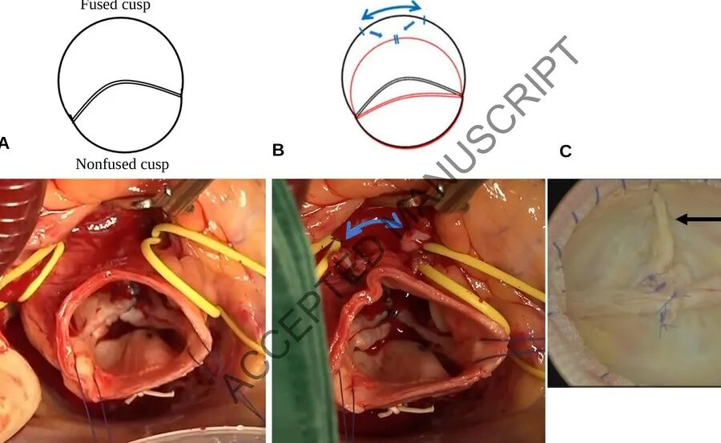
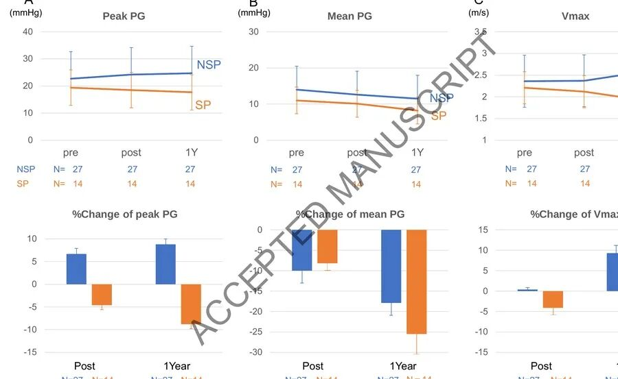
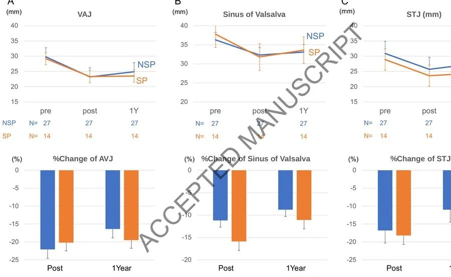

# Reshaping Symmetry: The Hemodynamic Value of Sinus Plication in Bicuspid Aortic Valve Repair

**Source:** HeartValvePro  
**Original title:** 重塑对称之美：窦折叠术在二叶式主动脉瓣修复中的血流动力学价值  
**Original URL:** https://mp.weixin.qq.com/s/LqdtGZCz1B0SPhjz_3UwwA

Symmetry restored, flow optimized: a geometric approach to bicuspid valve repair.

In the field of bicuspid aortic valve (BAV) repair, surgeons have long faced a difficult challenge: how to manage asymmetric root geometry. In BAV patients, the fused and nonfused leaflets are often exposed to imbalanced stress distribution. This asymmetry is not only an important cause of recurrent aortic regurgitation (AR), but also a potential driver of early calcification and stenosis progression. A recent multicenter retrospective study from Takashi Kunihara's team at The Jikei University School of Medicine, published in the European Journal of Cardio-Thoracic Surgery, provides an intervention perspective based on geometric remodeling. The study focused on the use of sinus plication (SP) in BAV repair and examined its effect on early postoperative hemodynamics.

The investigators retrospectively analyzed data from 41 patients with BAV and moderate-to-severe AR who underwent aortic valvuloplasty (AVP) between January 2018 and December 2023. Fourteen patients received SP (SP group), and 27 did not (NSP group). All operations were performed by the same experienced surgeon to minimize technical heterogeneity. The core question was whether plication of the sinus of Valsalva corresponding to the fused leaflet, thereby reducing sinus circumference and narrowing commissural distance, could translate into better hemodynamic performance at 1-year follow-up.

Figure 1. Conceptual diagram and intraoperative view of sinus plication. A, schematic of BAV asymmetry; B, schematic of restored symmetry after sinus plication. The lower panels show intraoperative photographs, with arrows indicating the sinus plication suture site. Source: original Figure 1, Methods section.

Clinically, neither group had deaths within 1 year after surgery, and AR was effectively controlled in both groups, with substantial left ventricular reverse remodeling. This indicates that the basic valve repair strategy successfully relieved volume overload in both the SP and NSP groups. However, when the investigators turned to transvalvular hemodynamic parameters, two different trajectories began to appear.

## Divergence of Two Trajectories

In the NSP group, peak transvalvular pressure gradient (peak PG) gradually increased over time, from 22.7 ± 10.4 mmHg preoperatively to 24.2 ± 9.4 mmHg at discharge and 24.7 ± 9.6 mmHg at 1 year, a relative baseline change of +8.8% ± 1.3%. Maximum transvalvular flow velocity (Vmax) followed a similar trajectory, measuring 2.37 ± 0.51 m/s at discharge and rising to 2.58 ± 0.62 m/s at 1 year, a relative baseline change of +9.3% ± 2.5%.

In contrast, the SP group had a more stable and even improved hemodynamic trajectory. Peak PG fell from 19.4 ± 6.4 mmHg preoperatively to 18.5 ± 6.5 mmHg at discharge and further to 17.7 ± 5.5 mmHg at 1 year, a relative baseline decrease of 8.8% ± 1.1%. Similarly, Vmax fell to 1.92 ± 0.31 m/s at 1 year, a relative baseline decrease of 13.1% ± 2.1%. This early postoperative decrease in hemodynamic parameters contrasted sharply with the continued increase observed in the NSP group.

Figure 4. Changes in peak PG, mean PG, and Vmax before surgery, at discharge, and at 1 year in both groups. Blue, NSP group; orange, SP group. Bar charts below show percentage change from baseline. Source: original Figure 4, Results section.

How should this hemodynamic difference be understood? Put simply, the BAV root is like a distorted funnel. When water passes through it, turbulence and resistance are difficult to avoid. Conventional leaflet repair may close the leak, but the deformity of the funnel itself has not been fully corrected. Sinus plication is like narrowing the waist of the funnel. By folding the excessively dilated fused sinus inward, the commissural angle that originally exceeded 180° is forced back toward a more symmetric physiologic state. When the funnel becomes more symmetric, flow becomes smoother, and transvalvular resistance and velocity fall accordingly.

## Imaging Evidence of Geometric Remodeling

This geometric remodeling was supported by imaging data. The study showed that after surgery, the SP group had reductions not only in sinus of Valsalva dimensions, but also a more pronounced narrowing of the sinotubular junction (STJ). This overall three-dimensional adjustment from the STJ to the annular level may form the anatomic basis for improved leaflet mobility and lower transvalvular gradients. The investigators further noted a moderate negative correlation between commissural angle and peak PG (Spearman rho=-0.22, P<0.001), consistent with the hypothesis that a more symmetric commissural orientation helps improve hemodynamics.

Figure 2. Changes in aortic root geometric parameters, including ventriculo-aortic junction, sinus of Valsalva, and sinotubular junction, before surgery, at discharge, and at 1 year. The SP group showed more pronounced reduction in sinus and STJ dimensions. Source: original Figure 2, Results section.

At the same time, these positive data still require objective caution. Although the SP group showed numerical advantages in peak PG and Vmax, after covariate adjustment the percentage changes did not reach statistical significance between groups. The adjusted mean percentage difference was -11% for peak PG (95% CI, -63% to +42%) and -4% for Vmax (95% CI, -25% to +16%). In addition, no clear difference was observed in postoperative mean PG or aortic valve area (AVA). This suggests that the early hemodynamic benefit of SP may be subtle, and that the true clinical effect size is still obscured by wide confidence intervals.

This statistical uncertainty is closely related to the small sample size, with only 14 patients in the SP group, and the short follow-up period of 1 year. The real test of aortic valve repair often appears 5 or even 10 years after surgery. Can a small early advantage in peak PG translate into a meaningful improvement in long-term freedom from reintervention? This question must be answered by future studies with larger samples and longer follow-up. The authors also acknowledge that because SP was introduced only in 2021, longer-term data are not yet available, and the heterogeneity introduced by the multicenter design is another limitation that requires caution.

In the real world of patient care, the value of this study may not be the immediate declaration of a new gold standard. Rather, it provides a more three-dimensional tool for individualized BAV repair. For patients with asymmetric root dilatation, targeted sinus geometric remodeling in addition to precise leaflet repair may offer an extra safeguard for maintaining hemodynamic stability over the long postoperative years.

Overall, Kunihara's exploratory work extends the focus of BAV repair from leaflet coaptation alone to symmetric remodeling of the entire aortic root. The potential of sinus plication to improve early postoperative transvalvular gradients and flow velocity deserves continued tracking and validation on the path toward more durable repair.

## References

Kunihara T, et al. Haemodynamic early outcomes of sinus plication for bicuspid aortic valve repair. Eur J Cardiothorac Surg. 2024; ezad103. doi:10.1093/ejcts/ezad103.

For collaboration or submissions, please leave a message in the WeChat official account or email adams.wang@heartvalvepro.com.

This content is intended solely for academic reference by medical and healthcare professionals. It does not constitute medical advice or any basis for diagnosis or treatment. Clinical decisions must be made by the attending physician based on individual patient factors and relevant clinical guidelines; this account assumes no legal liability arising therefrom. The technical evaluation and literature interpretation in this article are based on currently available evidence-based data and are intended to reflect academic discussion objectively; it does not represent an exclusive recommendation of any specific product or surgical technique.
