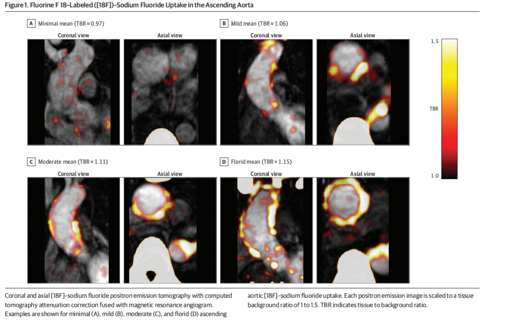
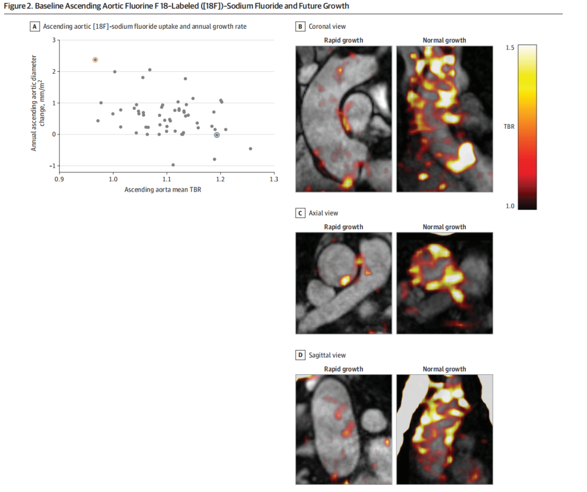

# Clinical Application of 18F-NaF PET Molecular Imaging in Risk Stratification for Bicuspid Aortic Valve-Associated Aortopathy

**Source:** HeartValvePro  
**Original title:** 18F-NaF PET分子成像在二叶式主动脉瓣相关主动脉病变风险分层中的临床应用  
**Original URL:** https://mp.weixin.qq.com/s/qxBKkG_ViZrCL1rZOWbtjQ

True insight sees the unseen before the inevitable arrives.

## A Hidden Crisis Beyond Diameter

In clinical practice, deciding the timing of surgery for bicuspid aortic valve (BAV)-associated ascending aortopathy remains a highly challenging problem. Current surveillance systems for aortic disease rely heavily on ultrasound, computed tomography (CT), or magnetic resonance imaging (MRI) to measure absolute vessel diameter. When internationally recognized thresholds are reached, patients are advised to undergo prophylactic aortic replacement. A clinically important reality is that many BAV patients admitted with acute Stanford type A aortic dissection had not reached current surgical intervention thresholds before onset. This highlights the limitations of risk stratification based solely on geometric diameter. Developing more precise assessment tools that reflect intrinsic biological activity within the vessel wall has become urgent.

## Noninvasive Tracking of Microscopic Vessel-Wall Evolution

Thoracic aortic disease is most commonly associated with BAV, and approximately 1 in every 160 patients with BAV will experience fatal acute Stanford type A aortic dissection. In the early stages of thoracic aortic disease, microscopic calcium deposits occur on damaged elastic fibers. As aortic disease progresses toward severe histologic pathology, elastic fibers are sharply depleted, and the microcalcifications closely attached to them also decline substantially. Quantifying microcalcification within the aortic wall may become a new pathway for noninvasively tracking pathologic progression.

A joint team from the University of Edinburgh and other institutions recently published a prospective longitudinal cohort study in JAMA Network Open, a leading cardiovascular journal, first examining the clinical potential of fluorine-18 sodium fluoride (18F-NaF) positron emission tomography (PET) for evaluating aortic microcalcification and predicting vascular expansion in patients with BAV. The study included 76 adults with confirmed BAV, with a mean age of 52.6 years; 75.0% were men. All participants underwent baseline clinical assessment and hybrid 18F-NaF PET-CT and MRI scanning. Aortic 18F-NaF uptake was quantified using the mean tissue-to-background ratio (TBR).

Figure 1. Fluorine-18 sodium fluoride uptake in the ascending aorta. Coronal and axial fused PET-CT images show minimal, mild, moderate, and severe ascending aortic 18F-NaF uptake.

Follow-up data showed that 56 patients underwent repeat MRI after a median of 723 days. Data analysis revealed a significant negative correlation between baseline ascending aortic 18F-NaF uptake and the annual rate of change in aortic diameter (Pearson r=-0.37; P=0.005). This correlation remained after multivariable regression adjustment for comorbid factors.

Figure 2. Relationship between baseline ascending aortic 18F-NaF uptake and future growth. The figure shows a moderate negative correlation between uptake and annual expansion rate, as well as imaging comparisons between rapid-growth patients with low uptake and normal-growth patients with high uptake.

Ascending aortic 18F-NaF uptake had no association with baseline aortic diameter (Pearson r=0.08; P=0.50). Baseline ascending aortic 18F-NaF uptake showed a moderate positive correlation with baseline ascending aortic stiffness index (Pearson r=0.38; P<0.001). In the BAV cohort, low ascending aortic 18F-NaF uptake marked the fastest rate of aortic enlargement and indicated severe impairment of aortic wall structural integrity. High uptake was associated with a stiffer and more slowly growing ascending aortic phenotype. These findings suggest that 18F-NaF PET imaging represents a promising noninvasive method for identifying microcalcific disease phenotypes in BAV-associated thoracic aortic disease.

## Pathologic Remodeling From Compensation to Collapse

This study provides a breakthrough biological dimension for evaluating catastrophic aortic risk in patients with BAV. Traditional thinking often equates calcification with end-stage disease or highest risk. This study reveals a very different microscopic dynamic process. High 18F-NaF uptake does represent a stiff vessel wall, but it also marks a relatively stable compensatory stage of disease. Low uptake in an already diseased ascending aorta implies that the elastic fiber network has been thoroughly destroyed and that the lesion has entered a severely fragile decompensated stage.

From a pathomechanical standpoint, conversion of vascular smooth muscle cells toward an osteogenic phenotype remodels the stress distribution of the vessel wall. Put simply, the microscopic structure of the aortic wall is like the reinforced concrete wall of a building. Elastin is the internal steel reinforcement. Early in disease, the steel begins to fail, and the body mobilizes calcium deposition, like filling cracks with sealant and compensatory cement. This repair makes the wall stiff, but for a time it helps keep the wall standing. Once the elastin "steel mesh" has completely deteriorated and ruptured, calcium salts lose their attachment base, and the wall becomes structurally loose and fragile. At that point, 18F-NaF no longer lights up, and rapid expansion and rupture follow as the vessel loses physical constraint.

## The Clinical Decision Bottom Line in the Precision Era

Patients with BAV are generally younger at disease onset, more likely to have severe calcification, and often experience substantial psychological anxiety. Current guidelines rely heavily on geometric cutoffs such as 50 or 55 mm to determine surgical timing, leaving many patients in the 40- to 49-mm gray zone living with deep fear about disease progression. The introduction of molecular imaging may help break this single-size determinism. It can identify occult high-risk patients whose diameter has not yet reached threshold but whose microscopic structure is already near collapse. For these patients, tailored early intervention and surgical planning before complete breakdown of the aortic wall may maximize preservation of native tissue and improve long-term quality of survival.

The evolution of surgical technique and the breakthrough of molecular diagnosis are mutually reinforcing. While pursuing less invasive techniques and native tissue preservation, the bottom line of clinical decision-making must remain absolutely clear. No matter how detailed preoperative advanced imaging is, it must still be tested against true anatomy under direct intraoperative vision. If leaflets are found to be in very poor condition or the aortic wall is paper-thin, with no realistic room for durable repair, replacement should be performed without hesitation. A definitive and safe replacement is far better than a forced repair filled with future uncertainty. Medical progress is irreversibly shifting our view from macroscopic anatomic appearance to microscopic molecular origin. True precision medicine requires us to treat the biological nature of disease and move beyond merely measuring organ geometry.

## References

Nash J, et al. Molecular Calcification Imaging and Ascending Aortic Disease in Patients With a Bicuspid Aortic Valve. JAMA Network Open. 2026;9(2):e2560385. doi:10.1001/jamanetworkopen.2025.60385

For collaboration or submissions, please leave a message in the WeChat official account or email adams.wang@heartvalvepro.com.

This content is intended solely for academic reference by medical and healthcare professionals. It does not constitute medical advice or any basis for diagnosis or treatment. Clinical decisions must be made by the attending physician based on individual patient factors and relevant clinical guidelines; this account assumes no legal liability arising therefrom. The technical evaluation and literature interpretation in this article are based on currently available evidence-based data and are intended to reflect academic discussion objectively; it does not represent an exclusive recommendation of any specific product or surgical technique.
