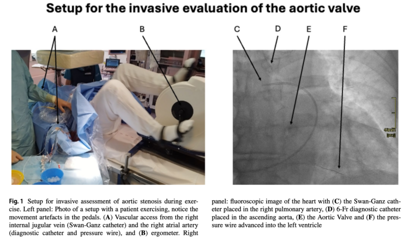
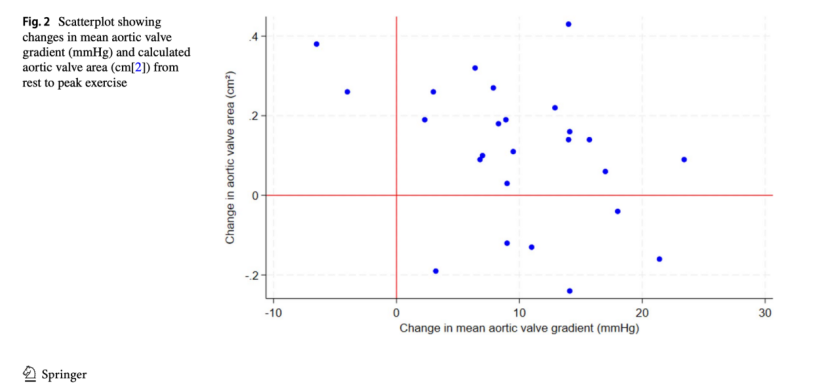
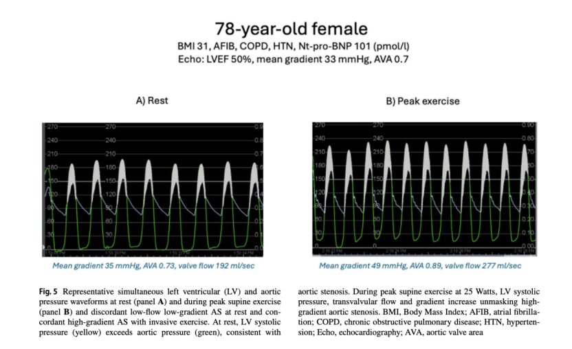
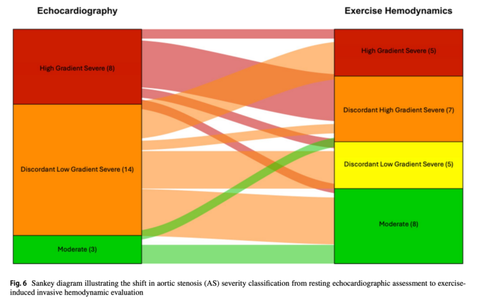

# Commentary | Decoding Hemodynamics Under Exercise Stress: The PREFLOW Study and Real Assessment of Aortic Stenosis

**Source:** HeartValvePro  
**Original title:** 时评 | 运动负荷下的血流动力学解码：PREFLOW研究与主动脉瓣狭窄的真实评估  
**Original URL:** https://mp.weixin.qq.com/s/KzeFGO3YrmqJHZOoWhb9ig

Hemodynamics in motion reveals what resting physiology conceals.

Assessing the true severity of aortic stenosis (AS) in patients with preserved left ventricular ejection fraction remains a difficult challenge in daily clinical practice. With aging, comorbidities such as heart failure and chronic lung disease become increasingly common, and these conditions can easily obscure the true source of symptoms, making it difficult to evaluate the independent contribution of the valve lesion. Especially when resting echocardiography shows borderline values, or when imaging indices and the patient's symptoms are clearly separated, routine static assessment often cannot provide decisive evidence. Current guidelines mainly define stenosis severity using resting Doppler echocardiographic parameters, including maximal transvalvular velocity, mean transvalvular gradient, and aortic valve area (AVA) calculated by the continuity equation. Resting measurements often fail to capture the dynamic features of AS fully, carrying a risk of overestimating or underestimating disease severity. Invasive hemodynamic testing during exercise stress offers a new physiologic window for examining the dynamic coupling between pressure gradient and flow across the valve.

## Breaking From Static Observation to Dynamic Testing

Although dobutamine stress testing can characterize the physiology of severe stenotic aortic valves, dobutamine infusion lacks the true physiologic responses of exercise, such as increased venous return and tachypnea, which are essential for understanding the cause of exertional dyspnea. The PREFLOW study, recently published in Clinical Research in Cardiology and led by investigators from Aarhus University Hospital in Denmark and other institutions, prospectively explored the feasibility of simultaneous measurement of aortic valve pressure gradient and flow during exercise. It also revealed highly heterogeneous physiologic responses of stenotic valves under physical stress.

The investigators included symptomatic patients with preserved LVEF and high-gradient severe, low-gradient severe, or moderate AS. All patients underwent simultaneous right heart catheterization and invasive transaortic left heart catheter pressure measurement at rest and during maximal supine bicycle exercise. Cardiac output was measured using thermodilution-capable equipment, and beat-to-beat pressure data from a pressure wire were combined to calculate transvalvular flow and dynamic AVA precisely.

Figure 1. Equipment setup for invasive assessment of the aortic valve during exercise. The left panel shows a patient exercising on a supine bicycle; the right fluoroscopic image shows a Swan-Ganz catheter in the right pulmonary artery, a diagnostic catheter in the ascending aorta, and a pressure wire in the left ventricle.

Twenty-five patients successfully completed invasive hemodynamic measurements during exercise, demonstrating the safety and feasibility of this assessment strategy. For a long time, clinical practice has tended to rely on static resting echocardiographic snapshots for decision-making, treating valve area and transvalvular gradient as absolute truths. Resting parameters can obscure the true interaction among myocardial compliance, peripheral vascular impedance, and calcific leaflet stiffness under maximal load.

## The Dynamic Truth and Heterogeneity of Hemodynamics

At the group level, exercise stress increased transvalvular flow, mean pressure gradient, and valve opening area. Cardiac index rose from 2.4 ± 0.5 L/min/m² at rest to 4.0 ± 1.0 L/min/m² at peak exercise, and mean aortic valve gradient increased from 31 ± 13 mmHg to 41 ± 16 mmHg.

At the individual level, however, patients showed marked physiologic heterogeneity. Some patients had a clear increase in valve opening during exercise with a downward trend in pressure gradient. Six patients showed the opposite pathophysiologic trajectory: as transvalvular flow increased, valve opening area decreased and pressure gradient rose steeply. This breaks the traditional view of the stenotic aortic valve as a fixed resistance model.

Figure 2. Individual difference scatterplot showing changes in mean aortic valve gradient (mmHg) and calculated AVA (cm²) from rest to peak exercise.

It is like evaluating an old, stiff door. At rest, we simply push it lightly, see that the gap is narrow, and conclude that it is stuck. Exercise stress testing is like striking the door with full force, and the results can be completely different. Some doors open wider under impact; others have badly rusted hinges, and the harder one pushes, the more resistance rebounds exponentially. This dynamic difference is exactly what determines whether a patient develops severe dyspnea during exertion.

Figure 3. Simultaneous left ventricular and aortic pressure waveforms in a representative patient. Resting data showed discordant low-flow, low-gradient AS, while exercise stress exposed concordant high-gradient severe AS as left ventricular systolic pressure, transvalvular flow, and gradient increased.

Among 14 patients classified as low-gradient severe AS by resting echocardiography, 9 had substantive diagnostic reclassification based on exercise hemodynamics. Five shifted to concordant high-gradient severe AS during exercise, showing that exercise can unmask more severe valvular obstruction under a moderate increase in flow.

Figure 4. Sankey diagram of diagnostic transition, showing the pathway of AS severity classification from resting echocardiographic assessment to exercise-induced invasive hemodynamic assessment.

## Symptom Drivers Beyond the Valve

One of the study's most important findings was that every evaluated patient revealed at least one non-valve-dependent symptom driver during exercise. These included:

Chronotropic incompetence in 64% of patients

Abnormal pathologic elevation of mean pulmonary artery pressure or left ventricular end-diastolic pressure in 88% and 52% of patients, respectively

Impaired peripheral oxygen extraction or utilization, with 60% of patients unable to reduce mixed venous oxygen saturation (SvO2) below 30% at maximal exercise, a marker of reduced peripheral oxygen delivery, extraction, or utilization

Some patients with moderate AS showed a clinical phenotype during exercise consistent with heart failure with preserved ejection fraction (HFpEF), often accompanied by pulmonary hypertension and persistent symptoms after aortic valve replacement.

## HeartValvePro Perspective

This study offers several viewpoints that deserve cautious consideration. In China, the number of patients with bicuspid aortic valve malformation and calcification is substantial, and these patients often have both abnormal leaflet structure and pathologic changes of the ascending aortic wall. In this setting, relying only on borderline resting echocardiographic parameters to make intervention decisions may have limitations.

The PREFLOW study suggests that symptoms in some patients are not driven entirely by valvular stenosis itself, but are closely related to diastolic dysfunction or impaired peripheral oxygen utilization. In this context, valve replacement alone may not fully explain or relieve the symptom burden, which echoes the clinical observation that some patients gain less postoperative benefit than expected.

When imaging parameters and clinical presentation are inconsistent, these results suggest the need for reassessment from a more complete hemodynamic perspective. Dynamic data under exercise or stress can help identify pathophysiologic features that are difficult to see at rest. For younger patients or those who may need valve preservation, such assessment may provide additional dimensions to guide decision-making.

In addition, if intraoperative findings show that leaflet calcification extends into the commissural region or deep annulus and may impair repair durability, the balance between repair and replacement still needs to be judged using combined preoperative and intraoperative assessment. Overall, the study suggests that a single static index may not fully reflect the complexity of AS, and multidimensional dynamic hemodynamic assessment may bring us closer to the patient's true physiologic state.

## References

Vase H, Eftekhari A, Poulsen SH, et al. Pressure gradient vs. flow relationships in patients with symptomatic valvular aortic stenosis - PREFLOW. Clinical Research in Cardiology. 2026. doi:10.1007/s00392-026-02890-x

For collaboration or submissions, please leave a message in the WeChat official account or email adams.wang@heartvalvepro.com.

This content is intended solely for academic reference by medical and healthcare professionals. It does not constitute medical advice or any basis for diagnosis or treatment. Clinical decisions must be made by the attending physician based on individual patient factors and relevant clinical guidelines; this account assumes no legal liability arising therefrom. The technical evaluation and literature interpretation in this article are based on currently available evidence-based data and are intended to reflect academic discussion objectively; it does not represent an exclusive recommendation of any specific product or surgical technique.
