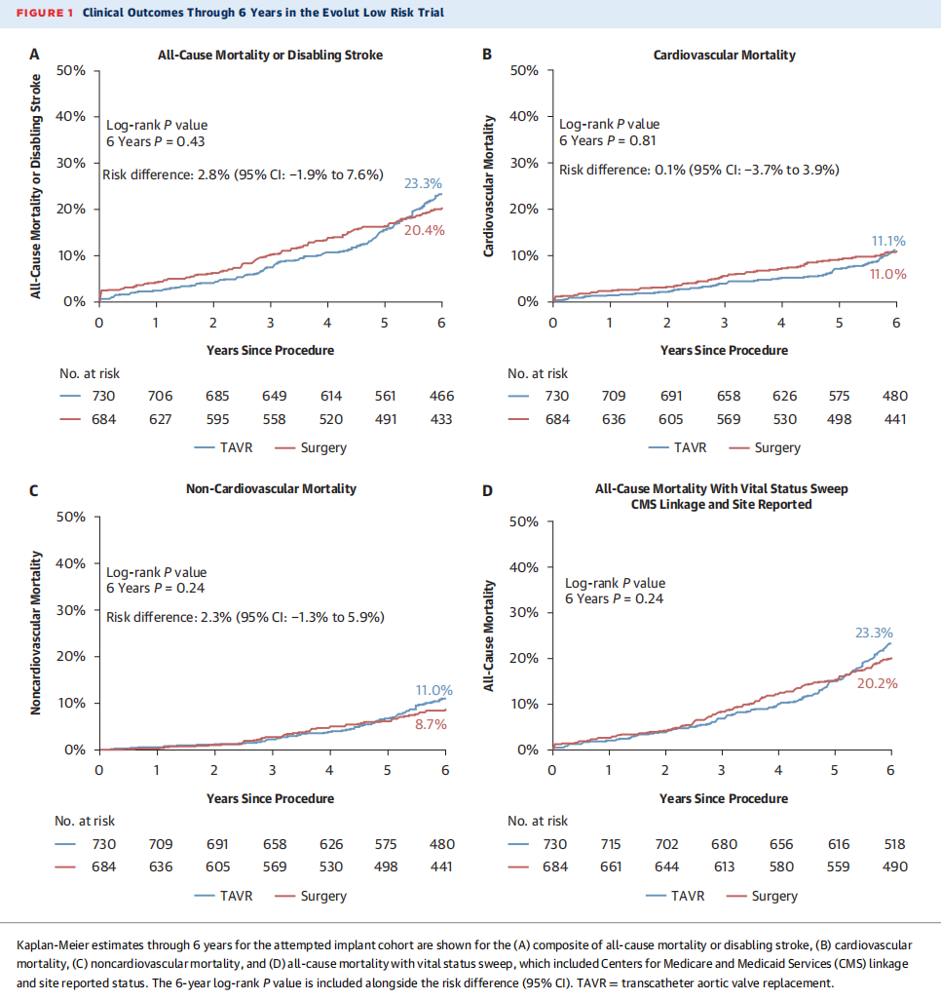
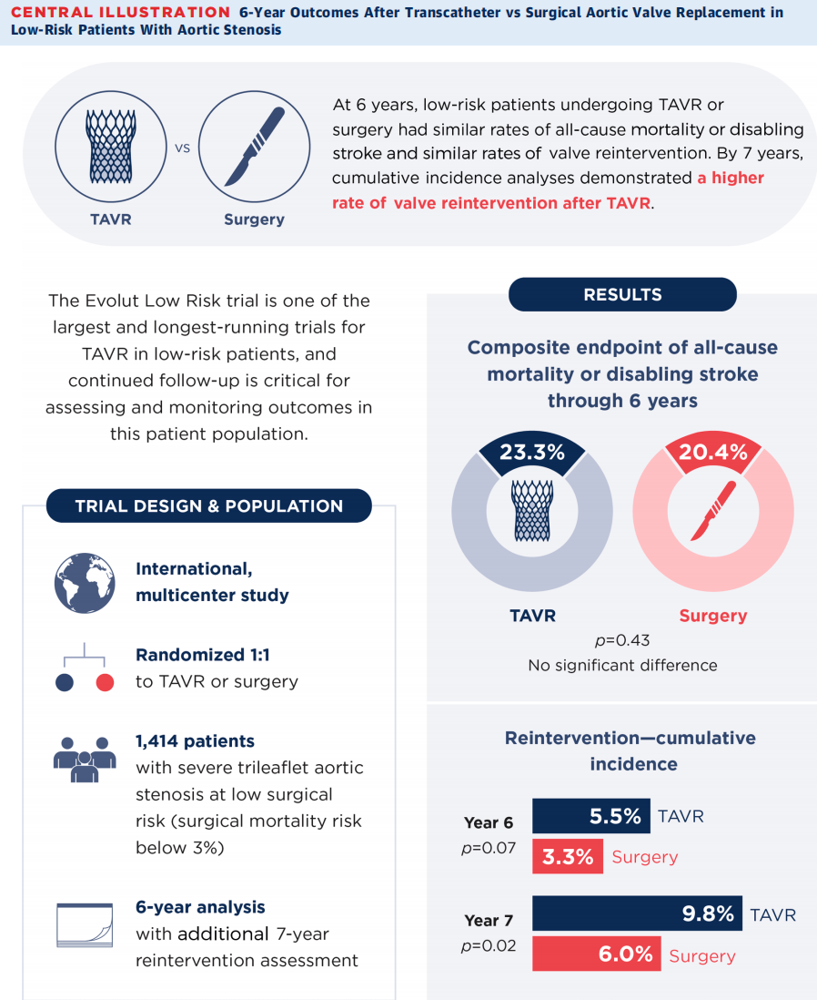
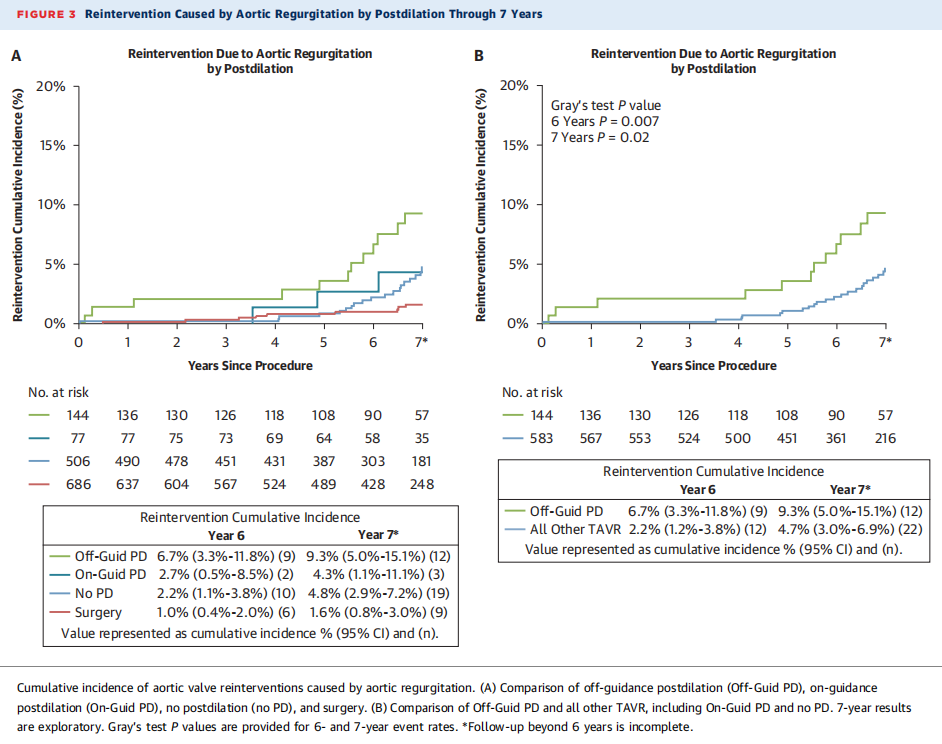

# TAVR Versus Surgical Replacement in Low-Risk Aortic Stenosis: A Reappraisal of Long-Term Outcomes

**Source:** HeartValvePro  
**Original title:** 低危主动脉瓣狭窄患者TAVR与外科置换的远期预后审视  
**Original URL:** https://mp.weixin.qq.com/s/p7_vgVyvrXFtsOJIcOe2WA

Time is the ultimate arbiter of all medical innovations.

The use of transcatheter aortic valve replacement (TAVR) in low-risk patients with aortic stenosis (AS) has continued to expand. As follow-up lengthens, valve durability and the long-term risk of reintervention have become central concerns. The 6-year follow-up results of the Evolut Low Risk trial, together with extended 7-year data, published in the Journal of the American College of Cardiology (JACC), have redefined the long-term clinical expectations for TAVR and surgical aortic valve replacement (SAVR).

## Mortality and Stroke: Hard Endpoints Remain Comparable

For hard endpoints, TAVR remained comparable to conventional SAVR. The trial enrolled 1,414 low-risk patients with severe AS. At 6 years, the composite endpoint of all-cause mortality or disabling stroke occurred in 23.3% of patients in the TAVR group and 20.4% in the SAVR group (difference: 2.8% [95% CI: -1.9% to 7.6%]; P = 0.43), with no statistically significant difference. When vital status follow-up was incorporated, 6-year all-cause mortality was 23.3% and 20.2%, respectively (P = 0.24).

Figure 1. Six-year clinical outcomes in the Evolut Low Risk trial. Kaplan-Meier curves are shown for all-cause mortality or disabling stroke, cardiovascular mortality, non-cardiovascular mortality, and all-cause mortality.

## The Long-Term Challenge: A Clear Difference in Reintervention

The clinical surface and the pathologic mechanism began to diverge. At 6 years, valve reintervention increased to 5.5% in the TAVR group, compared with 3.3% in the SAVR group (sHR: 1.66 [95% CI: 0.96-2.86]; P = 0.07). In the available extended 7-year analysis, this gap widened further: the cumulative reintervention rate reached 9.8% after TAVR and 6.0% after SAVR (sHR: 1.68 [95% CI: 1.10-2.58]; P = 0.02).

Figure 2. Central illustration/7-year cumulative incidence of reintervention, comparing TAVR and surgery for overall reintervention, reintervention for stenosis, and reintervention for regurgitation.

## Mechanistic Clues: Regurgitation and Off-Guidance Dilation

The incidence of stenosis due to valve deterioration was not different between groups (3.6% after TAVR vs 3.5% after SAVR; sHR: 1.14 [95% CI: 0.61-2.15]; P = 0.70). The main driver of the higher long-term reintervention rate after TAVR was aortic regurgitation (AR): 5.6% in the TAVR group versus 1.6% in the SAVR group (sHR: 3.39 [95% CI: 1.62-7.07]; P < 0.001).

Surgery removes the diseased structure completely and implants a new valve. TAVR, by contrast, requires anchoring a stented valve within a pre-existing, distorted, and often heavily calcified structure. The use of balloon postdilation beyond the recommended sizing guidance to achieve sealing, or off-guidance postdilation, may cause uneven mechanical stress distribution and injury to the edge of the prosthetic leaflets. The data showed that patients undergoing this type of off-guidance dilation after TAVR had a significantly higher proportion of reintervention driven by AR.

Figure 3. Relationship between postdilation strategy and reintervention for AR within 7 years, comparing off-guidance postdilation, on-guidance postdilation, no postdilation, and surgery.

## Reflections for Clinical Strategy

In China, a high proportion of patients with AS have bicuspid aortic valve (BAV), often accompanied by severe asymmetric calcification. Anchoring a stented valve in such hostile anatomy carries an objective risk of microscopic structural injury and long-term prosthetic degeneration. For young, low-risk patients with long life expectancy, treatment strategy must therefore be extremely cautious. If preoperative assessment suggests poor conditions in the valve anchoring zone, or if repeated large-balloon dilation is required intraoperatively to eliminate paravalvular leak, conventional surgical valve replacement should be chosen decisively when confidence is insufficient. Freedom from repeat surgery directly determines quality of life over the rest of the patient's lifespan. Shared decision-making must provide a detailed and transparent long-term picture.

## References

Forrest JK, Yakubov SJ, Deeb GM, et al. Six-Year Outcomes After Transcatheter vs Surgical Aortic Valve Replacement in Low-Risk Patients With Aortic Stenosis. JACC. 2026. https://doi.org/10.1016/j.jacc.2026.02.5063

For collaboration or submissions, please leave a message in the WeChat official account or email adams.wang@heartvalvepro.com.

This content is intended solely for academic reference by medical and healthcare professionals. It does not constitute medical advice or any basis for diagnosis or treatment. Clinical decisions must be made by the attending physician based on individual patient factors and relevant clinical guidelines; this account assumes no legal liability arising therefrom. The technical evaluation and literature interpretation in this article are based on currently available evidence-based data and are intended to reflect academic discussion objectively; it does not represent an exclusive recommendation of any specific product or surgical technique.
