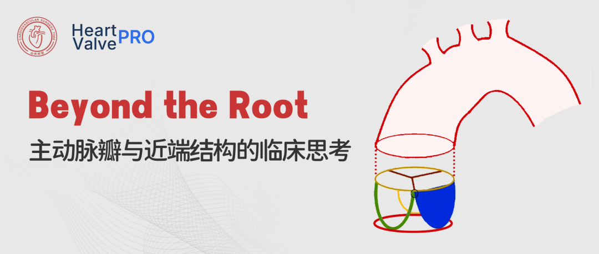
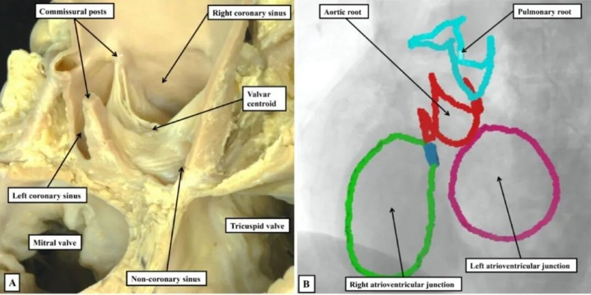
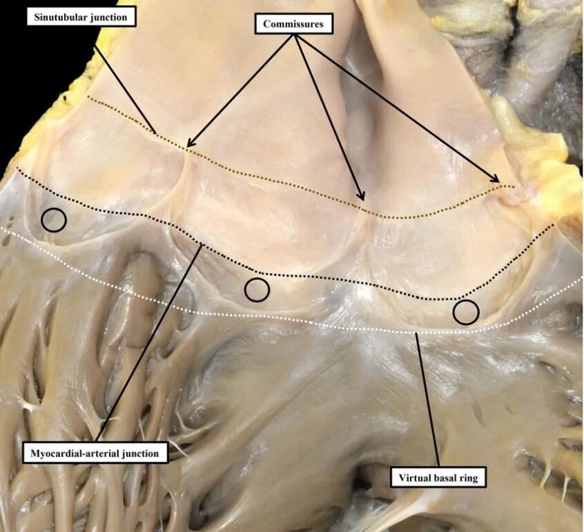
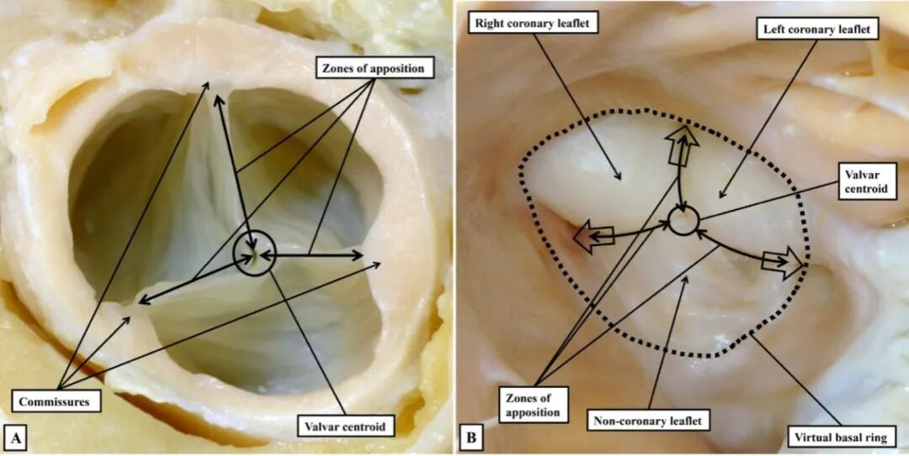

# Beyond the Root | What Are We Really Talking About When We Discuss the Aortic Root?

**Source:** HeartValvePro  
**Original title:** Beyond the Root | 当我们在讨论主动脉根部时，我们到底在说什么？  
**Original URL:** https://mp.weixin.qq.com/s/EbSllgg8OGFDTLW6j8kHbg

## The Problem Begins With Language

When we discuss the aortic root, the problem often does not first appear on the dissection table. It appears in language. This structure is measured repeatedly, operated on frequently, and regarded as one of the most basic and familiar territories in cardiac surgery. Yet the more often it is used, the more disagreement emerges.

People from different specialties, technical pathways, and training backgrounds may use the same terminology while actually referring to different spatial objects. This fragmentation of understanding is not accidental. It is the result of a systemic divergence that has accumulated over time.

Technical progress has obscured the issue. Imaging resolution continues to improve, three-dimensional reconstruction has become increasingly refined, and devices have become more reliable. We therefore tend to assume that our understanding of the aortic root must have deepened in parallel. But this is not always true. Precisely against the background of highly mature technology, fragmentation in anatomic language has become more hidden and more dangerous.

The "semantic crisis" described by Robert H. Anderson does not mean that one definition is simply wrong. It means that multiple definitions are being used at the same time without being clarified, and all are tacitly treated as correct.

## The Double Meaning of the "Annulus" and Spatial Misalignment

The "annulus" is the most concentrated expression of this problem.

From the surgical perspective, it is often understood as the semilunar attachment line of the leaflets, a real structure that can be seen directly and sutured during surgery. In imaging, however, it more often refers to a virtual basal plane abstracted from the three lowest points of leaflet attachment.

Both meanings are valid in their own contexts, but they are not equivalent. One is an anatomic entity, while the other is a geometric construct. One has tissue thickness and mechanical properties, while the other is a calculated result. When preoperative assessment relies on the latter but intraoperative work is based on the former, so-called precision assessment has already lost a unified object.

Figure 1. The "annulus" is not a single structure: spatial separation between the virtual basal ring and the true anatomic boundary. Ex vivo specimens show that the virtual basal ring, the myocardial-arterial junction, and the semilunar leaflet attachment line do not overlap in three-dimensional space. The term "annulus" points to different spatial layers in different systems, which is a core source of long-standing fragmentation in the anatomic language of the aortic root.

The deeper issue is that we have long been accustomed to using two-dimensional language to describe a structure that is essentially three-dimensional. The attachment of the aortic valve leaflets is never located on a single flat plane. It rises and falls continuously along the aortic wall, with the lowest points defining the virtual basal plane and the highest points reaching the commissural level, forming a characteristic crown-like configuration.

This configuration is not a minor anatomic detail. It is the foundation of leaflet mechanics. If we compress it cognitively into a flat "ring," subsequent judgments about leaflet height, coaptation length, and sinus space will be systematically displaced from the starting point.

Figure 2. Crown-like configuration of aortic leaflet attachment and the spatial dependence of the coaptation zone. The leaflet attachment line and commissural height rise and fall in space. Coaptation does not occur around a plane, but is constrained by three-dimensional geometry. Misunderstanding this structure as a two-dimensional ring directly affects leaflet height assessment and intraoperative reconstruction decisions.

## When the Wrong Model Enters the Operating Room

In valve repair, especially valve-sparing aortic root reconstruction, this displacement is rapidly amplified. The surgeon is not simply "resetting" the valve. The surgeon is redistributing tension, support, and coaptation within an artificially constructed space.

If the reference model itself is wrong, even highly refined technical execution can only produce an unstable result. Many so-called technical failures do not arise from inadequate skill, but from a misreading of spatial reality.

This misreading is particularly clear in the evolution of surgical techniques. Take the simplified reimplantation proposed by Modine as an example. Its appeal is easy to understand: fewer steps, shorter operative time, and a gentler learning curve. In a surgical system that values efficiency and reproducibility, such a strategy naturally spreads.

But simplification is not neutral. It means that certain structures are considered negligible, and certain constraints are judged unnecessary. When reimplantation focuses only on suspending the commissural tops while ignoring structural reconstruction of the intercommissural fibrous triangles, a mechanically unsupported cavity is effectively created behind the graft. This problem may not be obvious in the short term, but its cost gradually emerges under repeated diastolic stress.

The modification introduced by De Paulis was a direct response to this reality. Their aim was not to defeat simplification by increasing complexity. Rather, they reaffirmed an overlooked fact: the intercommissural fibrous triangles are not anatomic blanks, but key nodes in mechanical load transfer. By placing longitudinal sutures in these areas, the graft is forced to conform to the true three-dimensional structure rather than being shaped into a simplified model.

This difference appears subtle, but it marks two fundamentally different positions. One attempts to control complexity through simplification. The other chooses to acknowledge complexity and rebuild order on that basis.

Figure 3. The intercommissural fibrous triangles and their key role in aortic root mechanics. The image shows the spatial relationships among the intercommissural fibrous triangles, membranous septum, and aortomitral continuity. These regions are not structural "gaps," but core pathways by which leaflet stress is transferred to ventricular structures. Ignoring reconstruction in these areas creates a mechanically unsupported cavity behind the graft.

From this perspective, the difference between Modine and De Paulis is not merely a disagreement between two surgical techniques. It reflects different answers to the fundamental question: what exactly is the aortic root?

## Histologic Boundaries and Measurement Bias

The same logic also appears in how we understand histologic boundaries. The aortic root is not composed of a single tissue type. Different sinuses contain markedly different tissue components in their basal regions. Some areas include ventricular myocardium, while others are mainly fibrous.

This heterogeneity directly determines the safe boundary for suturing and explains why some complications show highly selective patterns. If discussion of paravalvular leak or conduction disturbance still blurs the distinction between anatomic junctions and functional junctions, we cannot truly understand the path by which the problem occurs. The conduction system is not injured at random. It lies precisely in these regions where tissues interweave and language most easily loses focus.

Imaging should bridge this gap, but only if measurement itself does not generate new bias. A plane that deviates from the leaflet midline systematically underestimates leaflet height and distorts the geometry of the virtual basal plane. In surgery adjusted at the millimeter level, this error is not small. It is simply hidden by being mislabeled as individual variation. Tools do not automatically bring truth unless the model behind them is clear.

## As Technology Moves Further, Cognition Must Align

Transcatheter aortic valve implantation (TAVI) pushes this problem to the extreme. In TAVI, operators depend almost entirely on imaging and virtual structures for judgment. Any inconsistency in anatomic language or spatial models is directly translated into procedural risk.

When the "annulus" points to different objects in different systems, precision implantation lacks a shared coordinate system. Re-clarifying the course of the conduction system through basic anatomy reduces complications not because the technology suddenly broke through, but because cognition was finally aligned.

Ultimately, the problem of the aortic root is not whether technology is advanced enough. It is whether we are willing to acknowledge an uncomfortable fact: if language, spatial models, and measurement logic cannot be unified, even the most refined procedure rests on an unstable foundation.

True progress does not come from upgrading tools alone. It comes from repeatedly recalibrating against anatomic reality. If this is ignored, technology itself may become a mechanism that magnifies risk.

## References

Anderson RH, Spicer DE, Tretter JT. The need for precision when describing the aortic root. Vessel Plus. 2025;9:18. https://dx.doi.org/10.20517/2574-1209.2025.102

## About the Journal

Vessel Plus (Online ISSN 2574-1209) is a gold open-access international academic journal launched by OAE Publishing Inc. on March 31, 2017, with a strict single-blind peer-review process. The journal focuses on basic, clinical, and translational research related to vascular disease, including pathogenesis, diagnosis, treatment, and prognosis. Its scope covers atherosclerosis, aneurysms, thrombosis, ischemic disease, hypertension, peripheral vascular disease, and related fields. The journal accepts original research, reviews, commentaries, and personal perspectives, and aims to provide a high-quality academic exchange platform for researchers and clinical experts in vascular medicine. The editor-in-chief is Professor Aijun Sun, and the senior academic adviser is Academician Junbo Ge. It is indexed in ESCI, Scopus, CAS, Lens, CNKI, and J-Gate. Its 2024 CiteScore is 1.8, with a real-time impact factor above 1.4 and a target impact factor of 5.

Journal website: https://www.oaepublish.com/vp

Submission link: https://www.oaecenter.com/login?JournalId=vp

Contact: editorialoffice@vpjournal.net

For collaboration or submissions, please leave a message in the WeChat official account or email adams.wang@heartvalvepro.com.

This content is intended solely for academic reference by medical and healthcare professionals. It does not constitute medical advice or any basis for diagnosis or treatment. Clinical decisions must be made by the attending physician based on individual patient factors and relevant clinical guidelines; this account assumes no legal liability arising therefrom. The technical evaluation and literature interpretation in this article are based on currently available evidence-based data and are intended to reflect academic discussion objectively; it does not represent an exclusive recommendation of any specific product or surgical technique.
