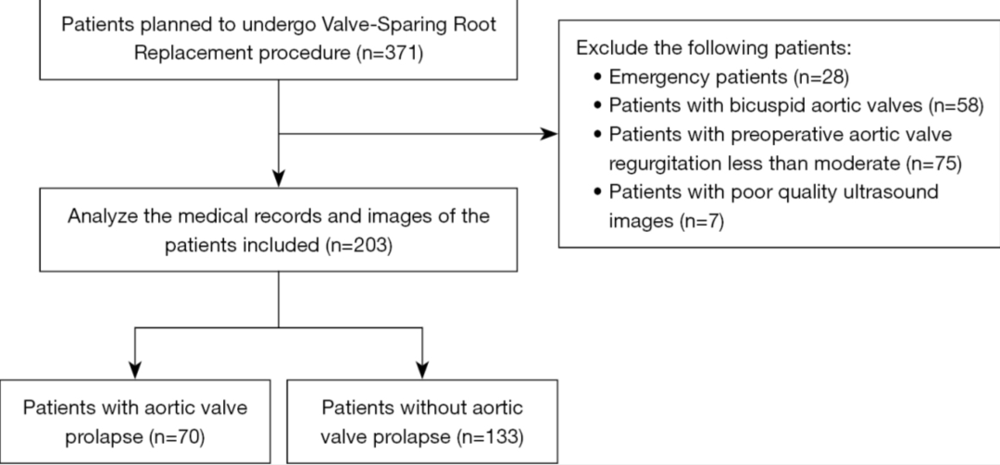
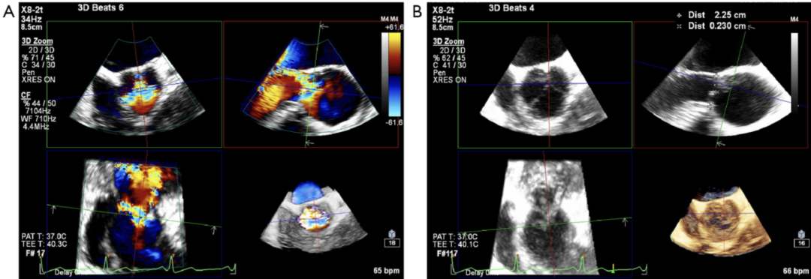
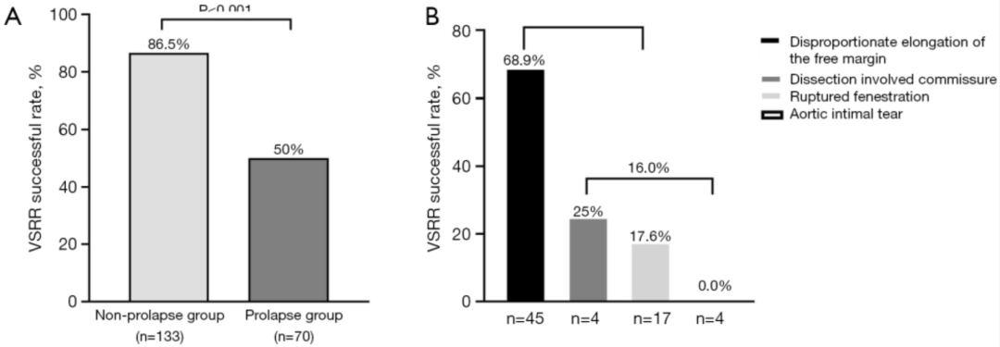

# Leaflet Prolapse in Tricuspid Aortic Valve Root Aneurysm: Mechanistic Classification and Surgical Strategy Based on 3D TEE

**Source:** HeartValvePro  
**Original title:** 三叶式主动脉瓣根部瘤中的瓣叶脱垂：基于 3D TEE 的机制分型与手术策略分析  
**Original URL:** https://mp.weixin.qq.com/s/51fCP1EFC6iUeC9DC6bUrA

Precision in diagnosis precedes the art of preservation.

## Challenge and Dilemma

Now that valve-sparing root replacement (VSRR) has become a standard operation for aortic root aneurysm, the surgeon's challenge has shifted from "can it be done?" to "should it be done?" For bicuspid aortic valve (BAV), relatively mature repair strategies already exist. But for patients with tricuspid aortic valve (TAV) and root aneurysm, decision-making becomes much more uncertain when preoperative imaging suggests leaflet prolapse. The mechanism of prolapse, and the extent to which it may obstruct an attempt at valve preservation, have long remained difficult questions in the field.

Previous studies have suggested that severe preoperative regurgitation may be a risk factor for repair failure. However, because the specific anatomic mechanisms behind regurgitation were not clearly distinguished, this conclusion remains controversial. Schäfers' group proposed a classic classification of aortic regurgitation mechanisms, but most of those cases did not involve root aneurysm, and specific imaging-based quantitative criteria for patients with root aneurysm and leaflet prolapse have been lacking.

## A Breakthrough: Mechanistic Stratification With 3D TEE

A study from the Department of Anesthesiology and the Department of Cardiovascular Surgery at Fuwai Hospital, Chinese Academy of Medical Sciences, published in Quantitative Imaging in Medicine and Surgery, offered a mechanistic stratification approach based on a large-sample analysis using three-dimensional transesophageal echocardiography (3D TEE). This retrospective cohort study directly addressed a pain point in real surgical practice and used detailed data to show the significant impact of leaflet prolapse on VSRR success. The study included 203 consecutive patients scheduled for VSRR because of TAV root aneurysm. The team acquired intraoperative 3D TEE images under general anesthesia using the Philips EPIQ CVx echocardiography system.

Figure 1. Study cohort flowchart.

## Precise Definition and Mechanistic Classification of Prolapse

Leaflet prolapse was strictly defined as eccentric regurgitation in any long-axis view, with an effective height (eH) of the suspected leaflet below 8 mm.

Figure 2. Definition of prolapse based on 3D TEE. (A) Long-axis view of the aortic valve showing eccentric regurgitation. (B) Effective height of the suspected leaflet below 8 mm.

Based on 3D reconstruction, the mechanisms of prolapse were divided into four categories: disproportionate free margin (FM) elongation, fenestration rupture, intimal tear at the commissure, and chronic type A dissection involving the commissure. 3D TEE can divide leaflet prolapse into "soft injury" and "hard injury." FM elongation is a soft injury, similar to a curtain that is too long and drags on the floor; central plication can gather the redundant segment and restore function. Fenestration rupture, intimal tear, or dissection involving the commissure are hard injuries, like decayed or torn curtain fabric, or fabric too short to cover the window because of insufficient geometric height (gH). Forced repair in such cases is often futile.

## The Harsh Reality Revealed by the Data

Among 203 patients, 34.5% (70 patients) had leaflet prolapse. Disproportionate FM elongation was the dominant mechanism, accounting for 64.3% of cases. The VSRR success rate was significantly lower in the prolapse group than in the non-prolapse group (50.0% vs 86.5%, P < 0.001). Among patients with root aneurysm and prolapse, the VSRR success rate was only 50%, reflecting the quality-control standard of a mature center and the need to find a rational balance between the ideal of preserving native tissue and the reality of long-term durability.

Subgroup analysis showed that when the prolapse mechanism was isolated FM elongation, the VSRR success rate reached 68.9%. Repair success for FM elongation was therefore still acceptable. In other complex mechanisms, such as fenestration rupture and tear, the success rate fell to 16.0%.

Figure 3. Surgical outcomes. (A) VSRR success rate in the prolapse and non-prolapse groups. (B) VSRR success rate across the four prolapse mechanisms.

## Geometric Height Defines the Repair Floor

Multivariable regression analysis showed that, after excluding non-FM elongation mechanisms, reduced minimal geometric height (gH) was an independent risk factor for VSRR failure (OR = 0.70). The tissue reserve of the leaflet itself is the key determinant of repair success. Patients in whom the valve was successfully preserved had significantly higher gH than those converted to a Bentall procedure (18.5 mm vs 17.38 mm).

In Chinese clinical practice, patients often have underdeveloped leaflets or concomitant calcification. If gH is borderline, forcing a repair makes it difficult to achieve the ideal postoperative effective height of 9-10 mm, and the risk of late recurrent regurgitation is substantial. The Fuwai team maintained technical restraint by not using patch augmentation to compensate for insufficient gH. A patch can solve the immediate coaptation problem, but it carries a high long-term risk of calcification and shrinkage.

## Surgical Decision-Making: Knowing When to Stop

In patients with TAV root aneurysm, the mechanisms of leaflet prolapse are heterogeneous and significantly reduce the success rate of VSRR. Accurate preoperative 3D TEE quantification of leaflet pathology and gH helps select suitable cases. The greatest value of this study lies in damage control. When preoperative assessment suggests a hard-injury type of prolapse or excessively low gH, decisively choosing the Bentall procedure, or composite valved conduit replacement, is responsible for long-term quality of life and should not be viewed as a surgical failure.

Although the proportion of valve preservation was lower in the prolapse group, careful screening and intraoperative conversion to Bentall when appropriate led to no significant difference between groups in midterm survival or freedom from reintervention. Whether the valve is repaired or replaced, the right strategy can provide good outcomes.

The highest skill of a cardiac surgeon is shown before the scalpel is picked up, in precise judgment based on anatomy and evidence. Suturing technique comes second. Strict decision boundaries mean that the suture is not only for the valve, but also for the stability of the patient's life over the next several decades.

For collaboration or submissions, please leave a message in the WeChat official account or email adams.wang@heartvalvepro.com.

This content is intended solely for academic reference by medical and healthcare professionals. It does not constitute medical advice or any basis for diagnosis or treatment. Clinical decisions must be made by the attending physician based on individual patient factors and relevant clinical guidelines; this account assumes no legal liability arising therefrom. The technical evaluation and literature interpretation in this article are based on currently available evidence-based data and are intended to reflect academic discussion objectively; it does not represent an exclusive recommendation of any specific product or surgical technique.
