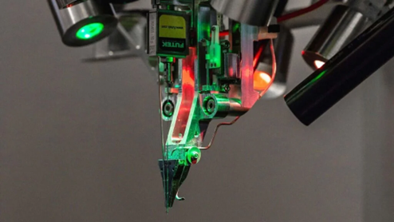

# Elon Musk on Surgeons: The Boundary Between Technique and Judgment

**Source:** HeartValvePro  
**Original title:** 马斯克谈外科医生：技术与判断的边界  
**Original URL:** https://mp.weixin.qq.com/s/hKsGUJdqKPLGsGM0R_Glvg

Figure 1. Elon Musk recently discussed this topic in an interview on Moonshots.

In an interview, Elon Musk made a striking prediction: the best surgeons in the future will not be human. This view has generated considerable discussion in medicine. But if placed back into the context of engineering and technological development, it is less a simple judgment on the profession of surgery than a question about the nature of surgery itself.

Musk's example came from the neurosurgical robot developed by his company Neuralink. Its task is to implant extremely thin electrodes into the brain with high precision while avoiding blood vessels. This process is highly structured: the pathway can be planned, the precision requirement is explicit, and the operation must be stable and repeatable.

Figure 2. The implanted Neuralink threads are extremely fine and can only be inserted by a surgical robot.

In an engineering system, once a task has these features, it usually moves toward standardization and automation: reducing human variability, improving consistency of results, and eventually forming a reproducible system capability. From this perspective, Musk was not discussing the "surgeon" in the simple professional sense, but the parts of surgery that can be standardized and engineered.

## Can Surgery Be Deconstructed?

In clinical practice, surgery is not a single process. It consists of multiple steps with different properties.

One part is gradually becoming structured. Preoperative imaging assessment and planning for valve procedures, including annular sizing, access selection, and three-dimensional reconstruction, increasingly depend on quantitative analysis and imaging data. Some operative steps also have clear paths and goals, with strong repeatability and trainability.

These steps are moving closer to the paradigm of engineering problems: the workflow is clear, error can be controlled, and results can be evaluated.

At the same time, however, another part of surgery remains difficult to standardize completely.

The tissue state seen during surgery often differs from preoperative imaging. Leaflet quality, calcification distribution, and structural morphology can only be appreciated fully under direct vision. Decisions based on these findings, whether to repair, how to repair, or whether to modify the initial plan, depend more on real-time judgment by the operator.

These decisions are often difficult to encode in advance as fixed workflows.

## Beyond Structure, There Is Flow

This difference is especially clear in cardiac surgery.

The goal of surgery is not only to reconstruct anatomic structure, but also to restore a reasonable hemodynamic state.

After repair, the path of blood flow, velocity distribution, presence or absence of regurgitation, and change in transvalvular gradient all affect the final result. These factors are not fully represented by the structure itself. They are fluid behaviors generated on the basis of structure.

Therefore, surgery requires not only "completing the structure," but also repeatedly evaluating and adjusting the flow result created by that structure.

This is why some judgments occur during the operation rather than being derived entirely from the preoperative plan.

At this level, surgery is not only structural reconstruction. It is the management of a complex fluid system.

## The Boundary Between Technique and Judgment

If surgery is deconstructed, two types of content coexist.

One part is moving toward standardization and reproducibility. The other still depends on experience, understanding, and real-time judgment.

The former is closer to an engineering problem and has the potential for automation. The latter involves dynamic regulation of a complex system and remains difficult to formalize completely.

What Musk emphasized was mainly the possibility of the first part: the parts of surgery that can be engineered.

Clinical practice, however, must deal with both parts at the same time.

## From "Doctor" to "Capability"

From a broader perspective, this discussion points to a deeper question: how surgical capability is delivered.

In the current medical system, high-level surgical capability depends heavily on individual experience and is concentrated in a small number of centers. Patients have to travel, and surgical opportunities are therefore constrained.

If part of surgical capability can be standardized and reproduced, the way medical services are supplied may change. It may no longer depend entirely on individuals, but partly on systems.

This does not mean that doctors will be replaced. It more likely means a shift in role: from operator toward decision-maker and system collaborator.

## Still in Motion

Technology is changing part of surgery, and this process is ongoing.

Imaging is more precise, pathways are clearer, and some experience is being translated into rules and systems. At the same time, uncertainty, individual variation, and real-time judgment still remain in the operating room.

Between these two forces, the form of surgery is gradually changing.

Future surgery may contain reproducible technology while preserving irreplaceable judgment.

That boundary is still moving.

## References

References omitted in the original article.

For collaboration or submissions, please leave a message in the WeChat official account or email adams.wang@heartvalvepro.com.

This content is intended solely for academic reference by medical and healthcare professionals. It does not constitute medical advice or any basis for diagnosis or treatment. Clinical decisions must be made by the attending physician based on individual patient factors and relevant clinical guidelines; this account assumes no legal liability arising therefrom. The technical evaluation and literature interpretation in this article are based on currently available evidence-based data and are intended to reflect academic discussion objectively; it does not represent an exclusive recommendation of any specific product or surgical technique.
