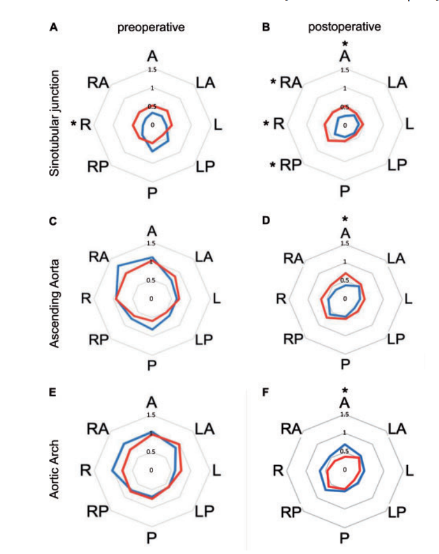
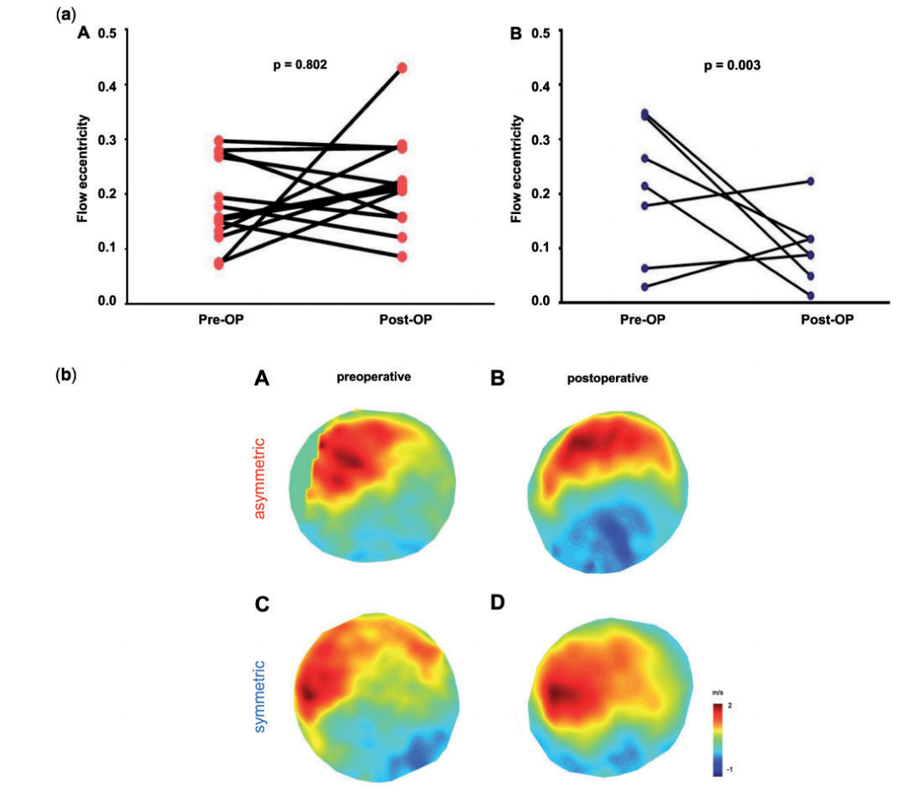

# Changes in Transvalvular Flow After Aortic Valve Repair: A Quantitative Comparison of Symmetric and Asymmetric Geometry

**Source:** HeartValvePro  
**Original title:** 主动脉瓣修复术后跨瓣血流模式的改变：对称与非对称几何形态的量化比较  
**Original URL:** https://mp.weixin.qq.com/s/aZK18o9DZJzgr0LoYVU2Lg

Form follows function, and in the heart, flow dictates destiny.

Congenital aortic valve disease often requires surgical intervention in young or middle adulthood because of its high prevalence and associated hemodynamic deterioration. In recent years, aortic valve repair has become a feasible option for carefully selected patients because it avoids the anticoagulation burden of mechanical valves and the degeneration of bioprosthetic valves. Within this field, a central technical debate has focused on how repaired valve geometry affects hemodynamics in the proximal aorta. Preserving native leaflet tissue is important, but the reconstructed commissural orientation and symmetry directly shape the flow field within the aortic root. With the clinical application of four-dimensional flow magnetic resonance imaging, surgeons can move beyond static anatomic observation and quantify complex dynamic transvalvular flow parameters, providing concrete imaging evidence for the long-term efficacy of different anatomic repair strategies.

## HeartValvePro Perspective

This magnetic resonance fluid-dynamics analysis from the Hamburg group, interpreted below, gives unavoidable physical meaning to commissural reconstruction strategy at the operating table. In past clinical discussion, the repair pathway for bicuspid aortic valve (BAV) has long been theoretically divided. One view tends to respect the native unequal leaflet anatomy absolutely and advocates completing an asymmetric repair with minimal intervention. Another strongly advocates restoring a 180-degree symmetric commissural orientation through complex root remodeling or patch techniques. The robust data from German investigators, by quantifying wall shear stress, a direct driver of aortic dilation, establish the clear long-term hemodynamic advantage of symmetric reconstruction.

The physical mechanism behind this lies in the fact that valve geometry determines the path of energy dispersion during systolic ejection. In plain terms, it is like reinstalling doors in an old stone archway. If the frame itself is tilted, placing two unequal door panels according to the tilted frame may temporarily maintain closure, but every surge of water will apply eccentric force to one particular supporting wall. The essence of symmetric repair is to reshape the frame and the door panels together, redirecting turbulent vortices into a smoother, centered laminar flow. This hydrodynamic correction greatly reduces eccentric shear injury from high-velocity flow on the anterior aortic wall and limits the future risk of dissection or recurrent root aneurysm at its source.

In domestic clinical practice, the pathologic background of patients with congenital valve disease is often harsher. Many patients already have extensive leaflet calcification, severe thickening, or free margin shortening by the time they present. When usable tissue is extremely limited, forced symmetric reconstruction can easily sacrifice coaptation height and cause fatal early repair failure. Therefore, careful preoperative echocardiographic evaluation and intraoperative tactile judgment of tissue pliability are both indispensable. If suspension and appropriate plasty can achieve an ideal symmetric, leak-free result, this is a perfect expression of surgical art. If leaflet quality is extremely poor, blind insistence on symmetric repair will create uncontrollable risk. When confidence is insufficient, prosthetic valve replacement should be chosen without hesitation.

The ultimate measure of medical intervention is always the real benefit to the patient over the long remainder of life. The superior flow-field data associated with symmetric geometry suggest that the patient's aortic wall may be spared nonphysiologic attrition with every future heartbeat. Every precise movement of the scalpel is both a microscopic refinement of damaged anatomy and a deep respect for the larger laws of life fluid dynamics.

## Literature Interpretation

The study discussed here was published in the European Journal of Cardio-Thoracic Surgery in 2021 and led by Professor Evaldas Girdauskas and Professor Hermann from the University Heart and Vascular Center Hamburg in Germany. This center has deep experience in aortic valve repair and advanced imaging assessment. The study innovatively used quantitative hemodynamic analysis to directly compare how repair strategies preserving different valve geometries affect wall shear stress and flow eccentricity.

## Study Background

BAV disease is often accompanied by progressive leaflet degeneration and aortic dilation. Previous studies have clearly shown that patients with untreated BAV commonly have abnormally elevated wall shear stress in the proximal aorta, eccentric flow, and severe helical flow. Even surgical valve replacement cannot fully restore the physiologic laminar flow pattern seen in a healthy tricuspid aortic valve. Current aortic valve repair techniques aim to reshape the commissural angle and eliminate annular dilation, but prospective quantitative data have been insufficient regarding whether surgeons should pursue absolute symmetry, with a commissural angle approaching 180 degrees, or accept the native asymmetric configuration, with a commissural angle below 160 degrees.

## Study Methods

The investigators prospectively enrolled 20 patients with congenital aortic valve disease who underwent aortic valve repair. Mean age was approximately 39 years, and 80% were male. All patients underwent non-contrast 4D-flow magnetic resonance imaging before and after surgery. Based on the final intraoperative commissural angle, the cohort was divided into two groups. The first was the asymmetric repair group, with 13 patients and a mean commissural angle of approximately 135 degrees, mainly Sievers type 1 BAV. The second was the symmetric repair group, with 7 patients, including patients who underwent bicuspidization of unicuspid valves and remodeling in the setting of aortic root aneurysm; all had commissural angles of at least 160 degrees. Core imaging parameters included flow eccentricity, transvalvular regurgitant volume, semiquantitative grading of helical and vortical flow, and circumferential and segmental wall shear stress assessed at the levels of the sinotubular junction (STJ), ascending aorta, and aortic arch.

## Study Results

The two groups showed no statistically significant differences in age, sex, preoperative STS score, or body mass index. In core surgical metrics, the symmetric repair group had a longer cardiopulmonary bypass time, 124 minutes versus 99 minutes (P = 0.023), and a longer aortic cross-clamp time, 84 minutes versus 54 minutes (P = 0.001). Postoperative echocardiography confirmed that both groups had very low transvalvular gradients and residual regurgitation, with no significant between-group difference.

## Hierarchical Changes in Wall Shear Stress

Imaging analysis revealed marked between-group hemodynamic divergence. After surgery, the asymmetric repair group showed a statistically significant reduction in circumferential wall shear stress only in the distal aortic arch, from 0.79 at baseline to 0.59 (P = 0.015). In the symmetric repair group, circumferential wall shear stress at the ascending aorta and aortic arch levels decreased significantly from baseline, with P values below 0.05. More importantly, direct between-group comparison showed that after surgery, the asymmetric repair group had significantly higher circumferential wall shear stress than the symmetric repair group at all three observed levels of the proximal aorta: 0.45 versus 0.30 at the STJ (P = 0.028), 0.59 versus 0.44 at the ascending aorta (P = 0.021), and 0.59 versus 0.40 at the aortic arch (P = 0.017).

Figure 1. Hierarchical changes in wall shear stress after repair.

## Flow Eccentricity and Helical Flow Grade

Flow eccentricity is a core marker of the extent to which the jet deviates from the central vascular axis. In the symmetric repair group, eccentricity at the ascending aorta decreased substantially from 0.38 before surgery to 0.25 after surgery (P = 0.003). In the asymmetric repair group, eccentricity showed no substantive postoperative improvement at any measured level, with P = 0.80 at the ascending aorta. In addition, postoperative helical flow severity in the ascending aorta was significantly lower in the symmetric group than in the asymmetric group (P = 0.046). Vortical flow and quantified forward and reverse transvalvular flow volumes did not differ significantly between groups.

Figure 2. Heatmap of ascending aortic flow eccentricity before and after repair.

## Study Conclusion

Objective quantitative analysis based on 4D-flow magnetic resonance imaging confirmed that, compared with anatomy-following asymmetric repair, aortic valve repair using symmetric geometry can more effectively restore a physiologic transvalvular flow distribution and significantly reduce wall shear stress and flow eccentricity in the proximal aorta. From the perspective of long-term hemodynamic optimization, surgeons treating congenital aortic valve disease should establish symmetric valve geometry as the preferred repair goal.

## Further Reading

Beyond the Root Master Series | Professor Hermann: Choice Is Not a Technical Question (Part 1)

New Column Preview | Beyond the Root: Clinical Reflections on the Aortic Valve and Proximal Structures

For collaboration or submissions, please leave a message in the WeChat official account or email adams.wang@heartvalvepro.com.

This content is intended solely for academic reference by medical and healthcare professionals. It does not constitute medical advice or any basis for diagnosis or treatment. Clinical decisions must be made by the attending physician based on individual patient factors and relevant clinical guidelines; this account assumes no legal liability arising therefrom. The technical evaluation and literature interpretation in this article are based on currently available evidence-based data and are intended to reflect academic discussion objectively; it does not represent an exclusive recommendation of any specific product or surgical technique.
