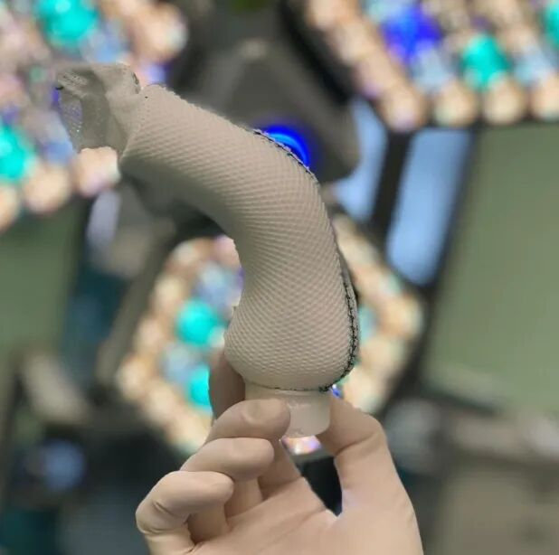
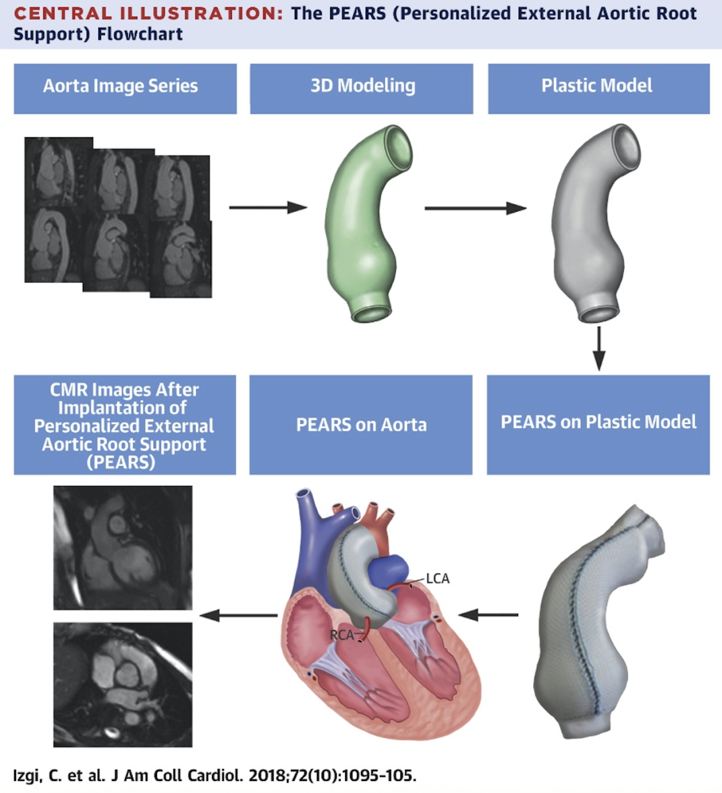

# The Algorithm of an Outlier: A Conversation With the First Chinese Patient to Undergo PEARS in the United Kingdom

**Source:** HeartValvePro  
**Original title:** 离群者的算法：对话首位赴英接受 PEARS 手术的中国患者  
**Original URL:** https://mp.weixin.qq.com/s/EJcloxbKmp0sibcqH-nEXQ

Fifty millimeters.

For cardiac surgeons, this aortic root diameter means that the starting gun for intervention has already fired. For Mr. F, it felt more like a chasm between physiologic structure and probability calculation.

He had been diagnosed with a non-Marfan connective tissue disorder, meaning that at the microscopic level his vascular wall was more fragile than that of the average person. Once the dilation reached the absolute surgical threshold of 50 mm, only two standard pathways seemed to lie before him: a Bentall procedure with replacement using a valved conduit, or a David procedure attempting to preserve the valve. Especially in China's leading cardiac centers, both operations are already mature, assembly-line-level techniques.

Yet Mr. F did not follow the current. He chose to become the first Chinese patient to travel to the United Kingdom for personalised external aortic root support (PEARS). This was not merely cross-border medical care. It was a rational decision-maker's attempt to calculate a survival pathway outside the standardized medical system.

## Re-Anchoring the Risk Model: From the "Olympic Champion" to First Principles

At the beginning of decision-making, Mr. F faced what is widely recognized as a jewel in the crown of cardiac surgery: the David procedure. China's leading experts have exceptional skill in valve-sparing surgery, but after deep research Mr. F keenly identified a statistical variable at the foundation of the procedure: operator dependency.

The David procedure requires the surgeon, within a very short window while the heart is arrested, to reconstruct the valve anatomy based on experience. For Mr. F's fragile connective tissue, this high-precision suturing was both salvation and risk. In the interview, he used a vivid analogy to describe the extreme demand on tactile skill:

"It is like asking an Olympic champion to hit 10.9 every time. Of course you cannot guarantee that every shot will reach that score. The lead surgeon is also a person, not a machine. If today he hits 10.5 or 10.4, the negative effect on the later surgical result could be very large."

He stated frankly that he did not want to stake the safety of the next several decades on a particular surgeon's physiologic state at a particular moment. Could there be a less mystified certainty, an engineering solution with greater tolerance for error? PEARS met precisely this need. It follows the first-principles logic admired by Musk: go directly to the essence of the problem, which is dilation.

Figure 1. PEARS follows first-principles logic: simple, efficient, and directed at the critical point of the problem.

Through CAD digital twinning and 3D printing, PEARS moves the key measurement step forward into the factory. The ExoVasc mesh support, as a customized mold, physically locks in a lower bound for the operation. What Mr. F valued was exactly this dimensional reduction: if suturing is too difficult, then avoid suturing; if the vessel wall is too thin, reinforce it from outside.

## The 50-mm Mechanical Game: Using the Native Structure Against Replacement

At the 50-mm dilation point, the rise in wall tension has already approached a physical limit. The logic of conventional surgery is destruction and reconstruction: removing the diseased vessel and replacing it with artificial material.

Mr. F's hesitation was not simple conservatism. As a young to middle-aged person, he wanted not only to survive, but to live with full effort. Once a mechanical valve was implanted, lifelong anticoagulation would become a sword hanging overhead. If a bioprosthetic valve was chosen, repeat sternotomy 15 years later would be another unavoidable risk.

PEARS follows Laplace's law, directly limiting wall tension by physically locking the radius. Data from Conal Austin's team show that in his cases, 95% did not require cardiopulmonary bypass. This meant that Mr. F most likely would not need cardiac arrest or systemic inflammatory exposure.

"Because the vessel is never opened, theoretically you do not need to worry about thrombosis or endocarditis risk... that makes a person feel much more at ease."

Although PEARS carries the risk of less mature long-term data compared with conventional surgery, it offers the benefit of preserving the native structure intact. This is a probability-based tradeoff.

## A Mismatch in System Style: Extreme Rigor Inside an Apparently Modest Setup

As the first Chinese case, Mr. F's medical experience in the United Kingdom was filled with a certain magical-realist mismatch. Compared with the scale and busyness of China's tertiary hospitals, the first impression left by the British private hospital was strikingly modest.

"That private hospital was only a small three- to five-story building. In China, it might be about the size of a township health center."

Yet it was in this seemingly modest environment that he encountered another dimension of rigor. Preoperative screening showed that he had antibiotic resistance. In China's high-throughput environment, this would usually require only standard prophylaxis. In the United Kingdom, it triggered a near biochemical-crisis level of defense: single-room isolation, full protective equipment, and scheduling as the last operation of the day.

"My surgery was arranged as the last case of the day... after my procedure, the entire operating room had to be disinfected... all the doctors who came to care for me wore gloves and protective clothing before entering."

What surprised him most was the rapid discontinuation of medication within 24 hours after surgery. In China, extended antibiotic coverage is standard after major surgery involving an artificial vascular graft. Mr. F admitted that he was worried at the time, feeling that even after a tooth extraction one takes anti-inflammatory medication, let alone after major heart surgery.

Figure 2. This highly porous mesh support, woven from medical-grade polymer, follows the core logic of in situ reinforcement. It is wrapped precisely around the adventitia of the dilated aortic root, without contacting blood or damaging the vascular endothelium. According to Laplace's law (wall tension = transmural pressure x radius), the mesh imposes a rigid physical constraint that locks the vessel radius and fundamentally limits further increases in wall tension. This non-intravascular implant design partly explains the anatomic confidence behind the British team's rapid postoperative discontinuation of antibiotics.

## Echoes Beyond the Narrow Gate

The successful operation convinced Mr. F that his choice had not been wrong. But he did not become an uncritical advocate. He clearly understood that PEARS is a narrow gate, suitable only for a specific group of patients like himself whose valve function is relatively intact.

"The reality is that if we already have 95% of what exists abroad, that is remarkable... but PEARS just happens to be one of the things we may not have."

Mr. F spoke highly of the domestic medical system. He believes that in 99% of situations, China's high-throughput model provides more efficient and safer support, with a complete team as backup, whereas in the United Kingdom, it is often more like a single-surgeon effort.

Even so, he chose to share this experience not to show off the label of a first case, but to introduce a new parameter for the remaining 1%, for patients like him who are caught between standard options.

"If we could bring PEARS surgery into China, that would be the best of both worlds... given China's population, I believe the number of operations could be multiplied by five, or even by ten."

Mr. F's story is ultimately not a tired narrative about foreign medicine being inherently better. It is the awakening of an expert patient. He shows us that in front of the great machinery of standardized medicine, the individual still has the possibility of holding the steering wheel. By dissecting data and looking through logic, he found an engineering pathway of his own beyond mature empiricism.

This is the most plain-spoken footnote to precision medicine.

For collaboration or submissions, please leave a message in the WeChat official account or email adams.wang@heartvalvepro.com.

This content is intended solely for academic reference by medical and healthcare professionals. It does not constitute medical advice or any basis for diagnosis or treatment. Clinical decisions must be made by the attending physician based on individual patient factors and relevant clinical guidelines; this account assumes no legal liability arising therefrom. The technical evaluation and literature interpretation in this article are based on currently available evidence-based data and are intended to reflect academic discussion objectively; it does not represent an exclusive recommendation of any specific product or surgical technique.
