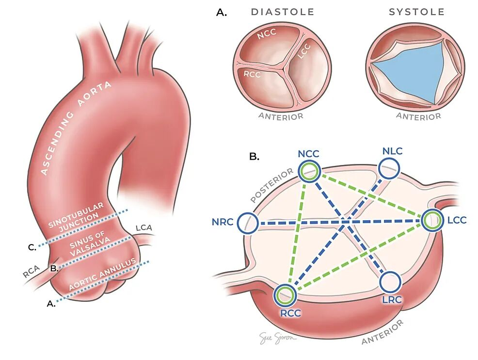
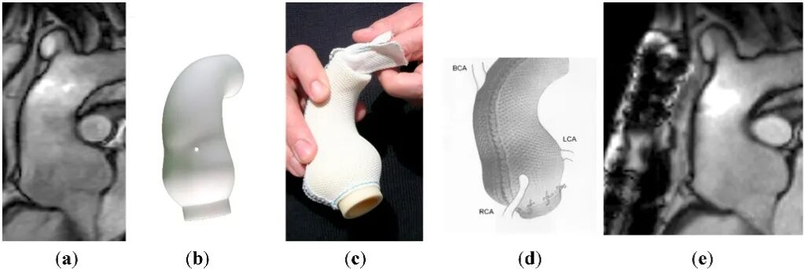
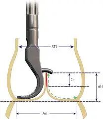

# Quantified Geometry: PEARS and Precision Imaging Assessment of the Aortic Root

**Source:** HeartValvePro  
**Original title:** 被量化的几何形态：PEARS 与主动脉根部的精准影像学评估  
**Original URL:** https://mp.weixin.qq.com/s/f1ccTxRxDn7SBsgl6vOfVw

A perfect aortic root operation is often won or lost before the skin incision. When the operating lights turn on, every step the surgeon performs is in fact a physical reproduction of preoperative imaging data. Whether the goal is valve-sparing root replacement (VSRR) that replicates anatomic structure, or PEARS, which depends completely on customized manufacturing, the core of both technologies is highly consistent: extreme quantification of the three-dimensional geometry of the aortic root.

## Imaging as Prescription: From Seeing Clearly to Measuring Precisely

For a long time, the role of preoperative CT was limited to diagnosing aneurysm size. But in the precision logic of valve-sparing surgery, CT data have evolved into the digital blueprint for surgery, and even into the direct production mold for an implant.

Figure 1. Anatomic layers of the aortic root and spatial quantification reference points. Left: three key cross-sectional planes of the aortic root are defined: A, the aortic annulus; B, the sinus of Valsalva; and C, the sinotubular junction (STJ). Precise imaging assessment must be based on axial measurements at these three levels. Upper right (A): morphologic switching of the valve between diastole and systole. Imaging assessment needs to capture the maximal geometry at end diastole. Lower right (B): the spatial geometric relationships among the three sinus centers, including the noncoronary cusp (NCC), right coronary cusp (RCC), and left coronary cusp (LCC). By quantifying the distances between commissures and sinus centers, surgeons can calculate leaflet coaptation height.

For the aortic root, a precise hydraulic functional unit, transesophageal echocardiography (TEE) is excellent for real-time hemodynamic observation but is limited in geometric quantification by dependence on imaging plane angle. Multidetector computed tomography (MDCT), with isotropic resolution and submillimeter measurement accuracy, has become the definitive ruler for defining surgical boundaries. It can capture the effective diameter of the annulus, eliminating the underestimation error that may arise from two-dimensional plane measurements and providing undeniable geometric truth for decision-making.

## PEARS: A Digital Twin of Bits and Atoms

PEARS represents an extreme form of imaging-guided engineering manufacturing. It requires the ExoVasc mesh support to become a digital twin of the patient's aorta. To achieve this, PEARS imposes extremely strict imaging entry requirements.

Temporal freezing: ECG-gated imaging must lock the scan to diastole, typically 60%-80% of the R-R interval. At this point, the aortic root is filled and relatively still, representing the maximal vascular geometry. This ensures that the support fits closely without compressing the aorta during diastole.

Precision limit: Slice thickness must be below 1.0 mm, ideally 0.5-0.75 mm, and the scan must consist of gapless raw data. Any artifact generated by interpolation may lead to misjudgment of coronary ostial position, which during surgery means the risk of coronary compression.

Figure 2. Complete reverse-engineering workflow for the personalised PEARS mesh support. (a) Raw preoperative imaging data (MDCT/MRI), acquired under a strict ECG-gated protocol. (b) Three-dimensional CAD model based on raw data, creating a digital twin of the aortic root. (c) Patient-specific 1:1 physical model produced with 3D printing for mesh customization. (d) Final ExoVasc customized polymer mesh support, precisely matched to patient anatomy. (e) Long-term postoperative follow-up imaging showing excellent integration between the mesh and the aortic wall.

During computer-aided design (CAD), engineers perform a key prestress operation based on these data. For patients with mild regurgitation, the model is scaled to 95% of the diastolic diameter. This subtle corset effect forces the leaflet commissures toward the center and physically eliminates central regurgitation. This precise engineering intervention depends entirely on millimeter-level accuracy in CT data.

## VSRR: Rational Selection Based on Geometric Data

If PEARS is a victory of engineering manufacturing, VSRR is the rigorous application of anatomic geometry.

When deciding whether to preserve the valve, the greatest uncertainty faced by the surgeon is whether there is enough leaflet material. The geometric height (GH) measured by CT has become a gold-standard parameter for this decision.

Figure 3. Core indicators for preoperative and intraoperative assessment of valve repair potential. An indicates annular diameter, and STJ indicates sinotubular junction diameter. GH, geometric height: the distance from the leaflet base to the free margin, determining the foundation for repair. eH, effective height: the distance from the annular plane to the leaflet coaptation edge, a key predictor of residual regurgitation.

GH is an anatomic constant, defined as the distance from the leaflet base to the center of the free margin. Studies show that if CT-measured GH is insufficient, forced valve preservation can easily lead to early postoperative recurrence. Through precise measurement at a preoperative VR workstation, physicians can predict valve repair potential before surgery begins, avoiding the passive situation of discovering irreparability only after cardiac arrest. In addition, CT can precisely quantify the proportions of leaflet prolapse (type II lesion) and annular dilation (type I lesion), guiding surgeons in selecting an appropriate graft size to ensure an ideal postoperative effective height (eH).

## Quantified Boundaries of Life

In the modern picture of aortic root surgery, imaging assessment has risen from an auxiliary diagnostic tool to a core basis for decision-making.

For PEARS, CT is the manufacturing mold; without protocol-compliant data, there is no implant. For VSRR, CT is the feasibility verdict; it defines the rational boundary between repairable and requiring replacement. This deep reliance on precision imaging reflects an evolutionary trend in surgery: only when we understand the geometry of living tissue with submillimeter precision do we truly have the confidence to repair it.

For collaboration or submissions, please leave a message in the WeChat official account or email adams.wang@heartvalvepro.com.

This content is intended solely for academic reference by medical and healthcare professionals. It does not constitute medical advice or any basis for diagnosis or treatment. Clinical decisions must be made by the attending physician based on individual patient factors and relevant clinical guidelines; this account assumes no legal liability arising therefrom. The technical evaluation and literature interpretation in this article are based on currently available evidence-based data and are intended to reflect academic discussion objectively; it does not represent an exclusive recommendation of any specific product or surgical technique.
