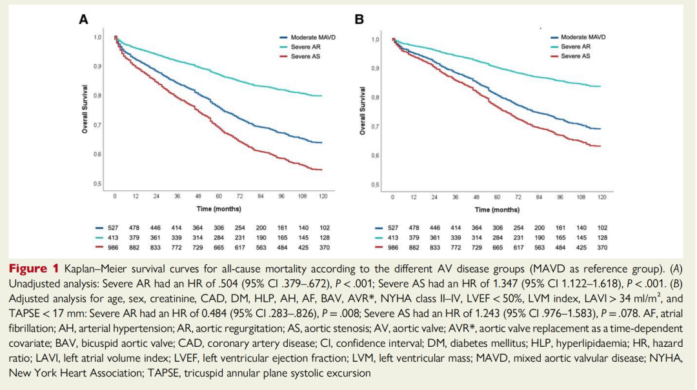
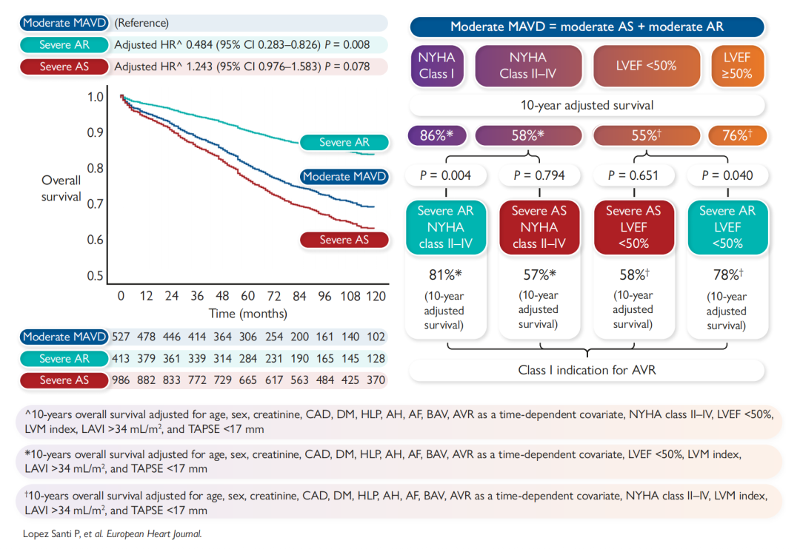
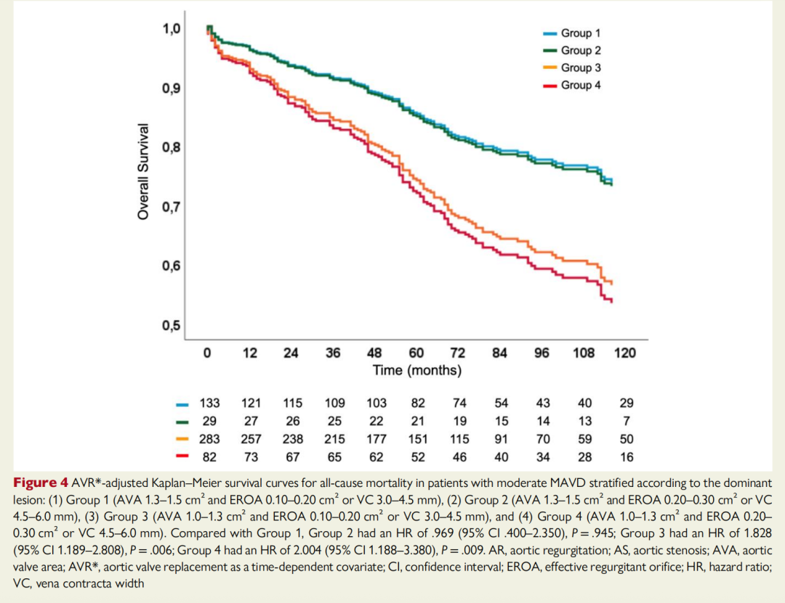

# The Misread "Moderate": New EHJ Big Data Confirms Mixed Aortic Valve Disease as a Hidden Killer

**Source:** HeartValvePro  
**Original title:** 被误读的“中度”：EHJ最新大数据证实，混合型主动脉瓣病变（MAVD）实为“隐形杀手”  
**Original URL:** https://mp.weixin.qq.com/s/rKA40i1GIHLl1VnGMbCdcA

In the clinical spectrum of valve disease, one particularly ambiguous zone has long remained in the gray area of guidelines: mixed aortic valve disease (MAVD).

When an echocardiography report says "moderate stenosis (AS) with moderate regurgitation (AR)," a common clinical decision is: "It has not reached severe disease yet, so continue follow-up." This decision is based on a linear logic. Since neither lesion reaches the guideline-defined severe threshold, such as AS Vmax < 4 m/s or AR effective regurgitant orifice area (EROA) < 30 mm², the condition should naturally also be moderate and the risk manageable.

However, a major multicenter study led by Pilar Lopez Santi and published in the European Heart Journal in 2025 challenged this clinical habit using long-term follow-up data from nearly 2,000 patients.

The study revealed a neglected truth: so-called moderate MAVD has long-term mortality almost identical to severe AS. This finding suggests that evaluating mixed disease solely according to the severity of each individual lesion may underestimate the patient's true risk.

## Physiologic Superposition: A Hemodynamic Effect Where 1 + 1 > 2

Why do two moderate lesions combine to produce a mortality risk close to that of severe disease?

The answer lies in the double mechanical hit faced by the left ventricle. Isolated AS increases pressure load, or afterload, causing the left ventricle to tend toward concentric hypertrophy. Isolated AR increases volume load, or preload, causing the left ventricle to tend toward eccentric dilation.

When both coexist, the heart enters a compensatory dilemma. Stenosis limits the heart's ability to eject the additional regurgitant volume, causing systolic wall stress to rise exponentially, while the hypertrophied ventricular wall further worsens diastolic dysfunction.

The study data confirmed this directly. During a median follow-up of 7.2 years, the 10-year survival rate of patients with moderate MAVD was only 62%, with no statistically significant difference from patients with isolated severe AS (55%; P = 0.078), but significantly worse than patients with isolated severe AR (79%; P < 0.001).

This means that patients labeled clinically as moderate already have a survival curve entangled with severe AS.

Figure 1. The underestimated mortality curve. Panel B from the original Figure 1 shows adjusted survival curves. The dark blue line (moderate MAVD) closely follows the red line (severe AS), while the green line (severe AR) shows significantly better survival. This clearly indicates that the prognostic risk of moderate MAVD should not be underestimated.

## Risk Thresholds: Symptoms and Ejection Fraction as Red Lines

If the overall risk of moderate MAVD is so high, which patients are at the edge of the cliff? The study identified two key prognostic thresholds.

1. Symptoms

Once patients with moderate MAVD develop symptoms, defined as NYHA class II-IV, prognosis worsens immediately. The data showed that symptomatic patients with moderate MAVD had a 10-year survival rate of only 58%, exactly comparable to symptomatic patients with severe AS (56%; P = 0.794).

2. Left ventricular function (LVEF < 50%)

LVEF is another lifeline. When LVEF falls below 50%, the 10-year survival rate of patients with moderate MAVD decreases to 55%, again comparable to severe AS patients with reduced LVEF (P = 0.651).

This sends an important clinical signal: in patients with moderate MAVD, the appearance of symptoms or decline in ejection fraction often means that compensatory mechanisms have failed, and the risk level has become equivalent to severe AS with an indication for intervention.

Figure 2. Risk-stratification pyramid. This summary figure clearly depicts risk levels. In the lower left, once patients with moderate MAVD develop LVEF < 50% (dashed line), their survival curve (blue dashed line) falls directly to the same level as severe AS (red dashed line). The core conclusion is that adjusted hazard ratios show mortality risk in moderate MAVD is more than twice that of severe AR and no different from severe AS.

## Driving Factor: Stenosis Greater Than Regurgitation

In mixed disease, which is more lethal: stenosis or regurgitation? The study performed detailed subgroup analysis to answer this.

Investigators divided patients into four groups according to aortic valve area (AVA) and degree of regurgitation. The results showed that the decisive factor was the severity of stenosis.

When AVA was in the 1.0-1.3 cm² range, close to the severe stenosis threshold, mortality was highest regardless of whether the accompanying regurgitation was mild-moderate or moderate-severe.

This suggests that AVA must be viewed with high sensitivity when evaluating mixed disease. A seemingly moderate AVA, such as 1.1-1.2 cm², may already have underestimated hemodynamic destructiveness if accompanied by regurgitation.

Figure 3. Dominant role of stenosis. The figure, adapted from the original Figure 4, shows survival across different subgroups. The yellow and red lines (Groups 3 and 4) represent patients with AVA between 1.0 and 1.3 cm². Regardless of regurgitation severity, these two groups had significantly lower survival than groups with AVA > 1.3 cm² (blue and green lines). The implication is that stenosis severity is the core driver of MAVD prognosis.

## Study Implications: Re-Examining Watchful Waiting

This 2025 study provides new evidence for understanding mixed valve disease and prompts deeper reflection on current clinical strategy.

Current guidelines generally recommend considering intervention when a single lesion reaches severe status. For MAVD, however, this divide-and-conquer assessment framework may lag behind clinical reality. Based on this study's data, the clinical perspective may need to be recalibrated.

Risk re-recognition: The data support viewing moderate MAVD as a pathologic state with risk comparable to severe AS, rather than a simple benign transitional stage.

Alertness to early signals: Symptoms, NYHA class II or higher, and LVEF < 50% are highly sensitive prognostic indicators. When these signals appear, mechanically waiting for hemodynamic parameters, such as velocity > 4 m/s, to reach the threshold may miss the optimal intervention window.

Focus on a specific range: Patients with AVA between 1.0 and 1.3 cm² should be included in high-risk surveillance regardless of regurgitation severity.

Medical progress often comes from deep exploration of the intermediate zone. Moderate mixed valve disease requires not only observation, but also precise decision-making based on pathophysiology.

## References

Lopez Santi P, et al. Outcomes of moderate mixed aortic valve stenosis and regurgitation. European Heart Journal. 2025;ehaf791.

For collaboration or submissions, please leave a message in the WeChat official account or email adams.wang@heartvalvepro.com.

This content is intended solely for academic reference by medical and healthcare professionals. It does not constitute medical advice or any basis for diagnosis or treatment. Clinical decisions must be made by the attending physician based on individual patient factors and relevant clinical guidelines; this account assumes no legal liability arising therefrom. The technical evaluation and literature interpretation in this article are based on currently available evidence-based data and are intended to reflect academic discussion objectively; it does not represent an exclusive recommendation of any specific product or surgical technique.
