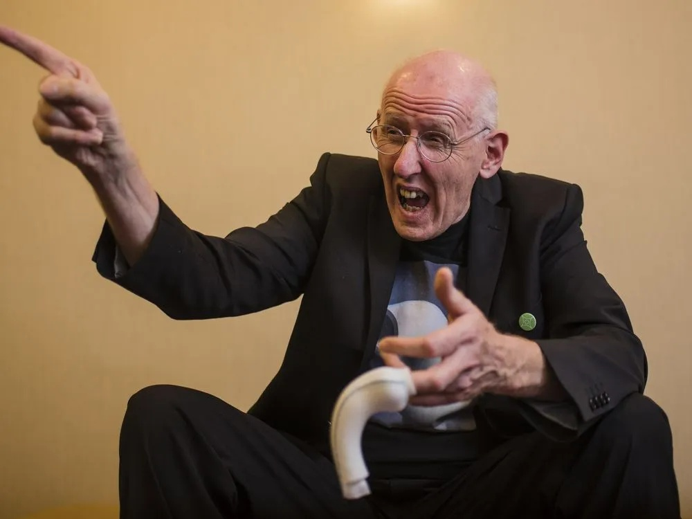
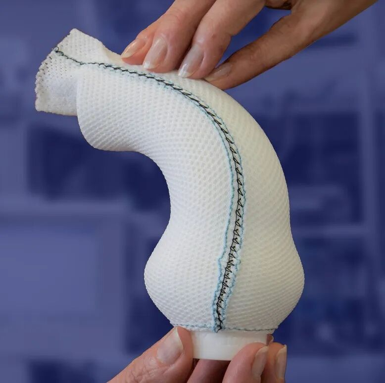
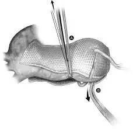

# When the Patient Picks Up the Scalpel: PEARS and the Native-Preservation Revolution in Aortic Medicine

**Source:** HeartValvePro  
**Original title:** 当患者拿起手术刀：PEARS技术——主动脉医学的“原生保留”革命  
**Original URL:** https://mp.weixin.qq.com/s/eNJw7OXf4wKHNgW6ilQpFg

In the halls of modern cardiac surgery, most classic procedures are named after great surgeons: Bentall, David, Yacoub, Ross. These names represent the highest authority in medicine, and they also represent a top-down logic of resection and reconstruction.

Yet one technology followed a completely different path. Its inventor was neither a surgeon nor a medical doctor, but a patient with Marfan syndrome. His name was Tal Golesworthy.

The technology is called PEARS, or personalised external aortic root support. It was born from a stubborn engineer's fundamental challenge to the traditional gold standard in aortic medicine. This was not simply a doctor-patient conversation, but a moment when engineering thinking cut through medical dogma.

## The Engineer's Anger: Why Remove a Perfectly Good Valve?

In 2000, 30-year-old chartered engineer Tal Golesworthy received a verdict: his aortic root had dilated to a dangerous threshold.

There appeared to be only one path in front of him: the Bentall procedure.

This was then, and still is, the absolute gold standard for aortic root aneurysm treatment: remove the diseased aortic vessel, remove the aortic valve at the same time, and replace both with an artificial conduit carrying a mechanical valve. The operation meant lifelong warfarin anticoagulation, the noise of a mechanical valve, and the stroke risk associated with cardiopulmonary bypass.

As an expert focused on process engineering and boiler piping, Tal found this hard to accept. In his eyes, conventional aortic surgery seemed excessively crude and wasteful.

He raised a purely fluid-mechanical question: "My aortic valve is functioning well. It is only the pipe wall that has become thin and bulged out. Why should the good valve be cut out because of a pipe problem?"

In industry, when a high-pressure pipe is at risk of expansion, engineers do not shut down the whole factory to replace the pipe. They place a clamp or support outside the pipe to limit further expansion.

He told his doctors: "If the water pipe is bulging, why not put a hoop around the outside and restrain it?"

## Finding Allies: When CAD/CAM Meets Cardiac Surgery

The medical community responded coldly at the time. Physicians believed the heart was a complex, dynamically beating organ, and that simple external wrapping could cause migration or erosion of the vessel wall. Similar historical attempts had failed.

Tal did not compromise. Using his engineering knowledge, he found Professor Tom Treasure and Professor John Pepper at Royal Brompton Hospital in London. Fortunately, these two leading experts had enough humility to listen to an outsider's suggestion.

Tal then began four years of development. He introduced the CAD/CAM process from industrial manufacturing into cardiac surgery for the first time.

Digital reconstruction: high-resolution MRI scanning was used to obtain 1:1 three-dimensional anatomic data of the patient's aortic root.

3D-printed former: a physical model of the patient's dilated aorta was printed.

Customized exoskeleton: a mesh support matched to the patient's vessel shape with millimeter precision was woven around the model using medical-grade polymer material, later known as ExoVasc.

Figure 1. Tal Golesworthy holding a 3D-printed aortic root model based on his own cardiac data, explaining his engineering concept to the medical community.

The design of this mesh support is full of engineering wisdom. It has a 0.7-mm microporous structure. This pore size preserves mechanical strength while allowing adventitial cells to grow through the mesh, ultimately integrating the support with the vessel wall and solving the problem of migration.

Figure 2. The ExoVasc personalised mesh support. This seemingly simple fabric was the world's first fully customized cardiac implant created through a CAD/CAM process.

## 2004: The First Patient

On May 24, 2004, Tal Golesworthy lay on the operating table. He was the inventor of the technology and the first person in the world to undergo PEARS.

The operation validated the victory of minimalism. Surgeons did not need to open the aorta, remove the valve, or even stop the heart. They simply placed the customized mesh support around the outside of the dilated aorta, like putting on a sock.

Figure 3. Principle of PEARS. The mesh support wraps around the outside of the aorta, providing external support that physically limits diameter expansion and reduces wall tension.

Once the mesh was in place, the aortic diameter was physically constrained within a safe range. According to Laplace's law (wall tension = pressure x radius), limiting the radius immediately reduced the tension on the fragile vessel wall, thereby reducing the risk of dissection.

Most importantly, the process completely preserved the patient's native tissue. Nothing was removed, and no foreign material such as a mechanical valve came into contact with the blood.

## From Heresy to an Option

Tal Golesworthy's bet succeeded.

Twenty years after surgery, he remains alive and well. Imaging follow-up shows that his aortic root size is extremely stable, his native valve functions well, and he does not need any anticoagulant medication. He lives normally and has continued his engineering consulting work.

With the success of the first case, PEARS gradually moved from heresy into clinical practice. It was no longer a single patient's self-rescue, but became a standardized medical solution. It provides a precious third option for young patients with Marfan syndrome: instead of choosing between mechanical-valve anticoagulation and bioprosthetic degeneration, they can keep their own organ and give it strong support.

## Epilogue: Humility in Medicine

The birth of PEARS reminds the whole field of aortic medicine that when facing complex anatomic disease, resection and replacement may not be the only answer.

Through precise external support, we can restrain disease progression while preserving physiologic function. Tal Golesworthy proved with his own life that sometimes the best doctor is the patient who understands his own suffering most deeply, and the best scalpel may be a 3D model generated on a computer.

For collaboration or submissions, please leave a message in the WeChat official account or email adams.wang@heartvalvepro.com.

This content is intended solely for academic reference by medical and healthcare professionals. It does not constitute medical advice or any basis for diagnosis or treatment. Clinical decisions must be made by the attending physician based on individual patient factors and relevant clinical guidelines; this account assumes no legal liability arising therefrom. The technical evaluation and literature interpretation in this article are based on currently available evidence-based data and are intended to reflect academic discussion objectively; it does not represent an exclusive recommendation of any specific product or surgical technique.
