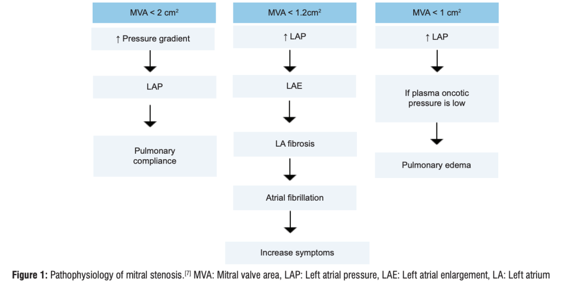
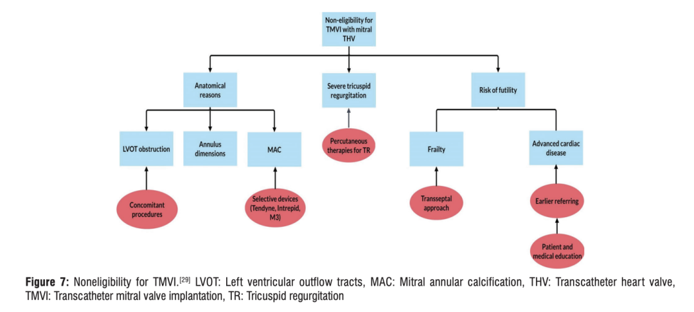
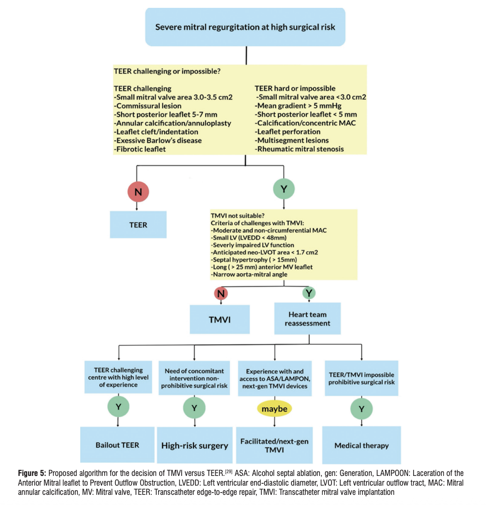

# Beyond the Interventional Noise: Revisiting the Overlooked Truths of Mitral Stenosis in 2025

**Source:** HeartValvePro  
**Original title:** 在介入喧嚣之外，重读2025年二尖瓣狭窄的“冷门”真相  
**Original URL:** https://mp.weixin.qq.com/s/N3jMflGm-WCuLi4CiARW-g

At a time when interventional treatment of structural heart disease is advancing rapidly, the industry's attention is easily drawn to expansion of TAVI indications or iteration of TEER devices. It can feel as if every valve lesion can be solved as long as a catheter can reach it.

However, a major review recently published in Annals of Clinical Cardiology, titled "2025 Update on Mitral Valve Disease," offers the field a necessary moment of cool reflection.

The review reminds us that from a global perspective, mitral stenosis (MS), especially rheumatic MS, remains an unconquered mountain. In low- and middle-income countries, the 10-year survival rate of patients with untreated rheumatic MS remains as low as 0%-15%.

Through this review, we need to return to the deep waters of mitral valve diagnosis and treatment and touch the anatomic truths concealed beneath device parameters.

## The Diagnostic Blind Spot: When Symptoms and MVA Data Conflict

In frontline clinical practice, physicians often face this dilemma: a patient reports clear exertional dyspnea, but resting echocardiography shows that mitral valve area (MVA) still appears to be in the moderate range, above 1.5 cm². At this point, the reliability of the data is challenged.

The 2025 review gives a clear direction: reject reliance on a single static datum and return to dynamic hemodynamic assessment.

The pathophysiologic essence of MS is a vicious pressure cycle.

Figure 1. Hemodynamic domino effect of MS. Mitral stenosis is not merely physical restriction of the valve orifice. It triggers a cascade: increased left atrial pressure (LAP) causes left atrial enlargement (LAE), then pulmonary venous hypertension, and ultimately right ventricular failure. Clinicians must recognize that this pressure transmission process is amplified exponentially during exercise, while resting echocardiography often masks the dynamic process.

The review therefore emphasizes that when clinical symptoms and resting echocardiographic data do not match, exercise testing is the key to regaining diagnostic authority.

If, under exercise stress, the mean transvalvular gradient rises significantly above 15 mmHg or pulmonary artery wedge pressure (PAWP) exceeds 25 mmHg, then even if resting MVA remains acceptable, the patient has hemodynamically severe stenosis and requires intervention.

## The Illusion of Intervention and the Resolve of Surgery

If TAVI is a rescue for the aortic valve, can transcatheter mitral valve implantation (TMVI) become the final answer for mitral stenosis?

Capital markets and device development are full of enthusiasm for this possibility, but the clinical anatomic reality is harsh. The review reported an alarming figure: among patients screened for mitral valve disease, the TMVI screening failure rate is as high as 89%.

This is not because the devices are insufficiently sophisticated. The core problem is that we have encountered the red lines of cardiac anatomy.

Figure 2. The anatomic no-go zone for TMVI. Why are most patients unable to undergo TMVI? The figure shows three major obstacles: risk of left ventricular outflow tract obstruction (LVOTO), the most lethal anatomic limitation; mitral annular calcification (MAC), which leads to unstable anchoring and paravalvular leak; and annular size mismatch, which directly excludes current standardized devices.

These data force us to re-examine the value of surgery. When TMVI is limited by anatomic no-go zones, and balloon dilation, or percutaneous mitral balloon commissurotomy (PMBC), is limited by the gray zone of the Wilkins score, surgical repair shows irreplaceable resilience.

This anatomic dilemma forces us to reconsider the value of surgical repair. Especially in rheumatic MS, although replacement is a mature operation, repair that preserves the native valve still has irreplaceable physiologic advantages. By releasing subvalvular chordae and precisely opening the commissures, surgery can remove obstruction while preserving left ventricular contractile geometry, something no mechanical valve or transcatheter prosthesis can match.

For this reason, when the TMVI screening failure rate remains so high, surgical repair is not an outdated technique, but a fallback strategy for solving complex anatomic problems. It breaks through the limits of dependence on device size and returns to fine handling of diseased tissue. For patients who cannot benefit from balloon or catheter-based approaches because of complex anatomy, high-quality surgical repair remains a cornerstone option currently capable of providing long-term survival benefit.

## The Decision Dilemma: The Darkest Moment of Calcific MS

If rheumatic MS still has PMBC and advanced surgical repair as tools, then degenerative calcific mitral stenosis in older patients is currently one of the most difficult clinical situations.

These patients are usually elderly, have multiple organ dysfunction, and their valve disease consists of heavy calcium deposition rather than commissural fusion. This means that PMBC is ineffective, surgical risk is very high, and TMVI anchoring is difficult.

The 2025 review is highly clinically realistic on this point. For patients with MAC, unless symptoms are extremely severe and medication cannot control them, conservative therapy, including diuretics and atrial fibrillation rate control, is often preferred.

Figure 3. Logic tree for interventional decision-making. When facing complex mitral valve disease, physicians need to establish a decision tree like the one shown. If regurgitation is dominant and anatomy is suitable, TEER is preferred. But when stenosis is dominant or TEER anatomy is unsuitable, TMVI may be considered. On the TMVI pathway, LVOTO risk and MAC severity must be assessed strictly.

## Returning to Anatomic Authority

Although this 2025 review is titled an update, reading it feels more like a review and a return.

It reminds us that even in an era of rapidly evolving devices, the essence of medicine has not changed. Treatment of MS is no longer a simple choice between balloon and valve. It has become a precise game involving hemodynamic assessment, anatomic measurement, and patient life expectancy.

The moat protecting cardiac valves is not the number of new devices in hand, but the ability to find the one correct narrow gate for the patient in the face of complex anatomy, whether through precise diagnosis with exercise testing or through refined surgical repair.

## References

Alrashid EA, et al. A 2025 Update on Mitral Valve Disease - Focusing on Mitral Stenosis: Quantification, Clinical Management, and Guideline Review. Annals of Clinical Cardiology. 2025;7(2):64-79.

For collaboration or submissions, please leave a message in the WeChat official account or email adams.wang@heartvalvepro.com.

This content is intended solely for academic reference by medical and healthcare professionals. It does not constitute medical advice or any basis for diagnosis or treatment. Clinical decisions must be made by the attending physician based on individual patient factors and relevant clinical guidelines; this account assumes no legal liability arising therefrom. The technical evaluation and literature interpretation in this article are based on currently available evidence-based data and are intended to reflect academic discussion objectively; it does not represent an exclusive recommendation of any specific product or surgical technique.
